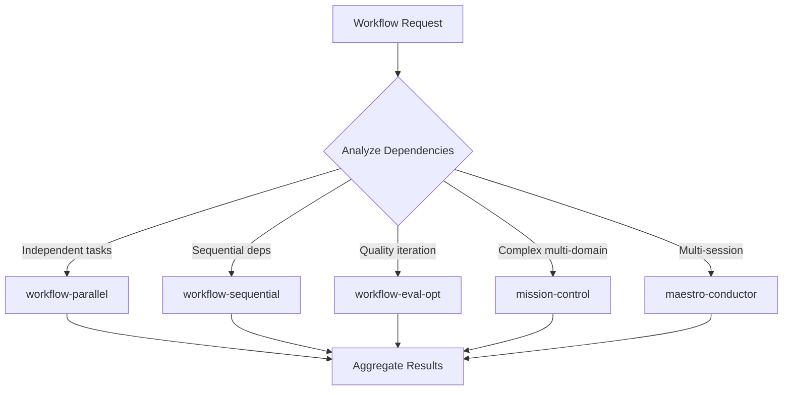

# Agent Workflow System

Orchestrate multi-agent workflows by composing sequential pipelines, parallel fan-out/fan-in, evaluator-optimizer loops, and durable mission state. Routes workflow requests to the optimal execution pattern based on task dependencies and quality requirements.

## When to Use

Use when the user asks to "orchestrate workflow", "run multi-agent pipeline", "agent workflow", "workflow system", "coordinate agents", "워크플로우 오케스트레이션", "에이전트 워크플로우", "파이프라인 실행", "agent-workflow-system", or needs to compose multiple skills into a coordinated execution flow with dependency management.

Do NOT use for single-skill execution (invoke the skill directly). Do NOT use for planning without execution (use planning-agent). Do NOT use for code review pipelines specifically (use engineering-harness).

## Default Skills

| Skill | Role in This Agent | Invocation |
|-------|-------------------|------------|
| mission-control | Runtime multi-skill orchestration with progress tracking | Primary workflow dispatcher |
| maestro-conductor | Durable cross-session missions with checkpoint save/restore | Long-running workflows |
| workflow-parallel | Fan-out independent tasks to parallel subagents | Independent concurrent tasks |
| workflow-sequential | Execute dependent tasks in order with checkpoints | Sequential pipeline stages |
| workflow-eval-opt | Evaluator-optimizer quality refinement loop | Iterative quality improvement |
| harness | Design and generate multi-agent skill architectures | New workflow pattern creation |
| omc-company | OneManCompany COO with E2R loops and self-evolution | Complex organizational decomposition |

## MCP Tools

None (orchestration-only agent).

## Workflow

## Modes

- **parallel**: Fan-out/fan-in for independent tasks
- **sequential**: Pipeline with dependency ordering
- **eval-opt**: Iterative generation-evaluation loop
- **mission**: Full mission-control decomposition
- **durable**: Cross-session maestro-conductor

## Safety Gates

- Max 4 concurrent parallel subagents
- Eval-opt loops capped at configured max iterations (default 2)
- Mission checkpoints required every 5 files modified
- Destructive operations require explicit user confirmation
