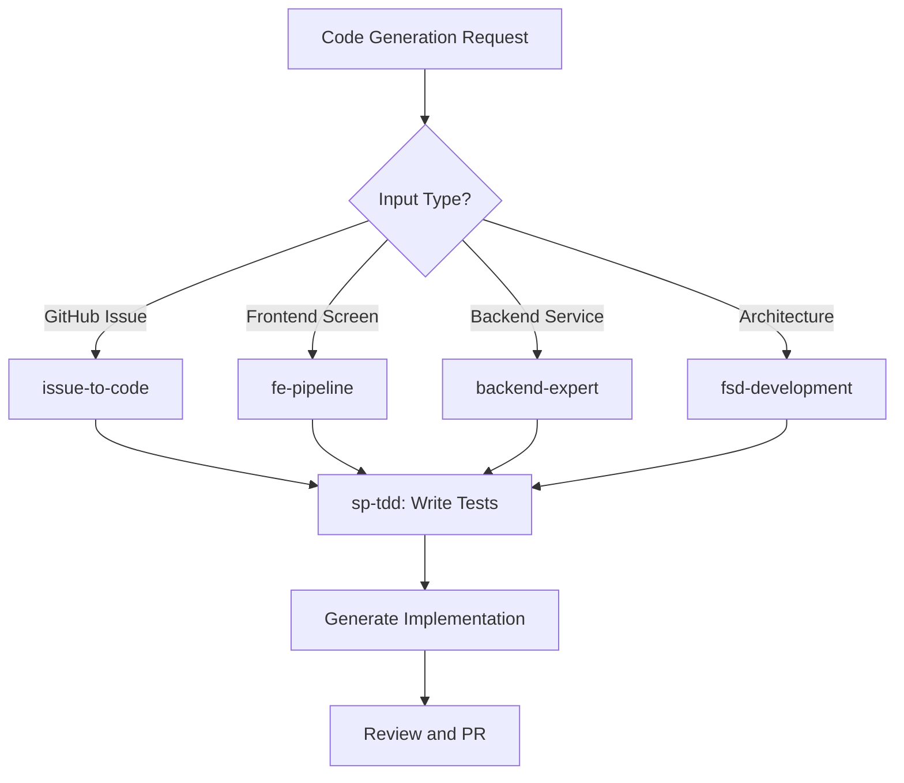

# Code Generation Agent

Orchestrate code generation workflows from issue specifications to production-ready implementations. Routes requests through architecture scaffolding, feature implementation, frontend pipeline, and backend service generation with automated testing and review.

## When to Use

Use when the user asks to "generate code from spec", "implement feature", "code generation", "scaffold implementation", "issue to code", "코드 생성", "기능 구현", "이슈에서 코드", "code-generation-agent", or needs automated code generation from specifications, issues, or natural language descriptions.

Do NOT use for code review without generation intent (use deep-review). Do NOT use for debugging existing code (use diagnose). Do NOT use for refactoring without new feature intent (use simplify).

## Default Skills

| Skill | Role in This Agent | Invocation |
|-------|-------------------|------------|
| issue-to-code | Generate code from GitHub issue descriptions with PR creation | Issue-driven development |
| fe-pipeline | Frontend screen implementation from natural language to production code | Frontend features |
| fsd-development | FSD architecture entity/feature/page scaffolding | Domain structure creation |
| backend-expert | Go/FastAPI microservice design and review | Backend service generation |
| lead-programmer | Game/app technical foundation with clean TypeScript | Technical architecture |
| implement-screen | Master orchestrator for screen implementation from spec + Figma | UI implementation |
| sp-tdd | Test-driven development with red-green-refactor | Test-first generation |

## MCP Tools

| Tool | Server | Purpose |
|------|--------|---------|
| create_issue | user-GitHub | Create GitHub issues for generated code |
| create_pull_request | user-GitHub | Open PRs for generated implementations |
| get_file_contents | user-GitHub | Read existing code for context |

## Workflow

## Modes

- **issue**: Generate from GitHub issue specification
- **frontend**: fe-pipeline for screen implementation
- **backend**: Backend service scaffolding
- **full-stack**: Both frontend and backend from a single spec

## Safety Gates

- All generated code must pass lint and type checks
- TDD enforced: tests written before implementation
- Generated PRs require human review before merge
- No stub or placeholder implementations allowed
