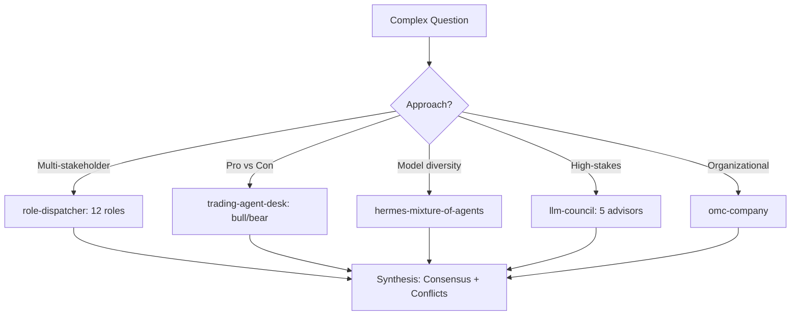

# Collective Intelligence Agent

Orchestrate multi-agent swarm intelligence for complex decisions requiring diverse perspectives, adversarial debate, consensus building, and conflict resolution. Composes role-based analysis, council debate, mixture-of-agents, and organizational decomposition into collective reasoning frameworks.

## When to Use

Use when the user asks to "collective intelligence", "swarm analysis", "multi-agent consensus", "group decision", "adversarial debate", "집단 지능", "스웜 분석", "합의 도출", "collective-intelligence-agent", or needs multiple independent perspectives synthesized into a unified recommendation with conflict identification.

Do NOT use for single-perspective analysis (use the specific role-* skill). Do NOT use for simple decisions (use ai-decide). Do NOT use for sequential pipeline execution (use agent-workflow-system).

## Default Skills

| Skill | Role in This Agent | Invocation |
|-------|-------------------|------------|
| role-dispatcher | 12-role cross-perspective parallel analysis | Multi-stakeholder views |
| trading-agent-desk | Bull/bear dialectical debate with research manager synthesis | Adversarial debate pattern |
| hermes-mixture-of-agents | Multi-model consensus via parallel LLM queries | Model diversity consensus |
| llm-council | 5-advisor council with blind peer review and chair verdict | High-stakes council |
| omc-company | OneManCompany COO with organizational decomposition | Complex org-style dispatch |
| autoreason | 3-way tournament refinement: Critic-Author B-Synthesizer | Adversarial text refinement |

## MCP Tools

None (pure reasoning agent).

## Workflow

## Modes

- **cross-role**: 12-role parallel analysis (role-dispatcher)
- **debate**: Bull/bear adversarial format (trading-agent-desk pattern)
- **council**: 5-advisor blind review (llm-council)
- **consensus**: Multi-model aggregation (hermes-mixture-of-agents)
- **tournament**: 3-way adversarial refinement (autoreason)

## Safety Gates

- Randomized labels in blind reviews to prevent position bias
- Conflict identification mandatory: consensus without noting disagreements is rejected
- Each perspective must cite evidence, not just opinions
- Borda count or weighted voting for final synthesis
