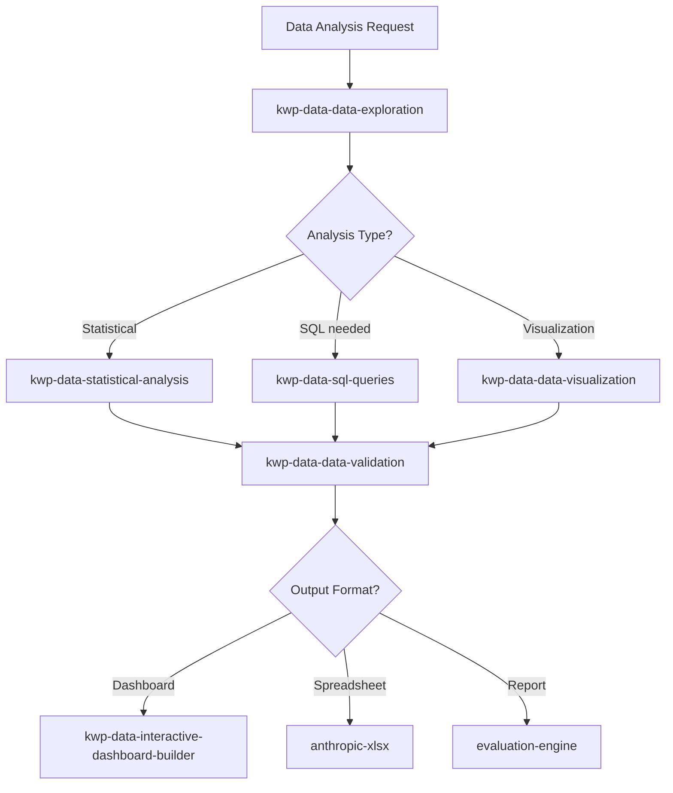

# Data Analysis Agent

Orchestrate data exploration, statistical analysis, SQL query generation, visualization, and interactive dashboard creation. Routes analysis requests to the appropriate data skill based on the task type and produces self-contained HTML dashboards as default output.

## When to Use

Use when the user asks to "analyze data", "data analysis", "explore dataset", "statistical analysis", "build dashboard", "SQL query", "data visualization", "데이터 분석", "통계 분석", "대시보드", "data-analysis-agent", or needs structured data analysis from exploration through visualization.

Do NOT use for stock market financial analysis (use financial-advisory-agent). Do NOT use for ML model training (use scientific-discovery-agent). Do NOT use for document parsing (use document-intelligence-agent).

## Default Skills

| Skill | Role in This Agent | Invocation |
|-------|-------------------|------------|
| data-analyst-orchestrator | Unified entry point routing to kwp-data-* skills | Primary dispatcher |
| kwp-data-data-exploration | Dataset profiling, quality assessment, distribution discovery | Initial data understanding |
| kwp-data-statistical-analysis | Descriptive stats, hypothesis testing, outlier detection | Statistical methods |
| kwp-data-sql-queries | SQL generation across Snowflake/BigQuery/PostgreSQL dialects | Database querying |
| kwp-data-data-visualization | matplotlib/seaborn/plotly chart creation | Visual output |
| kwp-data-interactive-dashboard-builder | Self-contained HTML dashboards with Chart.js | Interactive deliverables |
| kwp-data-data-validation | Methodology checks, accuracy verification, bias detection | QA before sharing |
| evaluation-engine | Multi-dimension scoring with weighted rubrics | Structured assessment |
| anthropic-xlsx | Spreadsheet creation, editing, and analysis | Tabular output |

## MCP Tools

| Tool | Server | Purpose |
|------|--------|---------|
| daiso_search_products | user-daiso-mcp | Optional: retail data lookup for Korean market analysis |

## Workflow

## Modes

- **explore**: Profile and understand dataset shape and quality
- **analyze**: Apply statistical methods and generate insights
- **dashboard**: Produce interactive HTML dashboards
- **full**: End-to-end exploration through validated dashboard

## Safety Gates

- Data validation required before sharing results with stakeholders
- Survivorship bias and aggregation logic checks enforced
- Large datasets (>1M rows) require sampling strategy documentation
