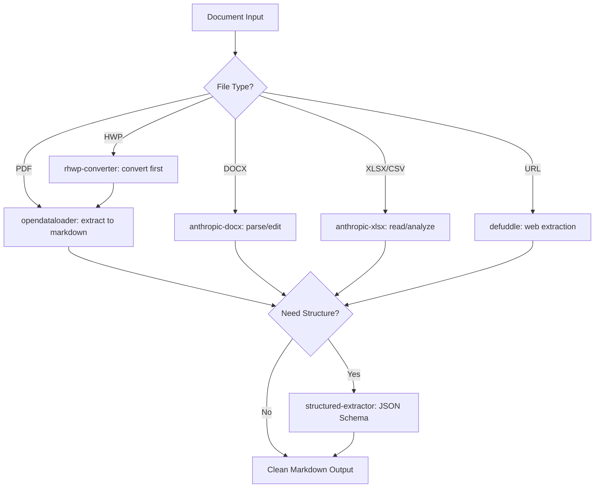

# Document Intelligence Agent

Orchestrate document processing workflows spanning PDF extraction, Word/Excel manipulation, structured data extraction, web content parsing, and format conversion. Routes documents by type to the optimal parser and produces clean, structured output.

## When to Use

Use when the user asks to "parse document", "extract from PDF", "document intelligence", "convert document", "structured extraction", "문서 파싱", "PDF 추출", "문서 인텔리전스", "document-intelligence-agent", or needs automated document processing, format conversion, or structured data extraction from unstructured sources.

Do NOT use for web scraping without document context (use scrapling). Do NOT use for meeting transcripts (use meeting-digest). Do NOT use for code documentation (use technical-writer).

## Default Skills

| Skill | Role in This Agent | Invocation |
|-------|-------------------|------------|
| opendataloader | Primary PDF reader: 0.907 accuracy, local + hybrid modes, 80+ lang OCR | High-fidelity PDF extraction |
| structured-extractor | JSON Schema-based extraction from PDF/web/images with confidence scoring | Structured data output |
| anthropic-pdf | PDF creation, merging, splitting, form filling, encryption | PDF manipulation |
| anthropic-docx | Word document creation, editing, tracked changes, comments | DOCX operations |
| anthropic-xlsx | Spreadsheet creation, editing, charting, data cleaning | Excel operations |
| defuddle | Clean markdown extraction from web pages and YouTube transcripts | Web content parsing |
| pandoc | Universal 60+ input / 80+ output format converter | Format conversion |
| rhwp-converter | HWP/HWPX to SVG/PDF conversion | Korean document format support |

## MCP Tools

None (file-based processing).

## Workflow

## Modes

- **extract**: Parse and extract content to markdown
- **structure**: Extract to JSON using schema inference
- **convert**: Format conversion via pandoc
- **batch**: Process multiple documents with cross-document entity resolution

## Safety Gates

- Fallback chain for PDF: opendataloader -> anthropic-pdf -> pdfplumber
- AI safety: prompt injection filtering for hidden text in PDFs
- Large documents (>100 pages) require chunking strategy
- Sensitive document content never logged to external services
