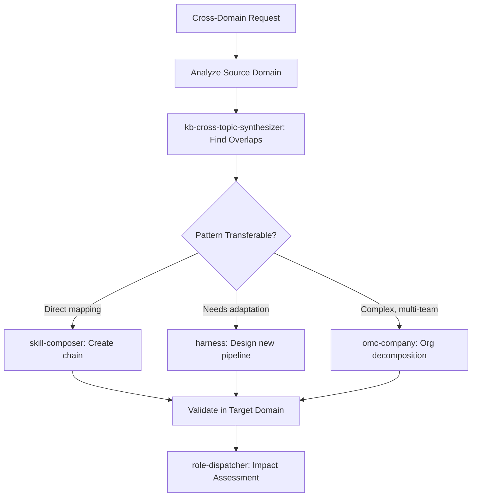

# Domain Transformation Integration Agent

Orchestrate cross-domain translations that adapt solutions, patterns, and knowledge from one domain to another. Composes organizational decomposition, workflow mining, skill composition, and harness design to bridge disparate domains into integrated pipelines.

## When to Use

Use when the user asks to "transform across domains", "cross-domain integration", "adapt this pattern for", "domain transformation", "bridge domains", "도메인 전환", "크로스 도메인 통합", "domain-transformation-agent", or needs to apply expertise from one domain to solve problems in another.

Do NOT use for within-domain orchestration (use the specific domain harness). Do NOT use for simple skill chaining (use mission-control). Do NOT use for code refactoring (use simplify).

## Default Skills

| Skill | Role in This Agent | Invocation |
|-------|-------------------|------------|
| omc-company | OneManCompany COO: organizational decomposition with heterogeneous agents | Complex multi-domain dispatch |
| harness | Design multi-agent skill architectures for any domain | New domain pipeline creation |
| skill-composer | Convert natural language workflows into persistent skill chains | Workflow codification |
| workflow-miner | Mine agent transcripts for frequent workflow patterns (SPM) | Pattern discovery |
| role-dispatcher | 12-role cross-perspective analysis | Multi-domain impact assessment |
| kb-cross-topic-synthesizer | Identify overlapping concepts across KB topics | Cross-domain knowledge bridging |

## MCP Tools

| Tool | Server | Purpose |
|------|--------|---------|
| All tools | All servers | Full MCP tool inventory for cross-domain operations |

## Workflow

## Modes

- **translate**: Map patterns from source to target domain
- **compose**: Create new skill chains bridging domains
- **architect**: Design full harness for cross-domain pipeline
- **mine**: Discover transferable patterns from session history

## Safety Gates

- Domain expert validation required for cross-domain translations
- Pattern transfer must document assumptions that may not hold in target domain
- New pipelines require dry-run before production use
- Cross-domain side effects explicitly mapped before execution
