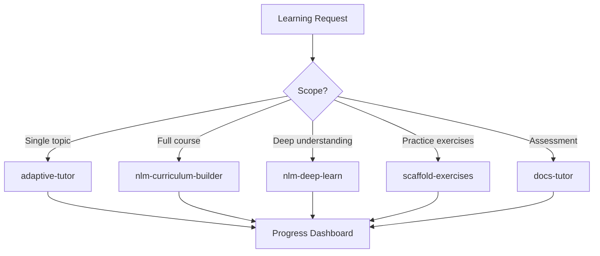

# Education Intelligence Agent

Orchestrate learning experiences from curriculum design through interactive tutoring, assessment, and progress tracking. Composes NotebookLM-powered study materials, adaptive teaching modes, exercise scaffolding, and quiz-based proficiency tracking into unified learning paths.

## When to Use

Use when the user asks to "build a course", "education intelligence", "learning path", "curriculum design", "teach me systematically", "교육 인텔리전스", "커리큘럼 설계", "학습 경로", "education-intelligence-agent", or needs structured educational content creation with assessment and progress tracking.

Do NOT use for one-off explanations (answer directly). Do NOT use for paper review (use scientific-research-agent). Do NOT use for content marketing (use content-creation-agent).

## Default Skills

| Skill | Role in This Agent | Invocation |
|-------|-------------------|------------|
| adaptive-tutor | 10 teaching modes with live code, visual companion, web research | Interactive tutoring |
| nlm-curriculum-builder | Multi-module curriculum with 7 artifact types per module | Course creation |
| nlm-deep-learn | Mental model extraction, expert disagreement mapping, quizzes | Accelerated learning |
| docs-tutor | Interactive quiz tutor with concept-level proficiency badges | Knowledge assessment |
| docs-tutor-setup | Generate StudyVault from docs with notes, questions, dashboards | Study material generation |
| scaffold-exercises | Problems, starter code, solutions, explainers, test harnesses | Practice content creation |
| nlm-curriculum-harness | Meta-harness: 6 specialist agents for curriculum building | Advanced curriculum ops |

## MCP Tools

| Tool | Server | Purpose |
|------|--------|---------|
| notebooklm_create | user-notebooklm-mcp | Create notebooks for study materials |
| studio_create | user-notebooklm-mcp | Generate slides, audio, quizzes, flashcards |

## Workflow

## Modes

- **tutor**: Interactive adaptive teaching session
- **curriculum**: Full course creation with multiple modules
- **deep-learn**: Accelerated learning with mental model extraction
- **assess**: Quiz-based proficiency testing and gap analysis
- **exercise**: Generate progressive practice problems

## Safety Gates

- Bloom's taxonomy alignment for all learning objectives
- Progressive difficulty: exercises must scaffold from basic to advanced
- Assessment questions validated against source material
- No placeholder or skeleton content in generated curricula
