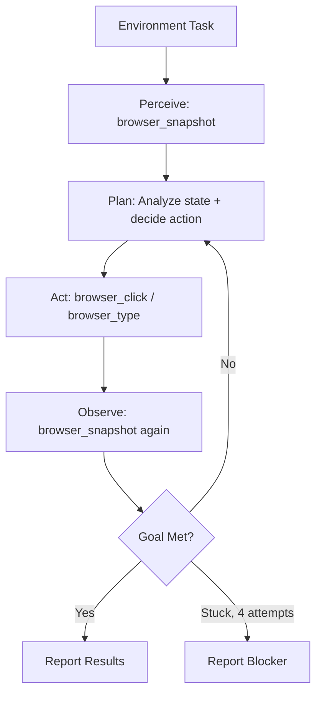

# Embodied Intelligence Agent

Orchestrate agents that perceive, interact with, and act upon virtual environments through browser automation, media generation, and feedback loops. Composes headless browsers, interactive scripting, visual capture, and media production into environment-aware action pipelines.

## When to Use

Use when the user asks to "interact with environment", "embodied agent", "browser automation loop", "visual interaction", "environment perception", "환경 인터랙션", "브라우저 자동화", "embodied-intelligence-agent", or needs agents that perceive a virtual environment, take actions, and observe results in a feedback loop.

Do NOT use for static web scraping (use scrapling). Do NOT use for E2E test suites (use e2e-testing). Do NOT use for simple screenshot capture (use full-page-capture).

## Default Skills

| Skill | Role in This Agent | Invocation |
|-------|-------------------|------------|
| agent-browser | Headless CLI browser: navigate, fill, click, screenshot, diff, record | Primary environment interaction |
| dev-browser | Sandboxed browser via QuickJS WASM with persistent pages | Isolated scripted interaction |
| qa-dogfood | Exploratory browser QA with health scoring | Environment health assessment |
| obscura | Lightweight Rust headless browser with anti-detection stealth | Stealth environment access |
| muapi-media-orchestrator | Multi-stage media production (image, video, lipsync) | Media generation in environment |
| pika-text-to-video | T2V/I2V with 7 modes for environment visualization | Visual content generation |
| canary-monitor | Post-action monitoring with baseline comparison | Feedback loop verification |

## MCP Tools

| Tool | Server | Purpose |
|------|--------|---------|
| browser_navigate | cursor-ide-browser | Navigate to target environment |
| browser_snapshot | cursor-ide-browser | Perceive current environment state |
| browser_click | cursor-ide-browser | Take actions in environment |
| browser_type | cursor-ide-browser | Input text into environment |
| browser_take_screenshot | cursor-ide-browser | Capture visual state for analysis |

## Workflow

## Modes

- **interact**: Perception-action-observation loop in browser
- **explore**: Autonomous environment exploration with health scoring
- **record**: Record browser sessions for replay
- **monitor**: Continuous environment monitoring with baseline diff

## Safety Gates

- Max 4 failed action attempts before stopping and reporting blocker
- Fresh snapshot required before every interaction action
- No destructive actions without explicit user confirmation
- Login/auth pages require manual user intervention
- Session recordings archived for audit trail
