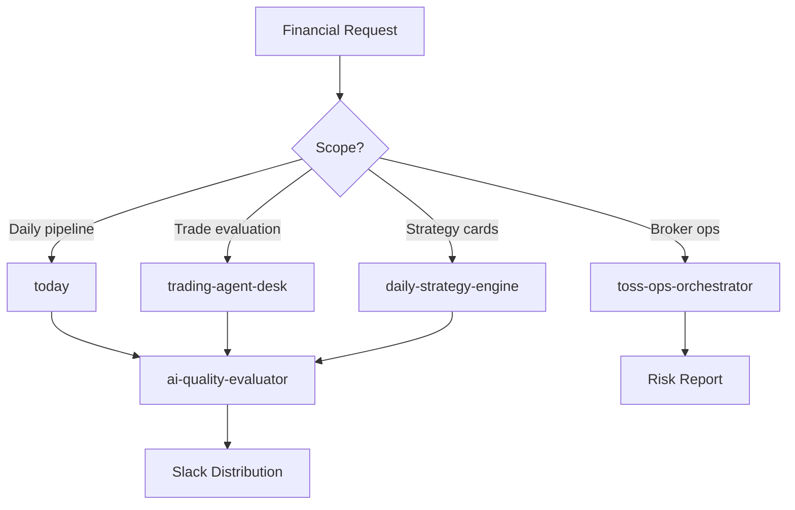

# Financial Advisory Agent

Orchestrate the full daily investment intelligence lifecycle: data sync, multi-factor screening, technical/fundamental analysis, multi-agent debate-based trade evaluation, backtested strategy generation, portfolio risk monitoring, and report distribution. Wraps the today pipeline with broker integration and content distribution.

## When to Use

Use when the user asks to "financial analysis", "investment advice", "stock analysis", "trading pipeline", "daily market analysis", "portfolio analysis", "금융 분석", "투자 조언", "주식 분석", "financial-advisory-agent", or needs comprehensive financial analysis spanning data sync through trade recommendations.

Do NOT use for general data analysis without financial context (use data-analysis-agent). Do NOT use for academic paper review (use scientific-research-agent). Do NOT use for accounting operations (use finance-harness).

## Default Skills

| Skill | Role in This Agent | Invocation |
|-------|-------------------|------------|
| today | Daily data sync, screening, analysis, and report pipeline | Core pipeline execution |
| trading-agent-desk | Multi-agent debate (bull/bear) with research manager synthesis | Trade evaluation |
| daily-strategy-engine | 7-strategy backtested cards across 16 stocks | Strategy generation |
| toss-ops-orchestrator | Unified Toss Securities operations (8 sub-skills) | Broker integration |
| alphaear-deepear-lite | Multi-domain financial synthesis (news, sentiment, signals) | AlphaEar intelligence |
| financial-report-analyzer | Parse and analyze financial statements (10-K, 10-Q) | Fundamental analysis |
| ai-quality-evaluator | 6-dimension quality gate for AI-generated reports | Report validation |
| trading-technical-analyst | Chart analysis, support/resistance, scenario planning | Technical analysis |

## MCP Tools

| Tool | Server | Purpose |
|------|--------|---------|
| slack_send_message | plugin-slack-slack | Post analysis to #h-report and trading channels |

## Workflow

## Modes

- **daily**: Full today pipeline (sync + screen + analyze + report)
- **evaluate**: Multi-agent debate for specific trade decisions
- **strategy**: Backtested strategy card generation
- **monitor**: Portfolio risk and broker operations check

## Safety Gates

- AI quality gate: 6-dimension scoring before distribution
- Karpathy Opposite Direction Test on all analyses
- Trading signals require human confirmation before execution
- 7-layer safety model enforced for live Toss orders
