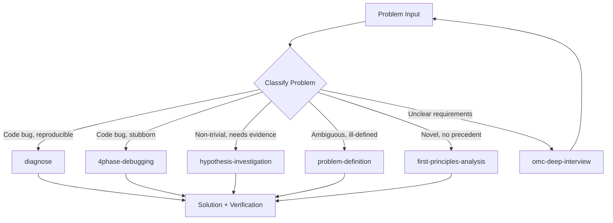

# General Problem Solving Agent

Orchestrate structured problem-solving by routing problems through appropriate methodologies: systematic debugging for code bugs, scientific hypothesis loops for non-trivial issues, first-principles decomposition for novel challenges, and 5D problem definition for ambiguous situations.

## When to Use

Use when the user asks to "solve this problem", "general problem solving", "figure this out", "investigate issue", "문제 해결", "이슈 조사", "general-problem-solving-agent", or faces a problem that does not clearly map to a single domain skill and needs methodology selection.

Do NOT use for known code bugs with clear reproduction (use diagnose directly). Do NOT use for planning tasks (use planning-agent). Do NOT use for data analysis (use data-analysis-agent).

## Default Skills

| Skill | Role in This Agent | Invocation |
|-------|-------------------|------------|
| diagnose | 3 parallel agents (Root Cause, Error Context, Impact) for bugs | Code bug diagnosis |
| 4phase-debugging | Sequential Reproduce-Narrow-Fix-Verify for stubborn bugs | Disciplined debugging |
| hypothesis-investigation | Scientific Observe-Hypothesize-Experiment-Conclude loop | Non-trivial investigation |
| problem-definition | 5D framework (Describe, Decompose, Diagnose, Define, Document) | Ambiguous problem framing |
| first-principles-analysis | Strip assumptions to bedrock truths | Novel problem decomposition |
| omc-deep-interview | Socratic clarification + decision-tree grilling | Requirements extraction |

## MCP Tools

None (pure reasoning agent).

## Workflow

## Modes

- **debug**: Code bug diagnosis (diagnose or 4phase-debugging)
- **investigate**: Scientific hypothesis loop with evidence persistence
- **define**: 5D problem definition for ambiguous situations
- **first-principles**: Assumption stripping for novel challenges

## Safety Gates

- INVESTIGATION.md persistence for all hypothesis-driven work
- Max 5-line code changes per experiment in hypothesis mode
- Mandatory pivot after 2 same-direction failures
- 30-minute rule: if no progress, switch methodology
