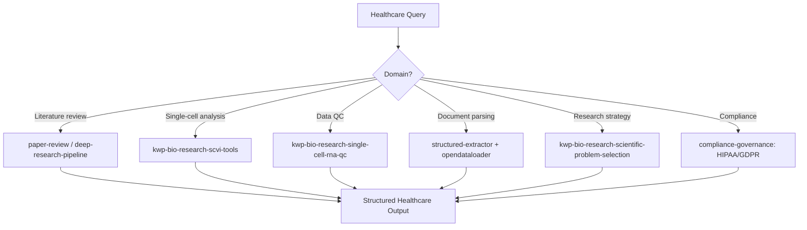

# Healthcare Intelligence Agent

Orchestrate healthcare data analysis spanning clinical literature synthesis, biomedical research workflows, medical document parsing, and regulatory compliance guidance. Composes bio-research skills, deep research pipelines, and structured extraction for healthcare and life sciences domains.

## When to Use

Use when the user asks to "healthcare analysis", "clinical literature", "medical research", "biomedical data", "healthcare intelligence", "의료 데이터 분석", "임상 문헌", "바이오 리서치", "healthcare-intelligence-agent", or needs healthcare-specific research, data analysis, or regulatory compliance guidance.

Do NOT use for general data analysis (use data-analysis-agent). Do NOT use for financial analysis (use financial-advisory-agent). Do NOT use for legal compliance only (use legal-intelligence-agent).

## Default Skills

| Skill | Role in This Agent | Invocation |
|-------|-------------------|------------|
| kwp-bio-research-scientific-problem-selection | Research problem selection, project ideation, strategic scientific decisions | Research direction |
| kwp-bio-research-scvi-tools | Deep learning single-cell analysis: scVI, scANVI, totalVI, PeakVI | Single-cell analysis |
| kwp-bio-research-single-cell-rna-qc | scverse/scanpy QC with MAD-based filtering | Data quality control |
| paper-review | End-to-end paper review with peer review and distribution | Literature analysis |
| deep-research-pipeline | Deep web research + 12-role analysis + Notion publishing | Comprehensive research |
| structured-extractor | JSON Schema-based extraction from medical documents | Clinical data parsing |
| opendataloader | High-fidelity PDF extraction for medical papers and reports | Document processing |
| compliance-governance | Regulatory compliance (HIPAA, GDPR for health data) | Compliance guidance |

## MCP Tools

None (primarily file and research-based).

## Workflow

## Modes

- **research**: Literature review and synthesis
- **analysis**: Biomedical data analysis (single-cell, genomics)
- **extract**: Clinical document parsing and structuring
- **compliance**: HIPAA/GDPR regulatory guidance

## Safety Gates

- NOT a medical device or clinical decision support system -- always advisory
- HIPAA compliance checks enforced for any patient-identifiable data
- Medical claims always cite peer-reviewed sources
- Regulatory advice marked as informational -- consult qualified professionals
- No diagnosis or treatment recommendations provided
