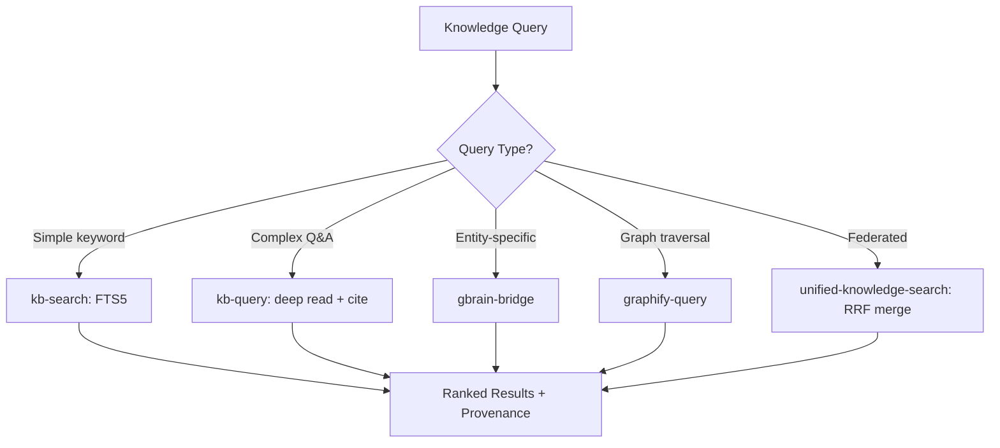

# Knowledge Retrieval Agent

Orchestrate multi-source knowledge retrieval across LLM Knowledge Bases (FTS5 + embeddings), Cognee graph RAG, gbrain entity pages, MemKraft personal memory, and web search. Applies Reciprocal Rank Fusion to merge results with provenance tags and confidence scores.

## When to Use

Use when the user asks to "search knowledge", "knowledge retrieval", "find in KB", "RAG search", "multi-source search", "지식 검색", "KB 검색", "knowledge-retrieval-agent", or needs federated search across internal knowledge stores with ranked, provenance-tagged results.

Do NOT use for web-only search (use parallel-web-search). Do NOT use for codebase search (use Grep/SemanticSearch). Do NOT use for memory storage (use memory-augmentation-agent).

## Default Skills

| Skill | Role in This Agent | Invocation |
|-------|-------------------|------------|
| kb-search | SQLite FTS5 full-text search across KB wiki articles | Text search with snippets |
| kb-query | Deep Q&A with citation-backed answers from KB wiki | Complex question answering |
| unified-knowledge-search | Federated search across MemKraft, gbrain, KB, Cognee, recall | Multi-source merging with RRF |
| cognee | Knowledge graph builder and graph-enhanced RAG search | Entity-relationship queries |
| graphify-query | BFS/DFS traversal, node explanation, shortest path on Graphify graphs | Graph topology exploration |
| gbrain-bridge | Bidirectional sync and query of gbrain entity pages | Entity-specific knowledge |
| ai-context-router | MemKraft-first query dispatch with provenance separation | Personal-first retrieval |

## MCP Tools

| Tool | Server | Purpose |
|------|--------|---------|
| notebooklm_query | user-notebooklm-mcp | Query NotebookLM notebooks for research context |

## Workflow

## Modes

- **search**: Fast FTS5 keyword search with snippets
- **query**: Deep Q&A with citations from KB wiki
- **graph**: Cognee or Graphify graph traversal
- **federated**: All sources via unified-knowledge-search with RRF

## Safety Gates

- All results tagged with source provenance (personal/team/company)
- Confidence scores below 0.3 flagged as low-confidence
- Stale results (>90 days) flagged with freshness warning
- No hallucinated citations: every claim traceable to source article
