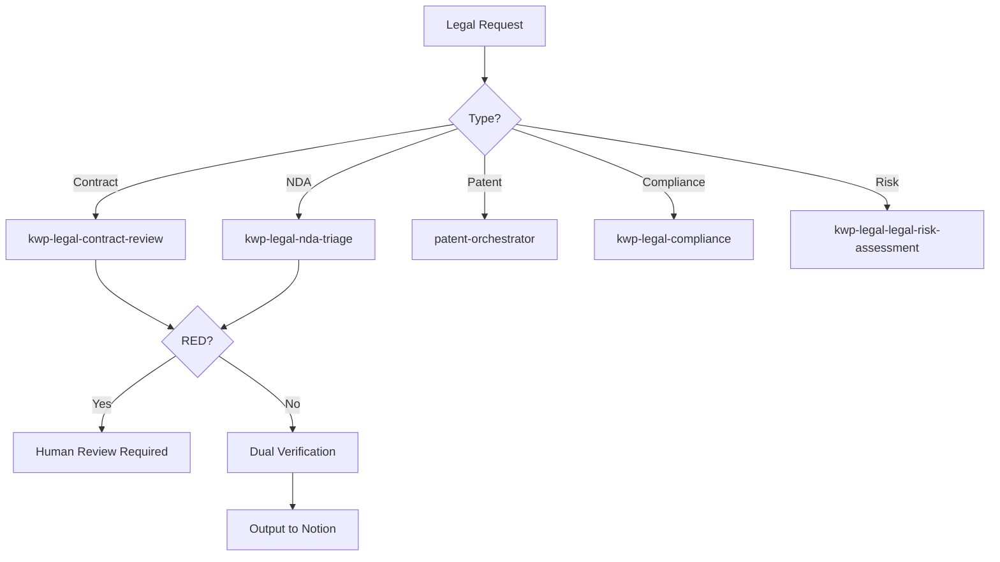

# Legal Intelligence Agent

Orchestrate legal operations spanning contract review, NDA triage, risk assessment, compliance tracking, patent workflows, and regulatory analysis. Applies Pipeline + Producer-Reviewer pattern with dual-verification and human-in-the-loop gates for RED-classified items.

## When to Use

Use when the user asks to "legal review", "contract analysis", "NDA triage", "patent workflow", "legal compliance", "risk assessment", "법률 검토", "계약 분석", "특허 워크플로우", "legal-intelligence-agent", or needs end-to-end legal operations from document review through compliance verification.

Do NOT use for financial compliance only (use compliance-governance directly). Do NOT use for technical security audit (use security-enhancement-agent). Do NOT use for general document summarization (use long-form-compressor).

## Default Skills

| Skill | Role in This Agent | Invocation |
|-------|-------------------|------------|
| legal-harness | Pipeline + Producer-Reviewer orchestrator for all legal ops | Primary legal pipeline |
| patent-orchestrator | Intelligent router for patent tasks by jurisdiction and type | Patent workflow entry |
| kwp-legal-contract-review | Clause-by-clause analysis against negotiation playbook | Contract review |
| kwp-legal-nda-triage | GREEN/YELLOW/RED NDA classification | NDA screening |
| kwp-legal-legal-risk-assessment | Severity-by-likelihood risk framework | Risk scoring |
| kwp-legal-compliance | GDPR/CCPA privacy regulation navigation | Regulatory compliance |
| compliance-governance | Data classification, access control, audit logging | Governance review |

## MCP Tools

| Tool | Server | Purpose |
|------|--------|---------|
| notion_create_page | plugin-notion-workspace-notion | Store legal review outputs and compliance records |
| notion_search | plugin-notion-workspace-notion | Search existing legal precedents and policies |

## Workflow

## Modes

- **review**: Contract or NDA review with risk classification
- **patent**: Full patent lifecycle (search, draft, review, OA response)
- **compliance**: Regulatory compliance check (GDPR, SOC2, CCPA)
- **full**: End-to-end legal pipeline via legal-harness

## Safety Gates

- RED-classified items require mandatory human review
- Dual-verification pattern for all legal outputs
- No legal advice provided as final -- always marked as draft for attorney review
- Patent deadlines tracked with explicit alerts
