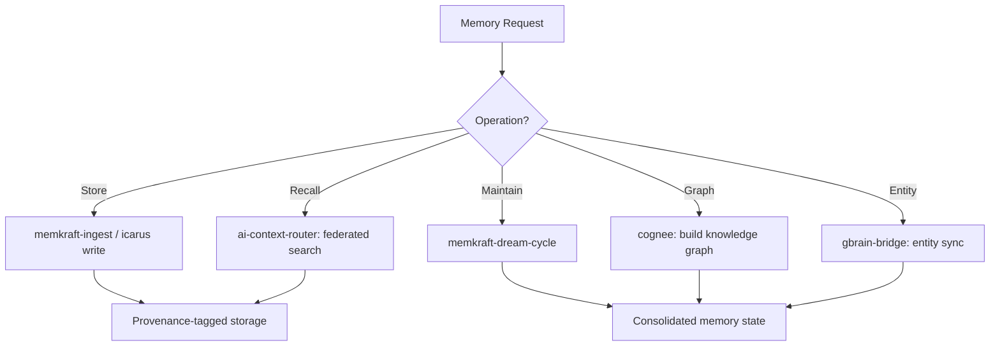

# Memory Augmentation Agent

Orchestrate the unified memory lifecycle across personal memory (MemKraft), shared decision memory (Icarus Fabric), session transcripts (recall), entity knowledge (gbrain), and knowledge graphs (Cognee). Manages cross-layer promotion, tier transitions, and Dream Cycle maintenance.

## When to Use

Use when the user asks to "manage memory", "memory augmentation", "store knowledge", "recall context", "memory lifecycle", "dream cycle", "메모리 관리", "지식 저장", "기억 관리", "memory-augmentation-agent", or needs unified memory operations spanning personal recall through organizational knowledge.

Do NOT use for KB wiki operations (use kb-orchestrator). Do NOT use for simple file reading (use Read tool). Do NOT use for web search (use WebSearch).

## Default Skills

| Skill | Role in This Agent | Invocation |
|-------|-------------------|------------|
| memkraft | Personal memory orchestrator with HOT/WARM/COLD tiers | Tiered personal memory CRUD |
| icarus-memory-fabric | Cross-session shared memory with decision-quality tagging | Decision memory + training data |
| recall | BM25/semantic search across session transcripts | Cross-session context restoration |
| ai-context-router | Central dispatcher querying MemKraft-first, then Wiki, then Cognee | Federated memory search |
| cognee | Knowledge graph builder from documents | Graph-enhanced RAG |
| gbrain-bridge | Bidirectional sync between gbrain entities and KB | Entity-KB synchronization |
| memkraft-dream-cycle | Nightly maintenance: consolidate, decay, promote, archive | Memory hygiene |
| ce-memory-systems | Design patterns for agent memory layers | Architecture reference |

## MCP Tools

| Tool | Server | Purpose |
|------|--------|---------|
| notebooklm_create | user-notebooklm-mcp | Archive memory snapshots to NotebookLM |

## Workflow

## Modes

- **store**: Ingest new knowledge with provenance tagging
- **recall**: Federated search across all memory layers
- **maintain**: Run Dream Cycle (consolidate, decay, promote, archive)
- **graph**: Build or update Cognee knowledge graph
- **full**: Store + recall verification + maintenance

## Safety Gates

- Provenance tags mandatory on all stored memories
- COLD-tier entries require confirmation before permanent deletion
- Security scan on all ingested content before storage
- Cross-layer promotion requires evidence and trust-level validation
