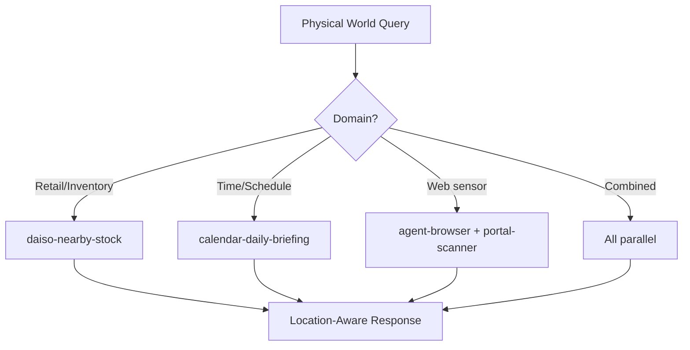

# Physical World Sensing Agent

Orchestrate real-world data gathering by composing retail store/inventory lookups, calendar-based temporal awareness, browser-based web sensors, and portal scanning into location-aware and time-aware action pipelines.

## When to Use

Use when the user asks to "check store inventory", "nearby stores", "real-world data", "physical world", "location-based", "sensor data", "매장 재고", "근처 매장", "실세계 데이터", "physical-world-sensing-agent", or needs information bridging the physical and digital worlds (store availability, location services, real-world scheduling).

Do NOT use for pure web scraping without physical context (use scrapling). Do NOT use for calendar management (use gws-calendar directly). Do NOT use for financial market data (use financial-advisory-agent).

## Default Skills

| Skill | Role in This Agent | Invocation |
|-------|-------------------|------------|
| daiso-mcp | Search Daiso/Olive Young/Megabox stores, check inventory, movie seats | Retail store data |
| daiso-nearby-stock | Product search + nearby stores + real-time inventory + visit recommendations | Location-based inventory |
| gws-calendar | Google Calendar: view agenda, create events, check availability | Temporal awareness |
| agent-browser | Headless browser for web-based sensor data (prices, availability, status) | Web sensor scraping |
| portal-scanner | Multi-strategy extraction from portals, job boards, product pages | Structured portal data |
| calendar-daily-briefing | Today's events with preparation alerts | Time-context assembly |

## MCP Tools

| Tool | Server | Purpose |
|------|--------|---------|
| daiso_search_stores | user-daiso-mcp | Find nearby Daiso stores |
| daiso_search_products | user-daiso-mcp | Search products by keyword |
| daiso_check_inventory | user-daiso-mcp | Real-time stock availability |
| oliveyoung_search | user-daiso-mcp | Olive Young product/store search |
| megabox_seats | user-daiso-mcp | Movie seat availability |
| browser_navigate | cursor-ide-browser | Access web-based data sources |

## Workflow

## Modes

- **inventory**: Retail store and product availability
- **temporal**: Calendar and schedule-aware actions
- **sensor**: Web-based data extraction for real-world state
- **combined**: Multi-source physical world intelligence

## Safety Gates

- Location data privacy: no persistent storage of user location
- Inventory data freshness: always note real-time caveat
- Web sensor data validated against multiple sources when possible
- Movie/event availability marked as point-in-time snapshot
