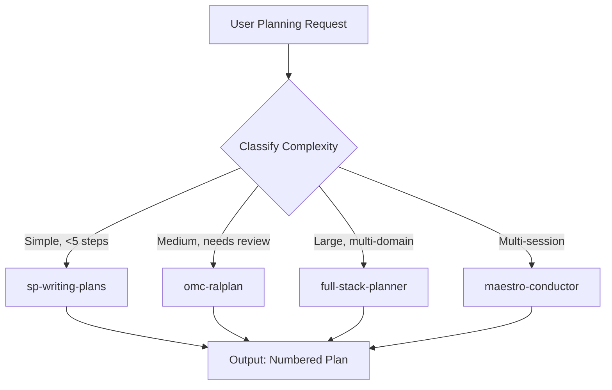

# Planning Agent

Orchestrate multi-step planning workflows by composing structured deliberation, consensus-based planning, and durable cross-session mission state. Routes planning requests to the optimal strategy based on complexity: quick plans via sp-writing-plans, consensus plans via omc-ralplan, full-stack pipeline plans via full-stack-planner, and long-running missions via maestro-conductor.

## When to Use

Use when the user asks to "plan a project", "create an implementation plan", "planning agent", "multi-step plan", "strategic plan", "project planning", "프로젝트 계획", "구현 계획", "전략 계획", "planning-agent", or needs structured planning for any non-trivial task requiring decomposition, dependency ordering, or phased execution.

Do NOT use for single-step tasks (execute directly). Do NOT use for code review (use deep-review). Do NOT use for brainstorming without planning intent (use sp-brainstorming). Do NOT use for runtime workflow execution of an existing plan (use mission-control).

## Default Skills

| Skill | Role in This Agent | Invocation |
|-------|-------------------|------------|
| jarvis | Meta-orchestrator for goal decomposition and agent registry lookup | Decompose high-level goals into sub-plans |
| omc-ralplan | 3-agent consensus planning (Planner-Architect-Critic) with ADR output | Complex plans requiring architectural review |
| sp-writing-plans | Lightweight plan writing with tracer bullet strategy | Simple multi-step implementation plans |
| full-stack-planner | 5-phase pipeline plans mapping goals to 20-50 skills | Enterprise-grade plans spanning many domains |
| maestro-conductor | Durable cross-session mission state with milestone gates | Long-running missions surviving context resets |
| plans | Prompt optimization + skill-based execution planning | Combined prompt refinement and planning |

## MCP Tools

None (pure reasoning agent).

## Workflow

## Modes

- **quick**: sp-writing-plans for simple task decomposition
- **consensus**: omc-ralplan 3-agent deliberation with ADR
- **full-stack**: full-stack-planner 5-phase pipeline
- **mission**: maestro-conductor with durable state

## Safety Gates

- Plans exceeding 50 steps must be decomposed into phases
- Each plan must include verification criteria
- Long-running missions require explicit user approval at milestone gates
