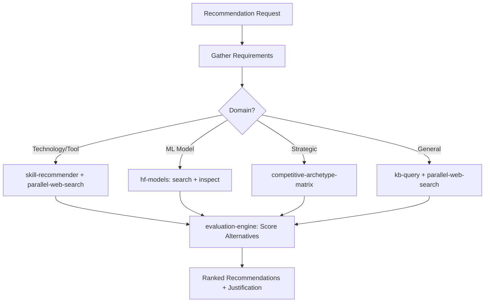

# Recommendation Agent

Generate context-aware recommendations by composing skill discovery, model search, entity evaluation, knowledge base querying, and competitive analysis into a unified recommendation pipeline. Supports technology, tool, model, content, and strategy recommendations with multi-dimensional scoring.

## When to Use

Use when the user asks to "recommend something", "what should I use", "recommendation agent", "suggest the best", "which option", "추천", "뭘 써야 해", "recommendation-agent", or needs a scored comparison of alternatives with evidence-backed recommendations.

Do NOT use for stock trading recommendations (use financial-advisory-agent). Do NOT use for skill routing (use sra-harness). Do NOT use for competitive battlecards (use kwp-sales-competitive-intelligence).

## Default Skills

| Skill | Role in This Agent | Invocation |
|-------|-------------------|------------|
| skill-recommender | Detect project stack and recommend relevant skills by scoring | Skill/tool recommendations |
| hf-models | Search, discover, and inspect models on HuggingFace Hub | ML model recommendations |
| evaluation-engine | Multi-dimension scoring with weighted rubrics and A-F grades | Alternative comparison |
| kb-query | Citation-backed answers from KB wiki for domain context | Knowledge-grounded recommendations |
| competitive-archetype-matrix | Classify and compare competitors with evidence | Competitive option analysis |
| weighted-rubric-engine | Custom rubrics with configurable dimensions and grade bands | Structured scoring |
| parallel-web-search | Multi-provider web research for current information | Real-time market data |

## MCP Tools

| Tool | Server | Purpose |
|------|--------|---------|
| resolve_library | plugin-context7-plugin-context7 | Resolve library documentation for tech recommendations |
| get_library_docs | plugin-context7-plugin-context7 | Fetch current API docs for evaluation |

## Workflow

## Modes

- **tech**: Technology and tool recommendations with stack detection
- **model**: ML model selection with benchmark comparison
- **strategic**: Competitive alternatives with archetype classification
- **general**: Evidence-backed recommendations from KB + web research

## Safety Gates

- All recommendations backed by evidence (no opinion-only outputs)
- Weighted scoring rubric explicitly documented for transparency
- Karpathy Opposite Direction Test: argue against the top recommendation
- Recency check: recommendations older than 6 months flagged for review
