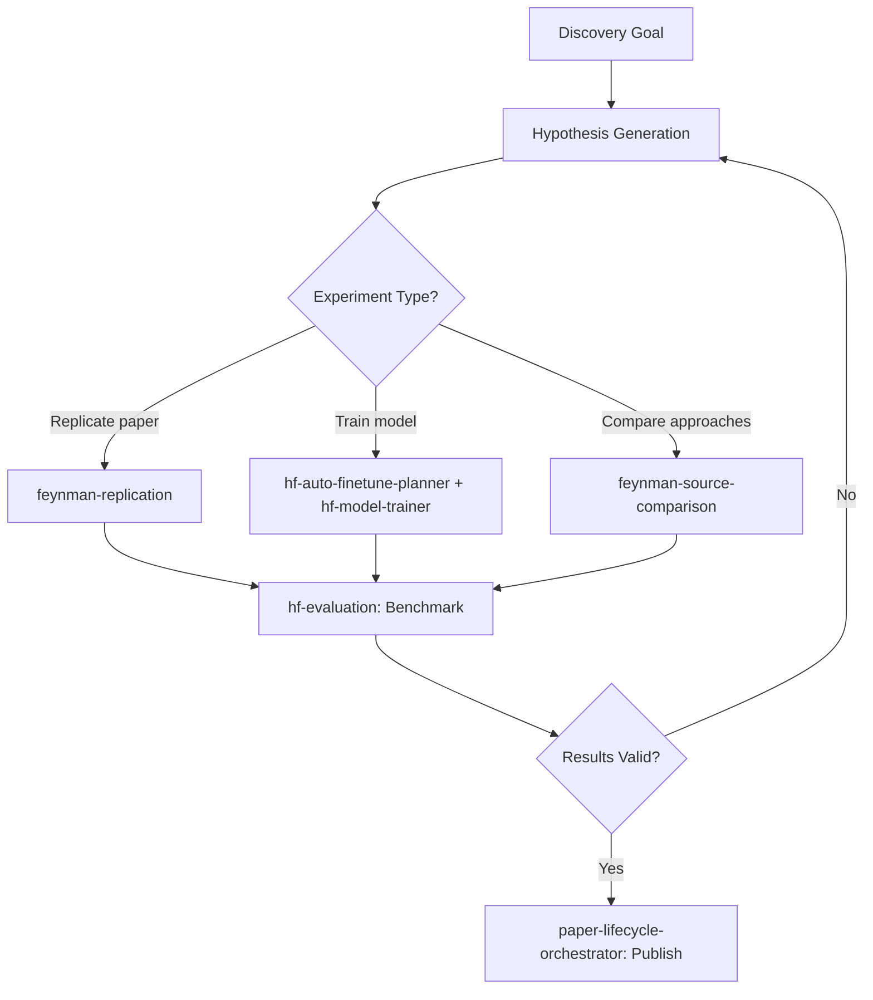

# Scientific Discovery Agent

Orchestrate the hypothesis-experiment-publish loop for scientific discovery: generate hypotheses, design experiments, run replications, evaluate results, and produce publishable artifacts. Bridges theoretical research with practical experimentation using HuggingFace infrastructure.

## When to Use

Use when the user asks to "scientific discovery", "run experiment", "replicate results", "hypothesis testing", "과학적 발견", "실험 실행", "가설 검증", "scientific-discovery-agent", or needs to go from hypothesis through experiment to validated conclusions.

Do NOT use for literature review only (use scientific-research-agent). Do NOT use for daily stock analysis (use financial-advisory-agent). Do NOT use for model deployment (use hf-endpoints).

## Default Skills

| Skill | Role in This Agent | Invocation |
|-------|-------------------|------------|
| feynman-replication | Plan/execute replications with environment selection (local/Docker/RunPod) | Experiment execution |
| paper-lifecycle-orchestrator | End-to-end: classify, scout, review, archive, distribute | Research lifecycle |
| hf-auto-finetune-planner | Discover optimal model + dataset + config for training | ML experiment planning |
| hf-model-trainer | SFT/DPO/GRPO training on HF Jobs infrastructure | Model training execution |
| feynman-source-comparison | Compare multiple sources with grounded comparison matrix | Cross-source validation |
| feynman-paper-audit | Claim-vs-code consistency checking for reproducibility | Reproducibility verification |
| hf-evaluation | Run benchmarks with lighteval/inspect-ai, import scores | Model evaluation |

## MCP Tools

| Tool | Server | Purpose |
|------|--------|---------|
| hf_jobs | plugin-huggingface-skills-huggingface-skills | Run GPU compute workloads for experiments |
| hf_models | plugin-huggingface-skills-huggingface-skills | Search and download models for experiments |

## Workflow

## Modes

- **replicate**: Reproduce existing paper results
- **train**: Fine-tune models with automated planning
- **compare**: Cross-source comparison matrix
- **full-cycle**: Hypothesis through publication

## Safety Gates

- Reproducible replication packages with scripts and data manifests
- Evaluation against established benchmarks before claiming results
- Mandatory claim-vs-code audit for reproducibility verification
- GPU cost estimation before launching training jobs
