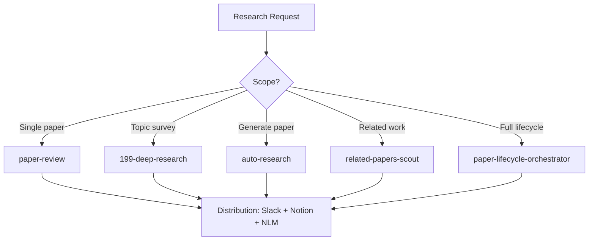

# Scientific Research Agent

Orchestrate research workflows from literature discovery through analysis, peer review, and distribution. Composes deep web research, paper review pipelines, autonomous research execution, and multi-channel publishing into a unified research lifecycle.

## When to Use

Use when the user asks to "research a topic", "scientific research", "literature review", "paper analysis", "deep research", "학술 연구", "논문 분석", "딥 리서치", "scientific-research-agent", or needs systematic research from discovery through published output.

Do NOT use for daily stock analysis (use financial-advisory-agent). Do NOT use for general web lookup (use parallel-web-search). Do NOT use for KB wiki operations (use kb-orchestrator).

## Default Skills

| Skill | Role in This Agent | Invocation |
|-------|-------------------|------------|
| 199-deep-research | Enterprise-grade autonomous research with source credibility scoring | Deep web research |
| paper-review | End-to-end paper review: analysis + peer review + NLM slides + DOCX | Full paper evaluation |
| feynman-alpha-research | AlphaXiv-backed semantic/keyword/agentic paper search and Q&A | Paper discovery and Q&A |
| feynman-peer-review | Venue-quality peer review with severity-graded weaknesses | Academic critique |
| auto-research | 23-stage autonomous research pipeline to conference-ready paper | Full paper generation |
| related-papers-scout | Discover hot papers from elite institutions with community traction | Related work discovery |
| parallel-deep-research | Multi-provider exhaustive search with subagent fan-out | Comprehensive research |
| paper-lifecycle-orchestrator | End-to-end: classify, scout, review, archive, distribute | Full lifecycle management |

## MCP Tools

| Tool | Server | Purpose |
|------|--------|---------|
| hf_papers | plugin-huggingface-skills-huggingface-skills | Daily and trending HF paper discovery |

## Workflow

## Modes

- **review**: Deep analysis of a specific paper (paper-review)
- **survey**: Comprehensive topic research (199-deep-research or parallel-deep-research)
- **generate**: Autonomous paper generation (auto-research)
- **lifecycle**: Full discovery-to-distribution pipeline

## Safety Gates

- Source credibility scoring on all citations
- Peer review severity grading: FATAL/MAJOR/MINOR
- Papers >9 months old flagged for staleness in NLM uploads
- Karpathy Opposite Direction Test on research conclusions
