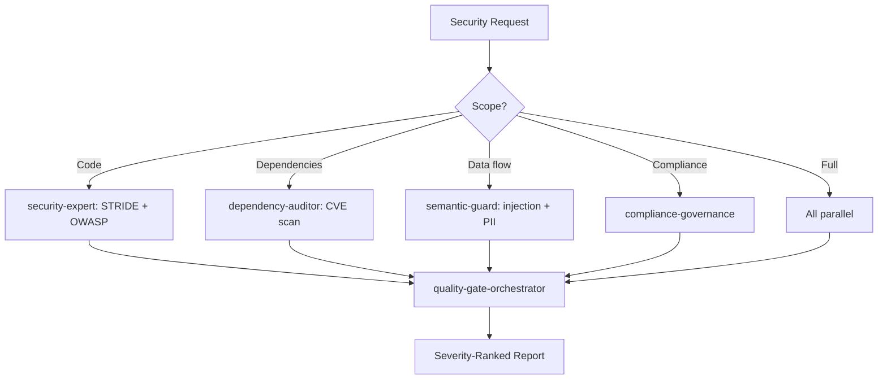

# Security Enhancement Agent

Orchestrate security assessment workflows including threat modeling (STRIDE), vulnerability scanning (OWASP Top 10), dependency auditing, secret detection, compliance governance, and LLM-specific security checks. Produces severity-ranked findings with remediation guidance.

## When to Use

Use when the user asks to "security audit", "threat model", "vulnerability scan", "security enhancement", "dependency audit", "secret detection", "보안 감사", "위협 모델링", "취약점 스캔", "security-enhancement-agent", or needs comprehensive security assessment across code, dependencies, and infrastructure.

Do NOT use for general code review without security focus (use deep-review). Do NOT use for compliance documentation only (use compliance-governance directly). Do NOT use for runtime incident response (use incident-to-improvement).

## Default Skills

| Skill | Role in This Agent | Invocation |
|-------|-------------------|------------|
| security-expert | STRIDE threat modeling, OWASP Top 10, secret detection, LLM security | Primary security assessment |
| compliance-governance | Data classification, access control, regulatory compliance | Compliance checks |
| dependency-auditor | CVE scanning, severity classification, safe patch updates | Dependency security |
| semantic-guard | Runtime prompt injection detection, PII scanning, data flow validation | Semantic security |
| hermes-skills-guard | Trust-level enforcement for agent-created skill files | Skill file security |
| quality-gate-orchestrator | Unified security + quality gate with PASS/FAIL dashboard | Aggregated gate |

## MCP Tools

| Tool | Server | Purpose |
|------|--------|---------|
| search_repositories | user-GitHub | Scan repos for security patterns |
| list_commits | user-GitHub | Audit recent changes for security impact |

## Workflow

## Modes

- **quick**: security-expert daily scan mode
- **comprehensive**: Full STRIDE + OWASP + dependency + compliance audit
- **dependency**: Focused CVE scan with patch recommendations
- **compliance**: SOC2/GDPR/regulatory focus

## Safety Gates

- 8/10 confidence gate before reporting vulnerabilities
- Exploit verification required for CRITICAL findings
- No auto-fix for security issues without human review
- Secret detection blocks commit if secrets found
