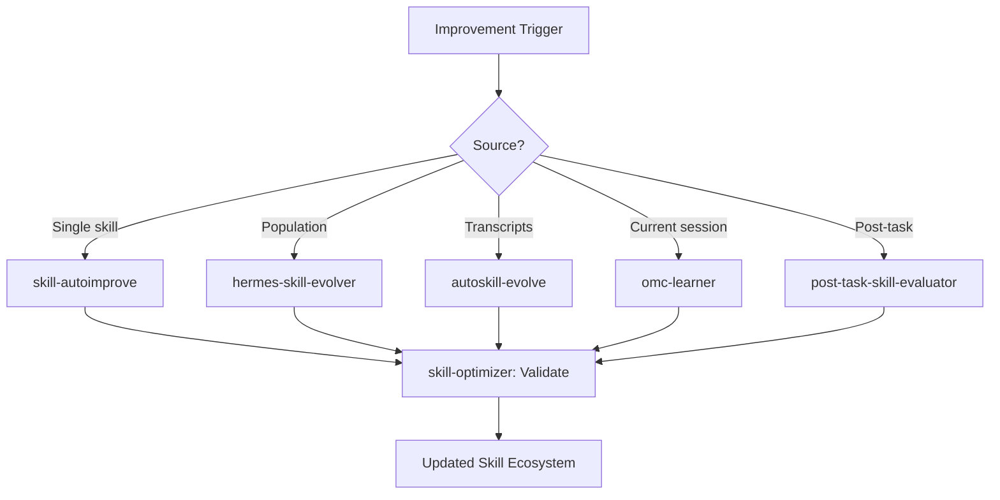

# Self-Improvement Agent

Orchestrate continuous self-improvement of the agent skill ecosystem through autonomous prompt optimization, population-based evolution, session pattern mining, post-task skill extraction, and structured retrospectives. Implements a closed-loop improvement cycle from observation through skill evolution.

## When to Use

Use when the user asks to "improve skills", "evolve skills", "self-improvement", "optimize prompts", "skill evolution", "agent learning", "스킬 개선", "스킬 진화", "자기 개선", "self-improvement-agent", or needs automated skill quality improvement, pattern extraction, or skill ecosystem maintenance.

Do NOT use for creating skills from scratch (use create-skill). Do NOT use for skill discovery (use skill-guide). Do NOT use for general code quality (use deep-review).

## Default Skills

| Skill | Role in This Agent | Invocation |
|-------|-------------------|------------|
| skill-autoimprove | Karpathy-style mutation loop: one change at a time, keep improvements | Single-skill prompt optimization |
| hermes-skill-evolver | Population-based GEPA evolution with LLM-Judge rubric | Multi-variant skill evolution |
| autoskill-evolve | E2E pipeline: extract from transcripts, judge, merge/add/discard | Session-based skill discovery |
| omc-learner | 3-gate quality filter for extracting reusable skills from debugging | Conversation-based learning |
| omc-retro | Dual self-evolution: micro (per-agent feedback) + macro (SOP improvements) | Structured retrospectives |
| ecc-continuous-learning | Instinct-based learning with confidence scoring | Pattern evolution |
| post-task-skill-evaluator | 5-dimension scoring for skill extraction suitability | Post-task checkpoint |
| skill-optimizer | Audit, benchmark, and fitness-score existing skills | Quality assessment |

## MCP Tools

None (internal optimization agent).

## Workflow

## Modes

- **optimize**: Single-skill mutation loop (skill-autoimprove)
- **evolve**: Population-based multi-variant evolution (hermes-skill-evolver)
- **mine**: Extract skills from session transcripts (autoskill-evolve)
- **retro**: Structured retrospective with SOP generation (omc-retro)
- **audit**: Quality assessment of existing skills (skill-optimizer)

## Safety Gates

- Constraint gates: size limit, growth rate, trigger/boundary preservation
- Holdout evaluation after mutation loops to detect overfitting
- Pure-output skills only for autoimprove -- not execution skills with side effects
- Skill-optimizer collision check before accepting new skills
