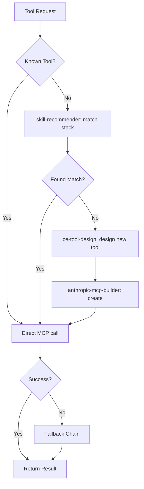

# Tool Usage Agent

Orchestrate intelligent tool discovery, capability matching, MCP server management, and fallback chain execution. Routes tool requests to the optimal provider and handles graceful degradation when primary tools are unavailable.

## When to Use

Use when the user asks to "use a tool", "find the right tool", "tool usage", "MCP tool", "which tool for this", "도구 사용", "도구 찾기", "tool-usage-agent", or needs to discover, configure, or chain external tools for a task.

Do NOT use for building new MCP servers (use anthropic-mcp-builder). Do NOT use for general code review (use deep-review). Do NOT use for skill discovery without tool focus (use skill-guide).

## Default Skills

| Skill | Role in This Agent | Invocation |
|-------|-------------------|------------|
| anthropic-mcp-builder | Build MCP servers connecting LLMs to external APIs | MCP server creation |
| ce-tool-design | Consolidation principle, architectural reduction, description engineering | Tool design patterns |
| agent-browser | Headless browser automation via CLI (navigate, fill, click, screenshot) | Browser-based tool execution |
| dev-browser | Sandboxed browser via heredoc JS in QuickJS WASM | Isolated browser scripts |
| setup-doctor | Scan prerequisites, CLI tools, packages, MCP servers | Tool health verification |
| atg-client | Route Notion/Slack/GitHub through Agent Tool Gateway | Accelerated tool access |
| skill-recommender | Detect project stack and recommend relevant tools | Stack-aware tool discovery |

## MCP Tools

| Tool | Server | Purpose |
|------|--------|---------|
| All tools | All servers | Full MCP tool inventory available |

## Workflow

## Modes

- **discover**: Find the right tool for a task
- **execute**: Run a specific tool with fallback chains
- **diagnose**: setup-doctor health check on all tools
- **build**: Create new MCP server for missing capability

## Safety Gates

- ATG routing check before every Notion/Slack/GitHub call
- Fallback chain: primary tool -> alternative tool -> manual workaround
- setup-doctor pre-flight before relying on external tools
- Tool call rate limiting to prevent API abuse
