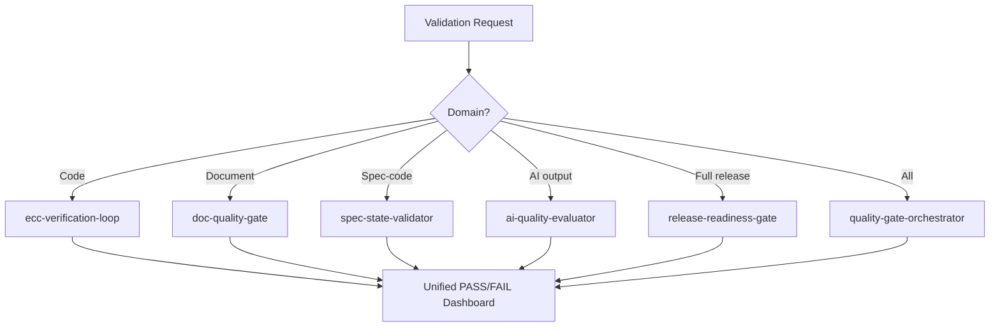

# Verification & Validation Agent

Orchestrate multi-domain verification and validation workflows spanning code quality, document completeness, spec-code alignment, security compliance, and AI output accuracy. Composes deterministic CI checks with AI-powered quality gates into a unified PASS/FAIL dashboard.

## When to Use

Use when the user asks to "verify implementation", "validate quality", "verification agent", "quality gate", "pre-release check", "검증", "품질 게이트", "verification-validation-agent", or needs comprehensive multi-domain quality assurance before deployment or handoff.

Do NOT use for code review only (use deep-review). Do NOT use for test writing only (use qa-test-expert). Do NOT use for individual document scoring (use doc-quality-gate directly).

## Default Skills

| Skill | Role in This Agent | Invocation |
|-------|-------------------|------------|
| ecc-verification-loop | 6-phase verification: build, typecheck, lint, test, security, diff review | Deterministic CI checks |
| quality-gate-orchestrator | Unified security + quality gate with PASS/FAIL dashboard | Aggregated quality gate |
| ci-quality-gate | Full CI pipeline locally (secret scan, lint, test, build, schema) | Local CI execution |
| doc-quality-gate | 7-dimension document scoring with A-D grades | Document quality |
| spec-state-validator | Cross-reference spec against code for coverage gaps | Spec-code alignment |
| ai-quality-evaluator | 6-dimension scoring for AI-generated content | AI output validation |
| release-readiness-gate | Pre-release: specs, designs, tests, policies, docs, UX all aligned | Release readiness |

## MCP Tools

| Tool | Server | Purpose |
|------|--------|---------|
| list_checks | user-GitHub | Verify CI check status on PRs |

## Workflow

## Modes

- **code**: ecc-verification-loop (build + lint + test + security)
- **document**: doc-quality-gate 7-dimension scoring
- **spec**: spec-state-validator cross-reference
- **release**: release-readiness-gate comprehensive check
- **full**: quality-gate-orchestrator all domains

## Safety Gates

- Deterministic checks always run before AI-powered checks
- FAIL on any CRITICAL finding blocks progression
- Evidence chain required: every pass/fail linked to specific check output
- No self-verification: AI outputs checked by independent evaluator
