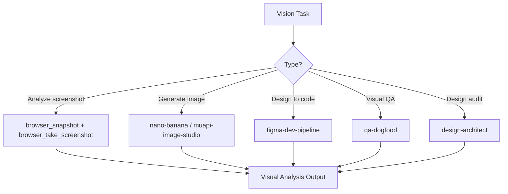

# Vision Language Agent

Orchestrate visual understanding and generation workflows: screenshot analysis, UI inspection, image generation, design-to-code translation, and visual QA. Routes vision tasks through browser automation, image generation, and design analysis pipelines.

## When to Use

Use when the user asks to "analyze this image", "visual QA", "vision language", "screenshot analysis", "design to code", "이미지 분석", "시각 QA", "스크린샷 분석", "vision-language-agent", or needs AI-powered visual understanding, generation, or screenshot-based interaction.

Do NOT use for text-only document analysis (use document-intelligence-agent). Do NOT use for video generation (use audio-processing-agent). Do NOT use for data visualization charts (use data-analysis-agent).

## Default Skills

| Skill | Role in This Agent | Invocation |
|-------|-------------------|------------|
| agent-browser | Headless browser: navigate, screenshot, extract, diff, profile | Browser-based visual inspection |
| nano-banana | Google GenAI image generation with 7,600+ curated prompt library | AI image generation |
| muapi-image-studio | 100+ model T2I/I2I via Muapi gateway with multi-reference input | Advanced image generation |
| qa-dogfood | Exploratory browser QA with screenshot-based health scoring | Visual bug discovery |
| figma-dev-pipeline | Figma design to code or code to Figma bidirectional pipeline | Design translation |
| full-page-capture | Full-page screenshots with viewport control and sectional capture | Page capture utility |
| design-architect | 14-dimension design audit with Steve Jobs philosophy | Visual design quality |

## MCP Tools

| Tool | Server | Purpose |
|------|--------|---------|
| browser_snapshot | cursor-ide-browser | Capture page structure for visual analysis |
| browser_take_screenshot | cursor-ide-browser | Capture visual state of web pages |
| get_design_context | plugin-figma-figma | Extract design context from Figma files |
| get_screenshot | plugin-figma-figma | Capture Figma design screenshots |

## Workflow

## Modes

- **analyze**: Screenshot capture and visual understanding
- **generate**: AI image creation (nano-banana or muapi)
- **translate**: Figma design to production code
- **qa**: Browser-based visual bug discovery
- **audit**: 14-dimension design quality assessment

## Safety Gates

- Original visual designs only -- no copying existing artists' work
- Figma design context always extracted before code generation
- Visual QA screenshots archived for regression comparison
- Large image generation requests require cost confirmation
