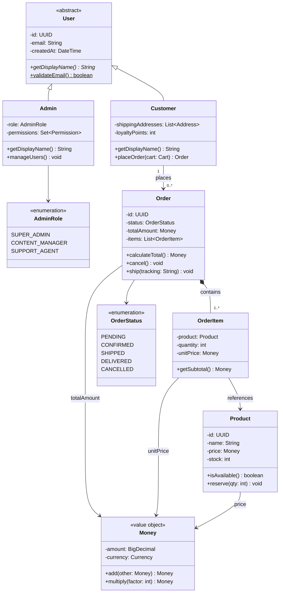
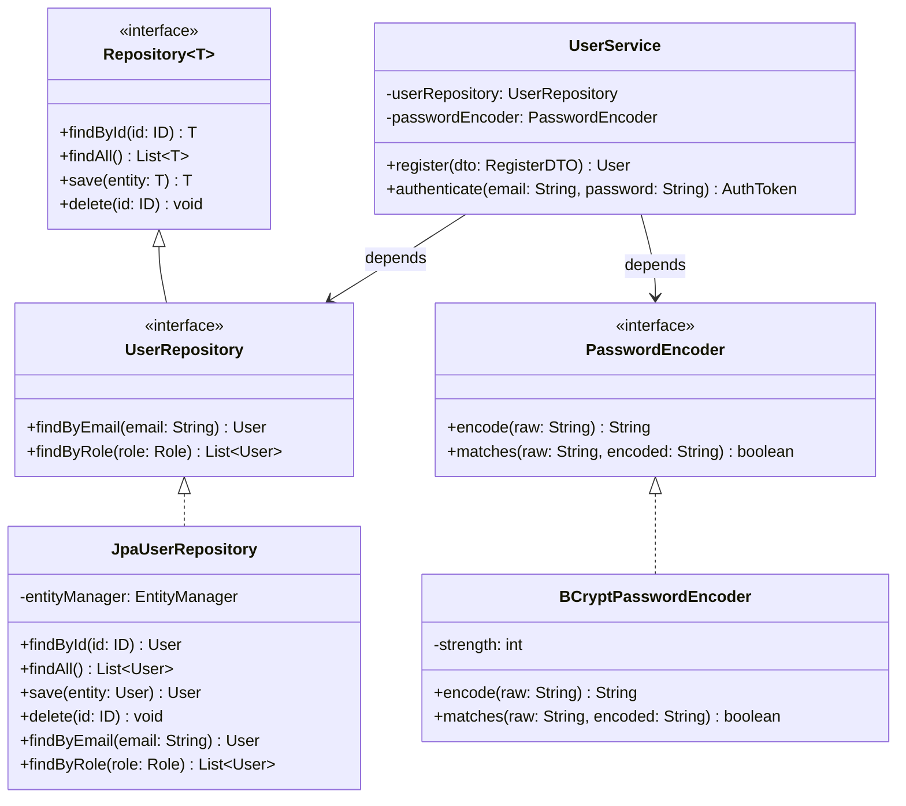
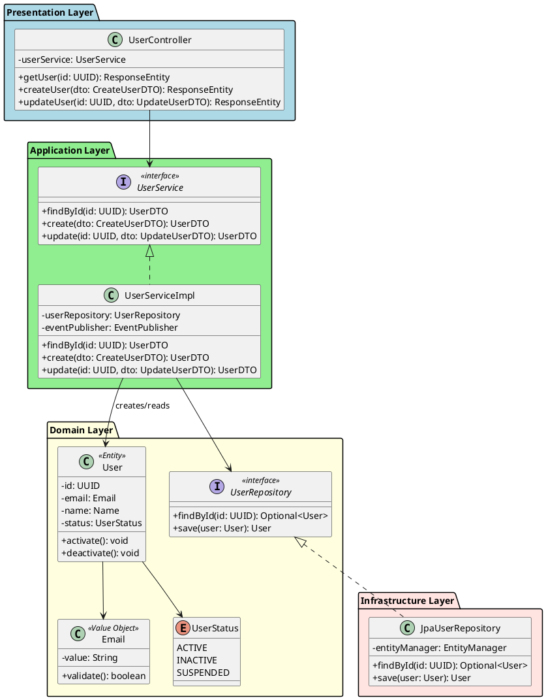

# Class Diagram Generator

**Quick Start:** Define classes with attributes/methods -> Add relationships (inheritance, composition, association) -> Apply styling and notes.

## Mermaid classDiagram (Preferred for Simple/Medium Complexity)

### Critical Rules

#### Rule 1: Mermaid Code Fence
Always output inside ` ```mermaid ` fenced code blocks using `classDiagram`.

#### Rule 2: Class Definition
```
class ClassName {
    +publicAttr : Type
    -privateAttr : Type
    #protectedAttr : Type
    ~packageAttr : Type
    +publicMethod(param: Type) ReturnType
    -privateMethod() void
    #protectedMethod()* ReturnType
    +abstractMethod()* void
    +staticMethod()$ ReturnType
}
```

Visibility prefixes:
| Prefix | Visibility |
|---|---|
| `+` | public |
| `-` | private |
| `#` | protected |
| `~` | package/internal |

Method modifiers:
| Suffix | Meaning |
|---|---|
| `*` | abstract |
| `$` | static |

#### Rule 3: Relationships
| Relationship | Syntax | Meaning |
|---|---|---|
| Inheritance | `Parent <\|-- Child` | Child extends Parent |
| Realization | `Interface <\|.. Implementation` | Implements interface |
| Composition | `Whole *-- Part` | Part cannot exist without Whole |
| Aggregation | `Container o-- Item` | Item can exist independently |
| Association | `ClassA --> ClassB` | Uses / references |
| Dependency | `ClassA ..> ClassB` | Depends on |
| Link (solid) | `ClassA -- ClassB` | Bidirectional association |

#### Rule 4: Cardinality
```
ClassA "1" --> "0..*" ClassB : contains
```

#### Rule 5: Annotations
```
class MyInterface {
    <<interface>>
}

class MyAbstract {
    <<abstract>>
}

class MyEnum {
    <<enumeration>>
    VALUE_A
    VALUE_B
}

class MyService {
    <<service>>
}
```

#### Rule 6: Generics
```
class List~T~ {
    +add(item: T) void
    +get(index: int) T
}
```

#### Rule 7: Namespace (Grouping)
```
namespace DomainLayer {
    class User
    class Order
}
```

### Template: E-Commerce Domain Model (Mermaid)



### Template: Repository Pattern (Mermaid)



## PlantUML (Preferred for Complex/Large Diagrams)

### When to Use PlantUML Over Mermaid
- Diagrams with 15+ classes
- Need for `skinparam` fine-tuning
- Package/namespace grouping with nesting
- Note blocks and constraints
- Stereotypes beyond `<<interface>>`

### Template: Layered Architecture Classes (PlantUML)



## Best Practices

1. **Group by layer or module** -- use `namespace` (Mermaid) or `package` (PlantUML) to organize
2. **Show visibility** -- always prefix attributes and methods with `+`, `-`, `#`, `~`
3. **Distinguish relationships** -- composition (`*--`) vs aggregation (`o--`) vs association (`-->`)
4. **Add cardinality** -- `"1"` to `"0..*"` on association ends
5. **Use annotations** -- `<<interface>>`, `<<abstract>>`, `<<enumeration>>`, `<<value object>>`
6. **Name relationships** -- label association arrows with role names
7. **Keep it focused** -- one diagram per bounded context or module; 8-15 classes per diagram
8. **Output format** -- ` ```mermaid ` for Mermaid, ` ```plantuml ` for PlantUML
