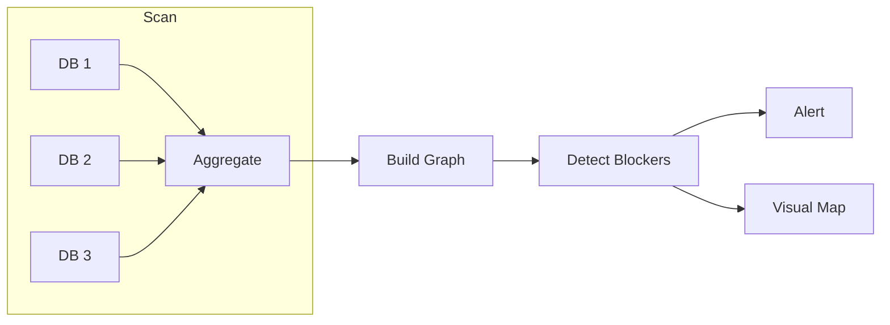

# Dependency Radar

## Output language

All outputs MUST be in Korean (한국어). Technical terms may remain in English.

## Overview
Scans multiple Notion project databases for cross-team linked items, builds a dependency graph, detects potential blockers and milestone delays, and generates visual dependency maps for planning and risk management.

## Autonomy Level
**L3** — Semi-autonomous; human reviews dependency findings and decides on escalation.

## Pipeline Architecture
Parallel scan of multiple Notion DBs → aggregate → build graph → detect blockers → alert → generate visual map.

### Mermaid Diagram


## Trigger Conditions
- English phrases such as "dependency radar", "cross-team dependencies", "blocker detection" (see YAML `description` for Korean triggers)
- `/dependency-radar` command
- Scheduled run (e.g., daily or before sprint planning)

## Skill Chain
| Step | Skill | Purpose |
|------|-------|---------|
| 1 | visual-explainer | Generate dependency graph visualization |
| 2 | gws-calendar | Cross-reference milestone dates |
| 3 | kwp-product-management-roadmap-management | Dependency-aware prioritization |
| 4 | md-to-notion | Publish dependency report to Notion |

## Output Channels
- **Notion**: Dependency report page with graph, blocker list, recommendations
- **Slack**: Alert on critical blockers or milestone delays

## Configuration
- `NOTION_PROJECT_DB_IDS`: Databases to scan for relations
- `SLACK_ALERT_CHANNEL_ID`: Channel for blocker alerts
- Blocker threshold: configurable delay days

## Example Invocation
```
"Run dependency radar"
"Detect cross-team blockers"
```
