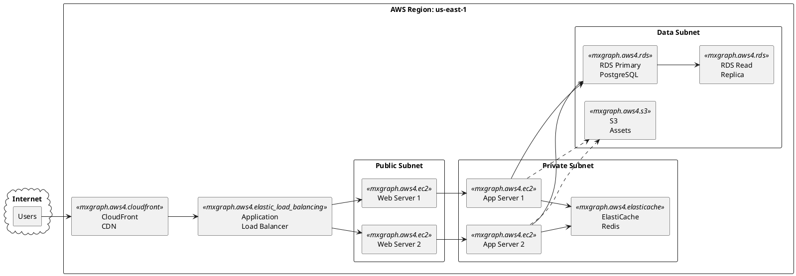
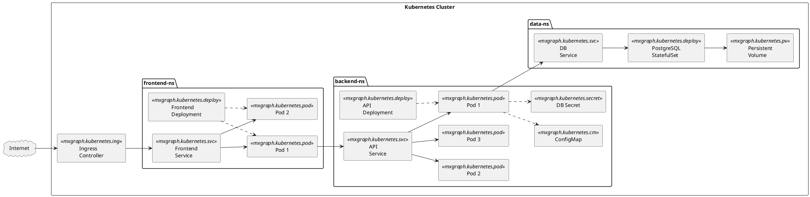
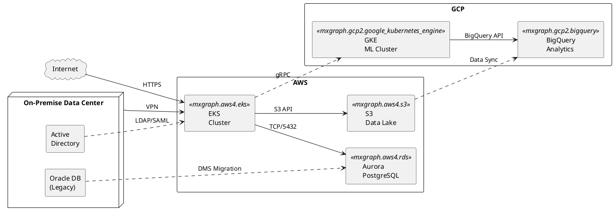

# Deployment Diagram Generator

**Quick Start:** Pick cloud provider -> Set direction -> Define nodes/services with stencil icons -> Group in regions/VPCs -> Connect with arrows.

## Critical Rules

### Rule 1: PlantUML Code Fence
Always output inside ` ```plantuml ` fenced code blocks with `@startuml` / `@enduml`.

### Rule 2: Direction
Use `left to right direction` for horizontal layouts (recommended for wide diagrams). Omit for vertical.

### Rule 3: Stencil Icon Syntax
Use `<<mxgraph.<provider>.<icon>>>` stereotype to apply cloud provider icons:
```
agent my_service <<mxgraph.aws4.lambda>> as "Lambda\nFunction"
```
Icons receive vendor-appropriate colors automatically.

### Rule 4: Provider Icon Libraries

#### AWS (`mxgraph.aws4.*`)
| Icon | Stencil | Use For |
|---|---|---|
| EC2 | `mxgraph.aws4.ec2` | Compute instances |
| Lambda | `mxgraph.aws4.lambda` | Serverless functions |
| S3 | `mxgraph.aws4.s3` | Object storage |
| RDS | `mxgraph.aws4.rds` | Relational database |
| DynamoDB | `mxgraph.aws4.dynamodb` | NoSQL database |
| ELB/ALB | `mxgraph.aws4.elastic_load_balancing` | Load balancer |
| CloudFront | `mxgraph.aws4.cloudfront` | CDN |
| VPC | `mxgraph.aws4.vpc` | Network boundary |
| EKS | `mxgraph.aws4.eks` | Kubernetes service |
| SQS | `mxgraph.aws4.sqs` | Message queue |
| SNS | `mxgraph.aws4.sns` | Notification service |
| API Gateway | `mxgraph.aws4.api_gateway` | API management |
| Route53 | `mxgraph.aws4.route_53` | DNS |
| IAM | `mxgraph.aws4.iam` | Identity & access |

#### Azure (`mxgraph.azure.*`)
| Icon | Stencil | Use For |
|---|---|---|
| VM | `mxgraph.azure.virtual_machine` | Compute |
| App Service | `mxgraph.azure.app_services` | PaaS web |
| AKS | `mxgraph.azure.kubernetes_services` | Kubernetes |
| SQL Database | `mxgraph.azure.sql_databases` | Database |
| Blob Storage | `mxgraph.azure.blob_storage` | Object storage |
| Functions | `mxgraph.azure.function_apps` | Serverless |
| VNet | `mxgraph.azure.virtual_networks` | Network |
| Load Balancer | `mxgraph.azure.load_balancers` | Load balancer |

#### GCP (`mxgraph.gcp2.*`)
| Icon | Stencil | Use For |
|---|---|---|
| Compute Engine | `mxgraph.gcp2.compute_engine` | Compute |
| GKE | `mxgraph.gcp2.google_kubernetes_engine` | Kubernetes |
| Cloud Functions | `mxgraph.gcp2.cloud_functions` | Serverless |
| Cloud SQL | `mxgraph.gcp2.cloud_sql` | Database |
| Cloud Storage | `mxgraph.gcp2.cloud_storage` | Object storage |
| Pub/Sub | `mxgraph.gcp2.cloud_pubsub` | Messaging |
| BigQuery | `mxgraph.gcp2.bigquery` | Data warehouse |

#### Kubernetes (`mxgraph.kubernetes.*`)
| Icon | Stencil | Use For |
|---|---|---|
| Pod | `mxgraph.kubernetes.pod` | Pod |
| Service | `mxgraph.kubernetes.svc` | Service |
| Deployment | `mxgraph.kubernetes.deploy` | Deployment |
| Ingress | `mxgraph.kubernetes.ing` | Ingress controller |
| ConfigMap | `mxgraph.kubernetes.cm` | Configuration |
| Secret | `mxgraph.kubernetes.secret` | Secrets |
| PV | `mxgraph.kubernetes.pv` | Persistent Volume |
| Namespace | `mxgraph.kubernetes.ns` | Namespace |

### Rule 5: Container Shapes
| Shape | Syntax | Use For |
|---|---|---|
| Region / VPC | `rectangle "us-east-1" { }` | Cloud region |
| Cluster | `package "EKS Cluster" { }` | K8s cluster |
| Availability Zone | `rectangle "AZ-a" { }` | AZ boundary |
| External | `cloud "Internet" { }` | External systems |
| On-prem | `node "Data Center" { }` | Physical infra |

### Rule 6: Connection Types
| Type | Syntax | Meaning |
|---|---|---|
| Solid | `-->` | Data flow / network |
| Dashed | `..>` | Async / eventual |
| Labeled | `--> : "HTTPS"` | Protocol / port |

## Template: AWS Three-Tier Architecture



## Template: Kubernetes Microservices Deployment



## Template: Multi-Cloud / Hybrid Topology



## Best Practices

1. **Group by network boundary** -- use `rectangle` for regions, VPCs, subnets, and AZs
2. **Use provider-specific icons** -- `mxgraph.aws4.*`, `mxgraph.azure.*`, `mxgraph.gcp2.*` for clarity
3. **Label connections with protocols** -- `HTTPS`, `gRPC`, `TCP/5432` on arrows
4. **Separate data plane from control plane** -- show management traffic as dashed arrows
5. **Show redundancy** -- include replicas, multi-AZ, and failover paths
6. **Use consistent naming** -- `<service>_<role>` pattern for IDs
7. **Output format** -- always output inside ` ```plantuml ` fenced code blocks
