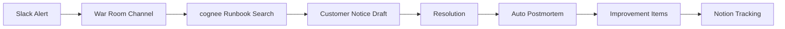

# Incident Lifecycle Manager

## Overview
Full incident lifecycle orchestration: Slack alert triggers war-room channel creation, runbook retrieval from Cognee knowledge graph, customer notice drafting, resolution tracking, auto-postmortem generation, improvement item extraction, and Notion tracking for follow-through.

## Autonomy Level
**L3** — Semi-autonomous; human leads war room and approves customer communications; automation handles runbooks, drafts, and tracking.

## Pipeline Architecture
Sequential: alert → war room → KG search → notice → resolve → postmortem → improve → track.

### Mermaid Diagram


## Trigger Conditions
- Production incident alert (Slack, PagerDuty, etc.)
- "incident lifecycle", "인시던트 관리", "full incident pipeline", "war room"
- `/incident-lifecycle-manager` with incident context

## Skill Chain
| Step | Skill | Purpose |
|------|-------|---------|
| 1 | incident-to-improvement | Core incident response, postmortem, improvements |
| 2 | cognee | Runbook retrieval from knowledge graph |
| 3 | sre-devops-expert | Technical runbook validation |
| 4 | md-to-notion | Incident record, postmortem, improvement tickets |
| 5 | kwp-customer-support-response-drafting | Customer notice draft |

## Output Channels
- **Slack**: War-room channel, status updates, customer notice draft
- **Notion**: Incident record, postmortem document, improvement tickets
- **Email**: Customer notice (via gws-gmail if configured)

## Configuration
- `SLACK_WAR_ROOM_PREFIX`: Channel naming for war rooms
- `COGNEE_INDEX`: Runbooks, past postmortems
- `NOTION_INCIDENT_DB_ID`: Incident tracking database

## Example Invocation
```
"Incident lifecycle: [alert context]"
"인시던트 관리 파이프라인 실행"
"Full incident pipeline for P1 outage"
```
