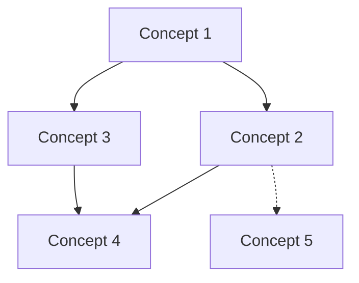

# KB Compile — Wiki Builder from Raw Sources

Transform raw source material into a structured, interconnected markdown wiki. The LLM reads all raw documents, identifies concepts, writes comprehensive articles, creates cross-references, and maintains navigational indexes — all automatically.

## Core Principle

**The wiki is the domain of the LLM.** Humans contribute raw sources; the LLM owns the wiki entirely. Every article, index, and link is generated and maintained by the compiler.

## Article Structure: Compiled Truth + Timeline

Every wiki article MUST use the two-part structure inspired by Garry Tan's GBrain:

1. **Compiled Truth** (mutable) — the current best understanding, rewritten whenever new evidence arrives. Written as definitive statements, not hedged summaries.
2. **Evidence Timeline** (append-only) — chronological log of all evidence with dates, sources, and what each added or changed.

```markdown
## Compiled Truth

[Current best understanding — rewritten holistically on each update]

## Evidence Timeline

- **2026-04-06** — [Source A]: [What this source established]
- **2026-04-03** — [Source B]: [What this source added or modified]
```

On incremental updates, rewrite Compiled Truth with the new synthesis; append new entries to Evidence Timeline. Never delete timeline entries.

### Evidence Diversity Scoring

After building the Evidence Timeline for each article, score its source diversity:

| Metric | Description |
|--------|-------------|
| **unique_sources** | Count of distinct raw source files cited |
| **date_spread_days** | Span between earliest and latest evidence date |
| **source_type_mix** | Number of distinct source types (web article, paper, report, slide, internal doc) |

Compute a diversity grade and add it to frontmatter:

```yaml
evidence_diversity: high    # 3+ sources, 30+ day spread, 2+ types
evidence_diversity: medium  # 2 sources OR 7-29 day spread
evidence_diversity: low     # single source, <7 day spread
```

Flag `low` diversity articles in the compile output log with:

```
⚠ LOW EVIDENCE DIVERSITY: wiki/concepts/{name}.md
  → Single source: raw/{source}.md
  → Consider ingesting additional perspectives before next compile
```

### Compiled Truth Quality Gate

Before finalizing the `## Compiled Truth` section of each article, verify that every Evidence Timeline entry is reflected in the compiled truth:

1. List all evidence entries from `## Evidence Timeline`
2. For each entry, confirm at least one sentence in `## Compiled Truth` addresses the information it contributed
3. If an evidence entry is not reflected, flag it as **orphan evidence**:

```
⚠ ORPHAN EVIDENCE: wiki/concepts/{name}.md
  → Timeline entry "2026-04-03 — Source B: Added pricing comparison data"
    is not reflected in Compiled Truth section
  → Action: Integrate this evidence or explain why it was excluded
```

Do not block compilation on orphan evidence — log the warnings and continue. The warnings feed into `kb-lint` for follow-up.

## Prerequisites

- Raw sources must exist in `knowledge-bases/{topic}/raw/`
- At least one source document is required
- `manifest.json` must exist (created by kb-ingest)

## Mechanical vs LLM Compile (separation of concerns)

Wiki building has two distinct phases that must NOT be conflated:

| Phase | Tool | Cost | When |
|-------|------|------|------|
| **Mechanical scaffolding** | `scripts/kb_auto_compile.py {topic}` | ~free, ~1s | After every raw/ change. Generates `references/*.md`, `_index.md`, `_glossary.md` placeholders, `_summary.md` placeholder. Pure file I/O + frontmatter parsing, no LLM. |
| **LLM synthesis** (this skill) | Claude subagents per article | ~$0.50–5 per topic | On demand only — produces `concepts/*.md`, fills `_summary.md`, `_concept-map.md`, draws `images/*` Mermaid. |

The mechanical step is safe to wire into hooks (e.g. `.claude/hooks/kb-intel-compile.py` runs on Stop when `.compile-pending` flag is present). The LLM step must remain user-triggered to control cost and avoid silent token spend.

When ingestion writes new raw files, the orchestrator should:
1. Touch `knowledge-bases/{topic}/.compile-pending`
2. Let the Stop hook run mechanical scaffolding
3. Surface a TODO ("kb-compile {topic} pending") for the user to invoke this skill manually when synthesis is wanted

## Wiki Directory Structure

```
knowledge-bases/{topic}/wiki/
├── _index.md               # Master index: all articles with one-line summaries
├── _summary.md             # Topic-level executive summary
├── _concept-map.md         # Visual concept relationship map (Mermaid)
├── _glossary.md            # Key terms and definitions
├── concepts/               # Core concept articles
│   ├── {concept-1}.md
│   ├── {concept-2}.md
│   └── ...
├── references/             # Source-derived reference articles
│   ├── {source-1}-notes.md
│   └── ...
├── connections/            # Cross-concept synthesis articles
│   ├── {topic-a}-vs-{topic-b}.md
│   └── ...
└── images/                 # Generated diagrams and charts
    └── ...
```

## Workflow

### Step 1: Survey Raw Sources

Read `manifest.json` to get the source inventory. Then read each raw file, building a mental model of:

- Key concepts mentioned across sources
- Relationships between concepts
- Areas of agreement and disagreement
- Gaps in coverage

### Step 2: Plan Wiki Structure

Based on the survey, plan the wiki structure:

1. **Identify 10-30 core concepts** that appear across multiple sources
2. **Group into categories** (if the topic warrants subcategories)
3. **Identify connections** — concepts that bridge or contrast
4. **Note gaps** — important subtopics not covered by raw sources

Write the plan to a temporary `_compile-plan.md` (deleted after compilation).

### Step 3: Generate Concept Articles

For each identified concept, write a wiki article following this template:

```markdown
---
title: "Concept Name"
category: "concepts"
related: ["concept-2", "concept-3"]
sources: ["raw/source-1.md", "raw/source-2.md"]
last_compiled: "2026-04-03"
word_count: 850
---

# Concept Name

[2-3 sentence definition and significance]

## Overview

[Comprehensive explanation synthesized from multiple sources]

## Key Details

[Technical details, mechanisms, important nuances]

## Connections

- **Related to [[concept-2]]**: [how they relate]
- **Contrasts with [[concept-3]]**: [key differences]
- **Builds on [[concept-4]]**: [dependency relationship]

## Sources

- [Source Title 1](../raw/source-1.md) — [what this source contributes]
- [Source Title 2](../raw/source-2.md) — [what this source contributes]
```

### Step 4: Generate Reference Notes

For each raw source, create a reference note summarizing the key takeaways:

```markdown
---
title: "Notes: {Source Title}"
category: "references"
source: "raw/{slug}.md"
concepts_mentioned: ["concept-1", "concept-2"]
last_compiled: "2026-04-03"
---

# Notes: {Source Title}

**Source:** [{title}]({url})
**Author:** {author} | **Date:** {date}

## Key Takeaways

1. [Major point 1]
2. [Major point 2]
3. [Major point 3]

## Concepts Covered

- **[[concept-1]]**: [how this source discusses it]
- **[[concept-2]]**: [how this source discusses it]

## Notable Quotes

> "Direct quote from source" — {author}

## Open Questions

- [Question raised but not fully answered]
```

### Step 4b: Connection Auto-Suggestion

After generating all concept articles in Step 4, run a lightweight co-occurrence check:

1. For each newly created or updated concept article, extract its `related` frontmatter and entity mentions
2. Build a mention-overlap matrix: concept pairs that share 3+ entity mentions or 2+ raw sources but have no existing `connections/` document
3. Log suggested connections in the compile output:

```
💡 SUGGESTED CONNECTION: [[gpu-inference-tco]] ↔ [[cogs-gpu-cost-structure]]
   → Share 4 entity mentions: GPU, NVIDIA, cost-per-token, inference
   → Share 2 raw sources: raw/gpu-pricing-2026.md, raw/cloud-cost-benchmark.md
   → No existing connections/ document found
   → Type suggestion: comparison (cost analysis perspectives)
```

4. Write all suggestions to `knowledge-bases/{topic}/outputs/connection-suggestions-{date}.md`
5. Do NOT auto-create connection articles — suggestions are advisory for manual review or `wiki-connection-discoverer`

### Step 5: Generate Connection Articles

For notable cross-concept relationships:

```markdown
---
title: "{Concept A} vs {Concept B}"
category: "connections"
concepts: ["concept-a", "concept-b"]
last_compiled: "2026-04-03"
---

# {Concept A} vs {Concept B}

[Analysis of the relationship, comparison, or synthesis]
```

### Step 6: Build Index Files

**`_index.md`** — Master index:

```markdown
# {Topic} Knowledge Base

> Compiled from {N} sources | {M} articles | ~{W}K words
> Last compiled: {date}

## Concepts

| Article | Summary | Sources |
|---------|---------|---------|
| [[concept-1]] | One-line summary | 3 |
| [[concept-2]] | One-line summary | 2 |

## References

| Source | Key Concepts | Date |
|--------|-------------|------|
| [[source-1-notes]] | concept-1, concept-3 | 2026-01 |

## Connections

| Article | Bridging |
|---------|----------|
| [[concept-a-vs-concept-b]] | concept-a ↔ concept-b |
```

**`_summary.md`** — Executive summary (500-1000 words):

```markdown
# {Topic}: Executive Summary

[High-level overview of the entire knowledge base]

## Core Themes

1. [Theme 1]: [brief]
2. [Theme 2]: [brief]

## Key Insights

- [Insight that emerges from synthesizing multiple sources]

## Open Questions

- [Important unresolved questions]
```

**`_concept-map.md`** — Visual relationship map:

````markdown
# Concept Map


````

**`_glossary.md`** — Key terms:

```markdown
# Glossary

| Term | Definition | See Also |
|------|-----------|----------|
| Term 1 | Brief definition | [[concept-1]] |
```

### Step 7: Rebuild SQLite Index

After wiki compilation, rebuild the brain index for fast search:

```bash
python scripts/kb_index_db.py --incremental
```

This updates FTS5 full-text search, wikilink graphs, and tag indexes. Add `--embed` to regenerate vector embeddings (requires OPENAI_API_KEY).

### Step 8: Update Manifest

Update `manifest.json` with wiki stats:

```json
{
  "stats": {
    "raw_count": 15,
    "wiki_articles": 28,
    "total_words": 42000,
    "last_compiled": "2026-04-03",
    "concepts": 18,
    "references": 15,
    "connections": 5
  }
}
```

### Step 9: Report

```
✓ Wiki compiled for: {topic}
  Concepts: {N} articles
  References: {M} source notes
  Connections: {C} synthesis articles
  Total words: ~{W}K
  Index files: _index.md, _summary.md, _concept-map.md, _glossary.md
  SQLite index: brain_index.db updated ({P} pages indexed)
  Evidence diversity: {H} high, {M} medium, {L} low
  Orphan evidence warnings: {O}
  Connection suggestions: {S} new pairs → outputs/connection-suggestions-{date}.md
```

## Incremental Compilation

When new raw sources are added after initial compilation:

1. Read only the new/modified raw sources
2. Identify new concepts or updates to existing ones
3. Update affected articles (preserve existing content, augment)
4. Regenerate index files
5. Update `_concept-map.md` with new relationships

**Never delete existing wiki articles** during incremental compilation unless the user explicitly requests a full recompile.

## Cross-Reference Syntax

Use wiki-style links for internal references:

- `[[concept-name]]` — link to concept article
- `[[source-notes]]` — link to reference notes
- `[text](../raw/source.md)` — link to raw source

## Examples

### Example 1: Initial compilation

**User says:** "Compile the transformer-architectures KB"

**Actions:**
1. Read all files in `knowledge-bases/transformer-architectures/raw/`
2. Identify concepts: attention mechanism, positional encoding, multi-head attention, etc.
3. Generate ~15 concept articles, ~10 reference notes, ~5 connection articles
4. Build all index files
5. Update manifest

### Example 2: Incremental update

**User says:** "I added 3 new papers to the KB, recompile"

**Actions:**
1. Compare manifest sources vs raw/ directory to find new files
2. Read only new sources
3. Update existing articles where new data applies
4. Create new articles for new concepts
5. Regenerate index files

## Obsidian Compatibility

Compiled wiki articles use `[[wikilinks]]` for cross-references, which render natively in Obsidian when you open `knowledge-bases/` (or a topic folder) as a vault. Configure Graph View, folders, and plugins in Obsidian locally; there is no repo-bundled Obsidian setup doc.

## Error Handling

| Error | Symptom | Action |
|-------|---------|--------|
| No raw sources | Empty raw/ directory | Prompt user to run kb-ingest first |
| Source too large | Single raw file > 100K words | Split processing, use SemanticSearch within file |
| Concept ambiguity | Same term means different things in different sources | Create disambiguation article |
| Circular references | Concepts reference each other in loops | Acceptable — ensure backlinks are consistent |

## Gotchas

- **Symptom:** Empty `wiki/` after compile. **Root cause:** `raw/` had zero ingest files. **Correct approach:** Confirm `raw/` has content and `manifest.json` reflects sources before compiling.
- **Symptom:** Low evidence-diversity score despite one excellent source. **Root cause:** Scoring measures source variety, not authority. **Correct approach:** Pair diversity flags with qualitative judgment; a single authoritative source can be sufficient.
- **Symptom:** Implausible connection suggestions. **Root cause:** Shared generic terms (e.g. "cloud", "platform") inflate co-occurrence. **Correct approach:** Review every suggestion; do not auto-file without human or explicit follow-up skill pass.

## Constraints

- One topic per compile run; no multi-topic merge in a single invocation.
- Compilation overwrites existing `wiki/`; commit or back up before full recompile.
- Evidence diversity is heuristic: 0.3 from two strong sources may beat 0.9 from ten shallow posts.
- Compiled Truth quality gate is advisory: it logs orphan evidence but does not block the compile.

## Composability

- **kb-ingest** — supplies `raw/` material the compiler consumes.
- **kb-lint** — validates compiled `wiki/`; run after compile.
- **kb-index** — rebuilds navigation metadata when wiki structure changes.
- **wiki-connection-discoverer** — extends connection discovery beyond compile-time suggestions.
- **kb-coverage-dashboard** — aggregates compile metrics (e.g. evidence diversity) for health views.

## Output Discipline

- Articles must synthesize and cross-reference; do not paste or lightly paraphrase raw text as the wiki body.
- Do not add claims not grounded in Evidence Timeline entries (or clearly mark and source new ingest first).
- Avoid boilerplate intros/outros that inflate length without new information.

## Honest Reporting

- State real compile stats: if half of articles fail the Compiled Truth gate, report that fraction explicitly.
- Never hide or soften evidence-diversity warnings to "look green."
- If connection auto-suggestion returns nothing, report **no suggestions**; do not invent pairs.
