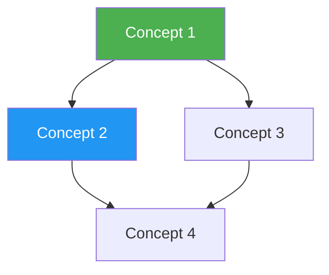

# KB Index — Wiki Index Maintainer

Auto-maintain navigational index files that let an LLM efficiently find and reference articles in a Knowledge Base wiki. Scans all wiki articles, extracts metadata, and regenerates index files.

## Why This Matters

At ~400K words, an LLM cannot read the entire wiki for every query. Index files provide a lightweight map — the LLM reads the index first (~2-5K tokens), identifies relevant articles, then reads only those. This is the "poor man's RAG" that Karpathy describes.

## Prerequisites

- Wiki must exist at `knowledge-bases/{topic}/wiki/`
- At least some articles with YAML frontmatter

## Workflow

### Step 0: Read Schema (MANDATORY)

Before any indexing, read `_schema.md` from the KB root directory. Extract:

- **Conventions**: naming rules, language, date format, preferred terminology
- **Quality Gates**: required frontmatter fields, minimum article standards
- **Domain Rules**: glossary terms that must appear, required index sections

If `_schema.md` does not exist, warn the user and suggest running `kb-orchestrator init` first. Proceed with defaults if the user chooses to continue.

### Step 1: Scan Wiki Directory

List all `.md` files in `wiki/` and subdirectories, excluding files starting with `_` (index files themselves):

```bash
find knowledge-bases/{topic}/wiki -name "*.md" ! -name "_*" -type f | sort
```

### Step 2: Extract Metadata

For each article, read its YAML frontmatter to extract:
- `title`
- `category` (concepts, references, connections)
- `related` (list of related concepts)
- `sources` (list of raw source files)
- `word_count`
- `last_compiled`

If frontmatter is missing or incomplete, parse the file to estimate:
- Title from first `# ` heading
- Word count from body text
- Category from directory path

### Step 3: Regenerate `_index.md`

Build a comprehensive index organized by category:

```markdown
# {Topic} Knowledge Base Index

> {N} articles | ~{W}K total words | Last indexed: {date}

## Quick Navigation

- [Concepts](#concepts) ({N1} articles)
- [References](#references) ({N2} articles)
- [Connections](#connections) ({N3} articles)

## Concepts

| # | Article | Summary | Words | Related | Sources |
|---|---------|---------|-------|---------|---------|
| 1 | [[concept-name]] | Brief one-liner | 850 | 3 | 2 |
| 2 | ... | ... | ... | ... | ... |

## References

| # | Source | Key Concepts | Words | Date |
|---|--------|-------------|-------|------|
| 1 | [[source-notes]] | concept-1, concept-3 | 600 | 2026-01 |

## Connections

| # | Article | Bridging | Words |
|---|---------|----------|-------|
| 1 | [[a-vs-b]] | concept-a ↔ concept-b | 500 |

## Statistics

- Total articles: {N}
- Total words: ~{W}K
- Average article length: ~{avg} words
- Most connected concept: {name} ({N} links)
- Most cited source: {name} ({N} references)
```

### Step 4: Regenerate `_summary.md`

Read the top 5-10 most interconnected concept articles and synthesize a 500-1000 word executive summary of the entire KB.

### Step 5: Regenerate `_concept-map.md`

Build a Mermaid diagram from the `related` fields:

````markdown
# Concept Map



## Legend

- **Green nodes**: Hub concepts (3+ connections)
- **Blue nodes**: Standard concepts
- **Dashed lines**: Weak/speculative connections
````

### Step 6: Regenerate `_glossary.md`

Scan all articles for defined terms (bold terms, heading terms) and compile:

```markdown
# Glossary

| Term | Definition | Article |
|------|-----------|---------|
| Attention | Mechanism for weighing input relevance | [[attention-mechanism]] |
```

### Step 6.5: Raw-Wiki Drift Detection

Compare `raw/` sources against wiki articles to detect drift:

1. **Uncovered sources** — raw files not referenced by ANY wiki article's `sources:` frontmatter
2. **Stale articles** — wiki articles whose ALL source files have been updated since `last_compiled`
3. **Orphan concepts** — wiki concepts not connected to any raw source

Report drift as a summary table:

```markdown
## Raw-Wiki Drift Report

| Type | Count | Details |
|------|-------|---------|
| Uncovered sources | 2 | raw/new-paper.md, raw/blog-post.md |
| Stale articles | 1 | concepts/attention.md (source updated 2026-04-01, compiled 2026-03-15) |
| Orphan concepts | 0 | — |
```

If drift is detected, recommend running `kb-compile` (incremental) to resolve.

### Step 6.6: Glossary-Schema Alignment

If `_schema.md` defines domain rules or a preferred terminology list:

1. Compare `_glossary.md` terms against schema-defined terms
2. Flag terms present in the schema but missing from the glossary
3. Flag glossary terms that use non-preferred terminology per the schema
4. Suggest `SCHEMA-SUGGEST` entries for new terms discovered in wiki articles but absent from both glossary and schema

### Step 7: Update Manifest Stats

Update `manifest.json` with current stats from the index scan.

## Examples

### Example 1: Rebuild after manual edit

**User says:** "I edited a few wiki articles, rebuild the index"

**Actions:**
1. Scan all wiki articles
2. Regenerate all `_` prefixed files
3. Report changes (new articles found, removed articles, updated stats)

### Example 2: Full reindex

**User says:** "kb index transformer-architectures"

**Actions:**
1. Scan `knowledge-bases/transformer-architectures/wiki/`
2. Regenerate `_index.md`, `_summary.md`, `_concept-map.md`, `_glossary.md`
3. Update `manifest.json`

## Distinction from `_log.md`

`_index.md` and `_log.md` serve different purposes — do NOT confuse them:

| File | Purpose | Updated by |
|------|---------|------------|
| `_index.md` | **Content catalog** — what articles exist, their topics, and links | kb-index (regenerated from wiki content) |
| `_log.md` | **Operations chronicle** — what happened, when, in what order | All skills (append-only) |

`_index.md` is regenerated from scratch on each index rebuild. `_log.md` is append-only and never regenerated — it preserves the full operational history.

## Dataview-Compatible Frontmatter

When generating or updating articles, encourage consistent YAML frontmatter fields that work with [Obsidian Dataview](https://blacksmithgu.github.io/obsidian-dataview/):

```yaml
---
title: "Attention Mechanisms"
created: 2026-04-05
updated: 2026-04-05
tags: [transformer, attention, architecture]
source_count: 3
word_count: 1200
status: active
---
```

During index rebuild, validate that articles have the minimum required fields (`title`, `created`, `tags`) and warn about missing fields.

## Operations Log

After every index rebuild, append to `_log.md` using the **grep-parseable H2 heading format** (never overwrite or truncate):

```markdown
## [2026-04-03 16:00] INDEX | articles: 18 | broken_links: 2 | orphans: 1 | drift: 3 uncovered sources

## [2026-04-03 16:00] INDEX | glossary_terms: 45 | schema_missing: 3 | non_preferred: 1
```

Format: `## [YYYY-MM-DD HH:MM] INDEX | key metrics...`

If glossary-schema alignment finds issues, also append co-evolution suggestions:

```markdown
## [2026-04-03 16:05] SCHEMA-SUGGEST | source: kb-index | rule: "Add 'fine-tuning' to preferred terminology" | status: pending-review
```

## Error Handling

| Error | Symptom | Action |
|-------|---------|--------|
| No schema | `_schema.md` missing | Warn user, suggest `kb-orchestrator init`, proceed with defaults |
| Schema parse error | Malformed `_schema.md` | Report parse error, fall back to defaults |
| No wiki articles | Empty wiki/ directory | Prompt to run kb-compile first |
| Missing frontmatter | Articles lack YAML headers | Infer metadata from content, warn user |
| Broken links | `[[concept]]` points to nonexistent file | List broken links in report |
| Orphan articles | Articles not referenced by any other | List orphans in report |
