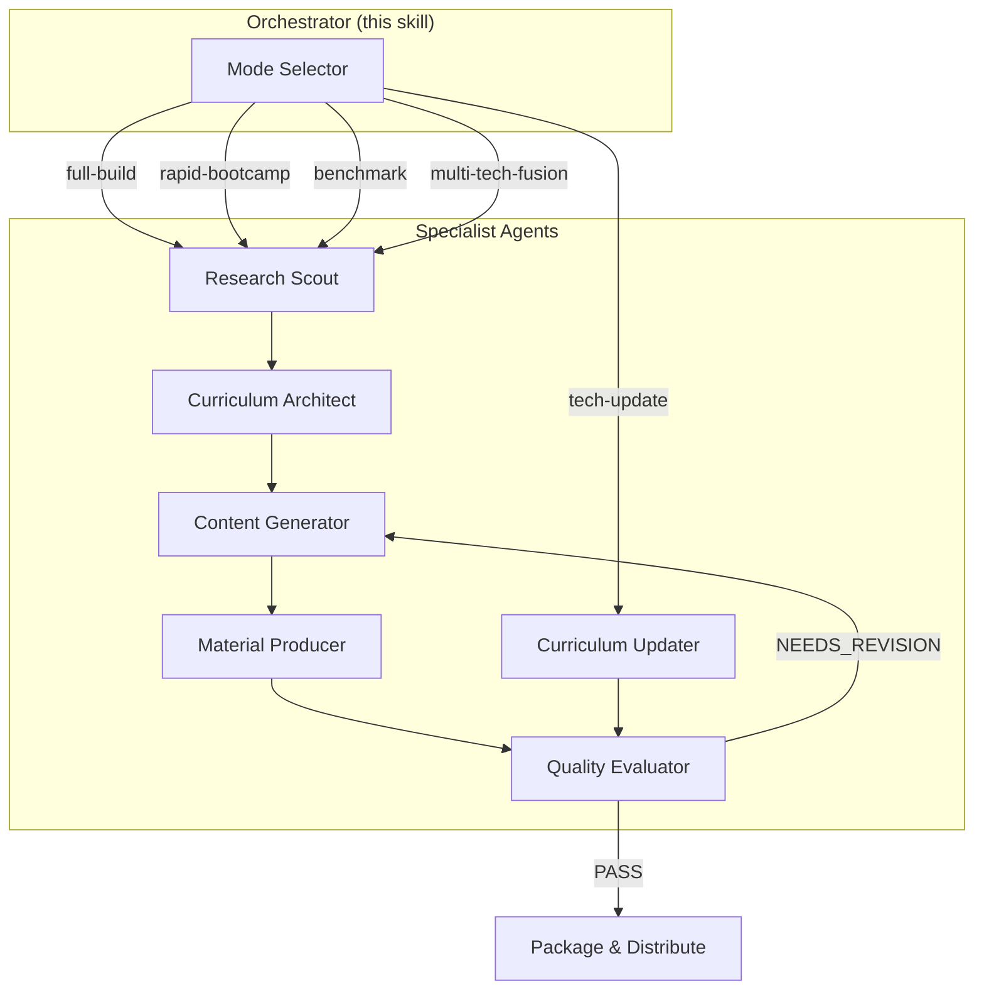

# NLM Curriculum Harness

Meta-harness that orchestrates 6 specialist agents across 5 operational modes to build, update, benchmark, and fuse DL/LLM curricula. When a new technology emerges (e.g., Mamba SSM, Mixture-of-Experts, RLHF, GRPO), this harness adapts without rebuilding from scratch — the updater agent surgically modifies affected modules while the quality-eval agent ensures pedagogical integrity.

## Architecture



## Agents

| Agent | File | Role |
|-------|------|------|
| Research Scout | `agents/research-scout.md` | Discover and rank source materials |
| Curriculum Architect | `agents/architect.md` | Design learning progression and Bloom's staircase |
| Content Generator | `agents/content-gen.md` | Write content and ingest into NLM notebooks |
| Material Producer | `agents/material-prod.md` | Batch-produce slides, audio, video, quizzes, flashcards |
| Quality Evaluator | `agents/quality-eval.md` | 7-dimension rubric scoring with pass/fail gate |
| Curriculum Updater | `agents/updater.md` | Surgical updates when new tech emerges |

## 5 Operational Modes

### Mode 1: `full-build`

Build a complete curriculum from scratch for a new DL/LLM technology.

**Pipeline:** Research Scout → Architect → Content Gen → Material Prod → Quality Eval → (loop if NEEDS_REVISION) → Package

**Example:** "Build a 14-week graduate course on Vision Transformers"

```
Agents: RS → AR → CG → MP → QE
Pattern: Sequential pipeline with evaluator-optimizer loop at QE
Max iterations: 2 (QE → CG revision loop)
```

### Mode 2: `tech-update`

Update an existing curriculum when a new technology, paper, or method emerges.

**Pipeline:** Updater → Quality Eval → (selective Content Gen if needed) → Material Prod

**Example:** "Mamba SSM was just published — update the Sequence Models curriculum"

```
Agents: UP → QE → (CG if revision needed) → MP
Pattern: Updater-first with selective regeneration
Input: existing course-slug + new technology description
```

### Mode 3: `rapid-bootcamp`

Compress a technology into a 1-3 day intensive workshop format.

**Pipeline:** Research Scout (scope=rapid) → Architect (bootcamp mode) → Content Gen → Material Prod (minimal set) → Quality Eval (quick mode)

**Example:** "Create a 2-day hands-on bootcamp for LoRA fine-tuning"

```
Agents: RS(rapid) → AR(bootcamp) → CG → MP(slides+quiz only) → QE(quick)
Pattern: Compressed sequential pipeline
Artifact set: slides + quiz only (no audio, video, mind map)
```

### Mode 4: `benchmark`

Compare your curriculum against competitor/reference courses.

**Pipeline:** Research Scout (competitor discovery) → Architect (benchmark mode) → Quality Eval (comparative)

**Example:** "Compare our Transformer course against Stanford CS224N and NYU DS-GA 1011"

```
Agents: RS(competitors) → AR(benchmark) → QE(comparative)
Pattern: Analysis-only pipeline (no content generation)
Output: coverage matrix, depth comparison, differentiation report
```

### Mode 5: `multi-tech-fusion`

Build a curriculum that synthesizes multiple related technologies into one cohesive course.

**Pipeline:** Research Scout (parallel per tech) → Architect (fusion mode) → Content Gen → Material Prod → Quality Eval

**Example:** "Build a course covering Transformer, Mamba SSM, RWKV, and xLSTM as competing sequence architectures"

```
Agents: RS×N(parallel) → AR(fusion) → CG → MP → QE
Pattern: Fan-out at RS (one per technology), fan-in at AR
Research Scout runs in parallel subagents for each technology
```

## Orchestration Protocol

### Step 1: Mode Selection

```python
if user requests new curriculum from scratch:
    mode = "full-build"
elif user mentions updating existing curriculum with new tech:
    mode = "tech-update"
elif user wants short workshop/bootcamp:
    mode = "rapid-bootcamp"
elif user wants to compare/benchmark curricula:
    mode = "benchmark"
elif user wants to combine multiple technologies:
    mode = "multi-tech-fusion"
```

Use `AskQuestion` if mode is ambiguous.

### Step 2: Input Collection

Collect via `AskQuestion` or user message:

| Field | Required For | Default |
|-------|-------------|---------|
| `course_title` | all modes | — |
| `topic` / `technologies` | all modes | — |
| `target_audience` | full-build, rapid-bootcamp, multi-tech-fusion | professional |
| `weeks` | full-build, multi-tech-fusion | 12 |
| `existing_course_slug` | tech-update, benchmark | — |
| `new_technology` | tech-update | — |
| `competitor_courses` | benchmark | auto-discovered |
| `bootcamp_days` | rapid-bootcamp | 2 |
| `quality_threshold` | all modes | 7.0 |

Persist to: `outputs/curriculum/{course-slug}/phase1-input.json`

### Step 3: Agent Dispatch

Each agent runs as a Task tool subagent with:
- Agent definition file read from `agents/{name}.md`
- Reference files from `references/` (system-prompt, templates)
- File-based data transfer via `outputs/curriculum/{course-slug}/`

**Sequential agents** use the Shell or Task tool serially.
**Parallel agents** (multi-tech-fusion RS) use multiple Task tool calls in one message.

### Step 4: Quality Gate

After Quality Evaluator:
- **PASS** (composite ≥ threshold): proceed to packaging
- **NEEDS_REVISION**: feed revision requests back to Content Generator, re-run Material Producer for affected modules, re-evaluate (max 2 iterations)

### Step 5: Package & Distribute

1. Generate `manifest.json` with all artifacts
2. Generate `curriculum-overview.docx` via `anthropic-docx`
3. Optionally upload to Google Drive via `gws-drive`
4. Optionally post summary to Slack `#효정-할일`

## File Structure

```
outputs/curriculum/{course-slug}/
├── phase1-input.json
├── research-scout-report.json          ← Research Scout output
├── authority-map.md                    ← Architect output
├── syllabus.md                         ← Content Gen output
├── syllabus.docx
├── quality-report.json                 ← Quality Eval output
├── update-log-v{X.Y}.json             ← Updater output (tech-update mode)
├── artifact-manifest.json              ← Material Prod output
├── curriculum-overview.docx
├── manifest.json
└── modules/
    ├── module-01-{slug}/
    │   ├── lesson-plan.md
    │   ├── study-guide.md
    │   ├── nlm-notebook-id.txt
    │   └── artifacts/
    │       ├── slides-expert.pdf
    │       ├── slides-elementary.pdf
    │       ├── audio-podcast.mp3
    │       ├── quiz.pdf
    │       ├── flashcards.pdf
    │       └── mind-map.pdf
    ├── module-02-{slug}/
    ...
```

## Usage Examples

### Example 1: Full Build — Vision Transformers Course

```
/nlm-curriculum-harness full-build \
  --title "Vision Transformers: From ViT to DINOv2" \
  --audience graduate \
  --weeks 14 \
  --sources papers/vit.pdf papers/deit.pdf papers/dinov2.pdf \
  --urls "https://arxiv.org/abs/2010.11929" \
  --drive --slack
```

Pipeline: RS → AR → CG → MP → QE → Package

### Example 2: Tech Update — Adding Mamba to Sequence Models

```
/nlm-curriculum-harness tech-update \
  --course sequence-models-2024 \
  --new-tech "Mamba: Linear-Time Sequence Modeling with Selective State Spaces" \
  --paper "https://arxiv.org/abs/2312.00752"
```

Pipeline: UP(impact analysis) → QE → CG(revision) → MP(new module) → Package

### Example 3: Rapid Bootcamp — LoRA Fine-Tuning

```
/nlm-curriculum-harness rapid-bootcamp \
  --title "LoRA Fine-Tuning Masterclass" \
  --days 2 \
  --audience professional \
  --urls "https://arxiv.org/abs/2106.09685" "https://huggingface.co/docs/peft"
```

Pipeline: RS(rapid) → AR(bootcamp) → CG → MP(slides+quiz) → QE(quick) → Package

### Example 4: Benchmark — Compare Against Top Programs

```
/nlm-curriculum-harness benchmark \
  --course our-ml-fundamentals \
  --competitors "Stanford CS229" "MIT 6.036" "NYU DS-GA 1003"
```

Pipeline: RS(competitors) → AR(benchmark) → QE(comparative) → Report

### Example 5: Multi-Tech Fusion — Competing Sequence Architectures

```
/nlm-curriculum-harness multi-tech-fusion \
  --title "Modern Sequence Architectures: Transformer vs Mamba vs RWKV vs xLSTM" \
  --technologies "Transformer" "Mamba SSM" "RWKV" "xLSTM" \
  --weeks 12 --audience graduate
```

Pipeline: RS×4(parallel) → AR(fusion) → CG → MP → QE → Package

## Prerequisites

- `notebooklm-mcp` MCP server registered and authenticated
- `anthropic-docx` skill for DOCX generation
- `parallel-web-search` or `WebSearch` for research scout
- `alphaxiv-paper-lookup` or `feynman-alpha-research` for paper discovery
- `hf-papers`, `hf-models` for HuggingFace resource discovery
- Optionally: `gws-drive` for Drive upload, Slack MCP for distribution

## References

Shared reference files inherited from `nlm-curriculum-builder`:

- `../nlm-curriculum-builder/references/system-prompt.md` — curriculum designer persona
- `../nlm-curriculum-builder/references/syllabus-template.md` — syllabus format
- `../nlm-curriculum-builder/references/lesson-plan-template.md` — lesson plan format

## Meta-Harness Optimizer Compatibility

This harness is designed for outer-loop optimization via `meta-harness-optimizer`:

- **Trace capture**: Each agent produces structured JSON output compatible with `TraceArchive`
- **Mutation targets**: Agent protocols, NLM query prompts, quality rubric weights
- **Pareto objectives**: Quality score (D1-D7 composite), total generation time, artifact count, source utilization rate
- **Baseline**: First full-build run establishes the optimization baseline

To run optimization:
```
/meta-harness-optimizer --target nlm-curriculum-harness --mode full-build --runs 3
```

## Related Skills

- **nlm-curriculum-builder** — original single-pass curriculum builder (delegates to this harness for complex cases)
- **notebooklm** — notebook/source CRUD
- **notebooklm-studio** — ad-hoc studio operations
- **nlm-deep-learn** — personal accelerated learning
- **nlm-dual-slides** — dual-audience slide generation
- **harness** — general-purpose harness architecture skill
- **meta-harness-optimizer** — outer-loop code-level optimization
