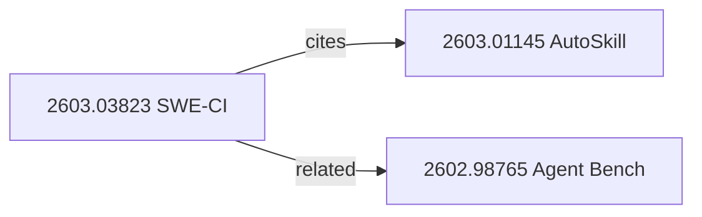

# Paper Archive

Central catalog that indexes all papers across paper-review,
related-papers-scout, alphaxiv-paper-lookup, and nlm-arxiv-slides into a
single searchable JSON index with relationship tracking and external sync.

## Prerequisites

- `outputs/papers/` directory exists
- `notebooklm-mcp` MCP server authenticated (for `sync-nlm`)
- `plugin-notion-workspace-notion` MCP server connected (for `sync-notion`)
- Semantic Scholar API access (for metadata enrichment during `register`)

## Reference Files

Read these as needed during execution:

- `references/index-schema.md` — JSON schema, field types, validation rules
- `references/workflow-steps.md` — Per-command detailed instructions
- `references/integration-hooks.md` — How paper-review and related-papers-scout auto-register

## Index Location

`outputs/papers/index.json`

If the file does not exist, create it with the empty scaffold:

```json
{
  "version": "1.0.0",
  "updated_at": "",
  "papers": [],
  "relationships": []
}
```

---

## Sub-Commands

### register

**Usage**: `paper-archive register <arXiv-ID or URL> [--status STATUS] [--tags "t1,t2"]`

Add a paper to the archive. Fetches metadata automatically.

1. Parse input to extract arXiv ID (from URL or raw ID).
2. **Dedup check** — if the ID already exists in the index, report it and
   stop (unless `--force` is set).
3. Fetch metadata:
   - Try Semantic Scholar API: `GET https://api.semanticscholar.org/graph/v1/paper/ArXiv:{ID}?fields=title,authors,year,abstract,externalIds,citationCount,fieldsOfStudy`
   - Fallback: fetch AlphaXiv overview via `curl -s "https://alphaxiv.org/overview/{ID}.md"`
   - Fallback: fetch Defuddle abstract via `curl -s "https://defuddle.md/arxiv.org/abs/{ID}"`
4. Scan `outputs/papers/` for existing artifacts matching the paper ID.
5. Build a `PaperEntry` object (see `references/index-schema.md`).
6. Append to `index.json` and update `updated_at`.
7. Report the registered entry to the user.

Default `--status` is `discovered`. If artifacts are found, auto-promote to
`reviewed`.

### list

**Usage**: `paper-archive list [--status STATUS] [--tag TAG] [--sort date|title] [--limit N]`

Browse archived papers with optional filters.

1. Load `index.json`.
2. Apply filters: status, tag (substring match), sort order.
3. Display as a formatted table:

```
| # | ID | Title | Status | Tags | Archived |
|---|-------|-------|--------|------|----------|
| 1 | 2603.03823 | SWE-CI: Evaluating... | reviewed | llm, code | 2026-03-12 |
```

Default: all papers sorted by `date_archived` descending, limit 20.

### search

**Usage**: `paper-archive search <query>`

Full-text search across title, tags, one_line_summary, and author fields.

1. Load `index.json`.
2. Tokenize query into keywords.
3. Score each paper by keyword matches across searchable fields (title
   weight 3x, tags 2x, summary 1x, authors 1x).
4. Return top 10 results sorted by relevance score.

### check

**Usage**: `paper-archive check <arXiv-ID or URL>`

Deduplication check — is this paper already in the archive?

1. Parse input to extract arXiv ID.
2. Search `index.json` for matching `id`.
3. If found: report status, date archived, available artifacts.
4. If not found: report "not in archive" and suggest `register`.

### relate

**Usage**: `paper-archive relate <paper-A-ID> <paper-B-ID> [--type TYPE]`

Add a relationship between two papers.

1. Verify both IDs exist in the index.
2. Check for existing relationship between the pair (either direction).
3. Add a `Relationship` entry to `index.json`.
4. Update `related_papers` arrays on both paper entries.

Valid types: `cites`, `extends`, `contradicts`, `related`, `supersedes`.
Default: `related`.

### graph

**Usage**: `paper-archive graph [paper-ID]`

Display the relationship graph.

- If `paper-ID` is provided: show all papers connected to it (1 hop).
- If omitted: show the full archive graph.

Output as a mermaid diagram:



For large archives (>15 papers), group by tag clusters.

### sync-nlm

**Usage**: `paper-archive sync-nlm [--notebook-id ID]`

Sync all archived papers to a NotebookLM "Paper Library" notebook.

1. If `--notebook-id` is provided, use it. Otherwise:
   - List notebooks via `notebook_list()` and find "Paper Library".
   - If not found, create it: `notebook_create(title="Paper Library")`.
2. For each paper with `status` >= `reviewed` and no `nlm_notebook_id`:
   - Add paper as a source via `source_add(notebook_id, source_type="url", url=arxiv_url)` or `source_add(notebook_id, source_type="text", text=review_content)`.
   - Update the paper's `nlm_notebook_id` in the index.
3. Save updated `index.json`.

Skills used: **notebooklm**

### sync-notion

**Usage**: `paper-archive sync-notion [--parent-id ID]`

Update the Notion paper database with current archive state.

1. Default parent: `3209eddc34e6801b8921f55d85153730` (ThakiCloud 논문 리뷰).
2. For each paper with `status` >= `reviewed` and no `notion_page_id`:
   - **Token-first**: Create a Notion page using `scripts/notion_api.py`
     (`NotionClient.create_page()`).
   - **MCP fallback**: Use `notion-create-pages` MCP tool when `NOTION_TOKEN`
     is not available.
   - Update the paper's `notion_page_id` in the index.
3. For papers already synced: optionally update status/tags if changed.
4. Save updated `index.json`.

Skills used: **scripts/notion_api.py** (primary), **plugin-notion-workspace-notion** MCP (fallback)

### stats

**Usage**: `paper-archive stats`

Display archive summary statistics.

```
Paper Archive Statistics
========================
Total papers:     12
  - discovered:    4
  - overview-only: 1
  - reviewed:      5
  - archived:      2
Top tags:          llm-agents (5), code-generation (3), fine-tuning (2)
Relationships:     8 (4 cites, 2 extends, 2 related)
NLM synced:        2 / 7
Notion synced:     5 / 7
Last updated:      2026-03-14
```

### export

**Usage**: `paper-archive export [--format md|json] [--output PATH]`

Export the archive as a formatted report.

- `md` (default): Markdown report with paper table, relationship graph
  (mermaid), and per-paper summary sections.
- `json`: Pretty-printed copy of `index.json`.

Default output: `outputs/papers/archive-report-{DATE}.md`

---

## Options

| Option | Scope | Description | Default |
|--------|-------|-------------|---------|
| `--status` | register, list | Filter or set status | `discovered` (register), `all` (list) |
| `--tag` | list | Filter by tag substring | none |
| `--tags "t1,t2"` | register | Comma-separated tags to assign | none |
| `--sort` | list | Sort field: `date` or `title` | `date` |
| `--limit` | list | Max results | 20 |
| `--type` | relate | Relationship type | `related` |
| `--format` | export | Output format: `md` or `json` | `md` |
| `--output` | export | Output file path | auto-generated |
| `--force` | register | Overwrite existing entry | false |
| `--notebook-id` | sync-nlm | Target NotebookLM notebook | auto-detect |
| `--parent-id` | sync-notion | Notion parent page ID | ThakiCloud 논문 리뷰 |

---

## Examples

```
/paper-archive register https://arxiv.org/abs/2603.03823
```

Fetches metadata from Semantic Scholar, scans `outputs/papers/` for
existing artifacts, and adds the paper to the index with auto-detected
status.

```
/paper-archive check 2603.01145
```

Reports whether the paper is already archived and shows its status
and available artifacts.

```
/paper-archive list --status reviewed --tag llm-agents
```

Shows a filtered table of reviewed papers tagged with "llm-agents".

```
/paper-archive search "code generation benchmark"
```

Searches titles, tags, summaries, and authors; returns top 10 matches.

```
/paper-archive relate 2603.03823 2603.01145 --type cites
```

Records that paper 2603.03823 cites paper 2603.01145.

```
/paper-archive sync-nlm
```

Creates or finds the "Paper Library" notebook in NotebookLM and adds
all reviewed papers as sources.

```
/paper-archive stats
```

Displays archive statistics: total papers by status, top tags,
relationship counts, and sync ratios.

---

## Auto-Registration Hooks

Other paper skills call `paper-archive register` automatically after
completing their pipelines:

| Source Skill | Trigger Point | Status Set |
|---|---|---|
| **paper-review** | After Phase 8 (Slack) | `reviewed` |
| **related-papers-scout** | After Phase 6 (Slack) | `discovered` |
| **alphaxiv-paper-lookup** | After saving overview | `overview-only` |
| **nlm-arxiv-slides** | After downloading slides | `reviewed` |

See `references/integration-hooks.md` for implementation details.

---

## Integration with recall

After modifying `index.json`, append a summary entry to
`memory/sessions/paper-archive-{DATE}.md` so the recall skill can find
papers across sessions:

```markdown
## Paper Archive Update ({DATE})

- Registered: {paper title} ({paper ID}) — status: {status}
- Tags: {tags}
- Source skill: {source_skill}
```

This enables queries like "recall papers about LLM agents" to surface
archived papers.

---

## Skills Composed

| Skill | Role |
|---|---|
| **paper-review** | Source of reviewed papers (auto-registers via Phase 9) |
| **related-papers-scout** | Source of discovered papers (auto-registers via Phase 7) |
| **alphaxiv-paper-lookup** | Quick overview fetch + metadata enrichment |
| **nlm-arxiv-slides** | Source of slide deck artifacts |
| **notebooklm** | Paper Library notebook management (sync-nlm) |
| **notebooklm-research** | Discover papers on a topic and import into archive |
| **recall** | Cross-session paper search via memory system |
| **defuddle** | Extract metadata from arXiv pages |
| **context-engineer** | Glossary and context package integration |

## Troubleshooting

| Symptom | Fix |
|---------|-----|
| index.json not found | Run any sub-command — it auto-creates the scaffold |
| Semantic Scholar API 429 | Rate limited; wait 3s and retry, or use AlphaXiv fallback |
| Duplicate ID error | Paper already archived; use `--force` to overwrite |
| NLM sync fails | Check `nlm login` auth; verify notebook exists |
| Notion sync fails | Check MCP server connection; verify parent page ID |
| Dangling relationship | One or both paper IDs not in the index; register them first |

## Related Skills

- **paper-review** — Full paper review pipeline
- **related-papers-scout** — Related paper discovery
- **alphaxiv-paper-lookup** — Quick paper overview
- **nlm-arxiv-slides** — arXiv to NotebookLM slides
- **nlm-deep-learn** — Accelerated learning from paper sources
- **notebooklm** — Notebook/source CRUD
- **recall** — Cross-session memory search
