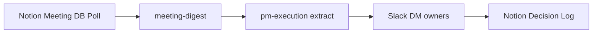

# Planning Meeting Sentinel

## Output language

All outputs MUST be in Korean (한국어). Technical terms may remain in English.

## Overview
Automated meeting intelligence pipeline that continuously monitors a Notion meeting database, runs meeting-digest on new entries, extracts decisions and action items, notifies owners via Slack DM, and maintains a rolling decision log in Notion. Designed for Cursor Automation with 30-minute polling cadence.

## Autonomy Level
**L4** — Fully autonomous scheduled automation; no human-in-loop for routine processing.

## Pipeline Architecture
Sequential orchestration: notion-meeting-sync → meeting-digest → pm-execution → Slack DM → Notion decision log update.

### Mermaid Diagram


## Trigger Conditions
- Cursor Automation schedule (every 30 min)
- User says "meeting sentinel", "auto digest meetings" (see YAML `description` for Korean triggers)
- `/planning-meeting-sentinel` command

## Skill Chain
| Step | Skill | Purpose |
|------|-------|---------|
| 1 | notion-meeting-sync | Sync meeting notes from Notion DB, detect new entries since last poll |
| 2 | meeting-digest | Analyze meeting content, produce summary + action items |
| 3 | pm-execution | Extract decisions, commitments, next steps |
| 4 | notebooklm | Optional: enrich with research context |
| 5 | gws-calendar | Optional: sync follow-up events |
| 6 | md-to-notion | Update rolling decision log page |

## Output Channels
- **Notion**: Rolling decision log page, meeting summary sub-pages
- **Slack**: DM to action item owners with assignments
- **Google Workspace**: Optional calendar events for follow-ups

## Configuration
- `NOTION_MEETING_DB_ID`: Notion database ID for meetings
- `NOTION_DECISION_LOG_PAGE_ID`: Parent page for decision log
- `SLACK_BOT_TOKEN`: For DM delivery
- Poll interval: 30 minutes (Cursor Automation)

## Example Invocation
```
/planning-meeting-sentinel
"Run meeting sentinel"
```
