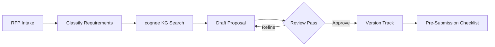

# Proposal Factory

## Overview
End-to-end RFP response pipeline: intake RFP requirements, classify and map to past proposals via Cognee knowledge graph, generate proposal draft with case studies, run approval flow in Notion, track versions, and produce pre-submission checklist.

## Autonomy Level
**L2** — Human-in-loop for approval and final review; automation handles research, drafting, and structure.

## Pipeline Architecture
Sequential with Evaluator-Optimizer: intake → classify → KG search → draft → review → refine → approve → checklist.

### Mermaid Diagram


## Trigger Conditions
- RFP or proposal request received
- "proposal factory", "제안서 생성", "RFP response", "create proposal"
- `/proposal-factory` with RFP document or requirements

## Skill Chain
| Step | Skill | Purpose |
|------|-------|---------|
| 1 | kwp-sales-create-an-asset | Generate proposal structure and content |
| 2 | cognee | Search past proposals, case studies, win themes |
| 3 | anthropic-docx | Generate formatted proposal document |
| 4 | kwp-product-management-competitive-analysis | Competitive positioning section |
| 5 | kwp-legal-contract-review | Compliance and terms review |

## Output Channels
- **Notion**: Proposal page with approval workflow, version history
- **Local**: DOCX proposal file
- **Checklist**: Pre-submission verification items

## Configuration
- `COGNEE_INDEX`: Knowledge graph with past proposals
- `NOTION_PROPOSAL_DB_ID`: Proposal tracking database
- Approval workflow: Notion status properties

## Example Invocation
```
"Create proposal for RFP: [requirements doc]"
"제안서 생성해줘"
"RFP response pipeline"
```
