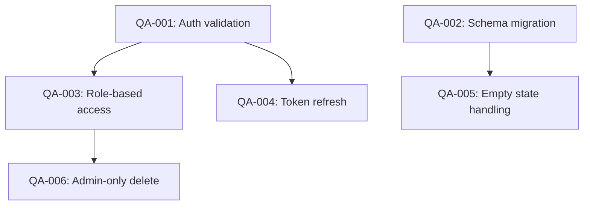

# QA with Blockers

Run a full QA pass over a feature, surface all edge cases, and produce a dependency-ordered set of issues where each issue declares what it blocks and what blocks it.

## When to Use

- Pre-merge QA pass on a feature branch
- Decomposing a large feature into testable, ordered work items
- Ensuring no edge case ships without its prerequisite fixes
- Building a visual blocker graph so the team knows what to tackle first

## When NOT to Use

- Writing test code or generating test files (use `qa-test-expert`)
- Exploratory browser-based QA (use `qa-dogfood`)
- Code review without QA decomposition intent (use `deep-review`)
- Sprint triage of existing issues (use `sprint-orchestrator`)

## Mode Detection

| Signal | Mode |
|--------|------|
| User specifies a feature/branch/PR, OR no `--session` flag | **Autonomous** — run the full 5-phase workflow below |
| User says "QA session", "report bugs", "let's do QA", `--session` flag, OR starts describing a bug conversationally | **Conversational** — jump to [Conversational Mode](#conversational-mode-session) |

---

## Autonomous Mode (default)

### Phase 1: Scope the QA Surface

1. Identify what changed:
   - Run `git diff main...HEAD --stat` to list affected files
   - Classify changes: new feature, bug fix, refactor, migration
2. Map the feature surface:
   - User-facing flows (happy path, error states, empty states)
   - API contracts (request/response, error codes, auth)
   - Data model changes (schema, migrations, seed data)
   - Integration points (external services, events, queues)
3. Output: **QA Scope Document** listing all surfaces to test

### Phase 2: Discover Edge Cases

For each surface from Phase 1:

1. **Happy path** — Does the golden path work end to end?
2. **Boundary values** — Min, max, zero, empty, null, overflow
3. **Error states** — Network failure, invalid input, timeout, partial failure
4. **Permission / auth** — Wrong role, expired token, unauthenticated
5. **Concurrency** — Simultaneous writes, race conditions, stale reads
6. **State transitions** — Can the entity reach an invalid state?
7. **Rollback / undo** — What happens if the user cancels mid-flow?
8. **Downstream impact** — What other features break if this feature is wrong?

Output: **Edge Case Matrix** — a table of surface × edge-case category

### Phase 3: Build the Blocker Graph

1. For each discovered issue, assign:
   - **ID**: `QA-001`, `QA-002`, ...
   - **Title**: One-line summary
   - **Severity**: critical / major / minor / cosmetic
   - **Blocks**: List of issue IDs that cannot be tested until this is fixed
   - **Blocked by**: List of issue IDs that must be fixed first
2. Build a DAG (Directed Acyclic Graph):
   - Root nodes = issues with no dependencies (fix first)
   - Leaf nodes = issues that can only be verified after all deps are done
3. Render the DAG as a Mermaid flowchart:



### Phase 4: File Issues

For each issue, produce a structured issue body:

```markdown
## Summary
[One-line description]

## Severity
[critical | major | minor | cosmetic]

## Steps to Reproduce
1. ...
2. ...
3. ...

## Expected Behavior
[What should happen]

## Actual / Suspected Behavior
[What happens or is expected to happen]

## Blocks
- #QA-XXX — [title]

## Blocked By
- #QA-YYY — [title]

## Acceptance Criteria
- [ ] [Specific verifiable condition]
```

### Phase 5: Produce QA Summary

1. **Summary stats**: Total issues, by severity, by surface
2. **Critical path**: The longest chain in the blocker graph (this determines minimum fix time)
3. **Recommended fix order**: Topological sort of the DAG
4. **Ship-readiness verdict**: PASS / CONDITIONAL / FAIL
   - PASS: No critical or major issues
   - CONDITIONAL: Major issues exist but have workarounds
   - FAIL: Critical blockers present

## Gotchas

1. **Circular dependencies in the blocker graph.** If QA-003 blocks QA-005 and QA-005 blocks QA-003, you have a design problem, not a QA problem. Flag it and escalate.
2. **Severity inflation.** Not every edge case is critical. Cosmetic issues blocking major features distort the priority queue. Score honestly.
3. **Missing the "downstream impact" category.** A change to the user model might break billing, notifications, and audit logs. Always check integration points.
4. **Filing issues without reproduction steps.** An issue that says "the form breaks sometimes" is useless. Every issue needs concrete steps to reproduce.

## Verification

After completing all phases:
1. Verify the Mermaid DAG renders without syntax errors
2. Confirm no circular dependencies exist in the blocker graph
3. Check every critical/major issue has concrete reproduction steps
4. Validate the topological sort order matches the DAG structure
5. Ensure every issue has at least one acceptance criterion

## Anti-Example

```markdown
# BAD: Issues without blocking relationships
QA-001: Fix auth
QA-002: Fix permissions
QA-003: Fix admin delete
→ No dependency info. Team works on QA-003 first, only to discover it requires QA-001.

# BAD: Severity inflation
QA-004: Button color is 1px off → Severity: CRITICAL
→ Cosmetic issues are not critical. This distorts the fix priority queue.

# BAD: Vague reproduction steps
"Sometimes the form doesn't submit"
→ Must specify: browser, input data, sequence of clicks, expected vs actual result.
```

## Constraints

- Every issue MUST have a severity rating and at least one acceptance criterion
- The blocker graph MUST be a valid DAG (no cycles)
- Critical and major issues MUST include step-by-step reproduction instructions
- The Mermaid diagram MUST render correctly (validate syntax)
- Do NOT file more than 30 issues in a single QA pass — split into multiple passes by surface area
- Freedom level: **Structured** — Autonomous mode follows the 5-phase workflow; Conversational mode follows the session loop. Adapt issue template to the project's existing format if one exists.

---

## Conversational Mode (`--session`)

Interactive QA session where the user reports bugs one-by-one and the agent files issues using the project's domain language.

### Session Rules

1. **One bug at a time.** Wait for the user to describe a bug before acting.
2. **Clarify before exploring.** Ask 1-2 targeted questions about reproduction, expected behavior, and severity — do NOT assume.
3. **Explore the codebase silently.** Use SemanticSearch/Grep to find the affected components, state machines, domain entities, and existing error handling. Extract the project's terminology.
4. **Domain language, not code paths.** Issue titles and descriptions use the project's ubiquitous language (e.g., "Workspace invite fails for SSO users") — never reference file paths, line numbers, or function names in issue titles or descriptions.
5. **Scope assessment before filing.** After exploring, report back: "This touches X, Y, Z. Severity: MAJOR. Ready to file?" Wait for user confirmation.
6. **File via `gh issue create`.** Use the structured template below. Add to relevant GitHub Project if configured.
7. **Accumulate the blocker graph.** Each new issue is added to a running Mermaid DAG. At session end, emit the complete graph.

### Session Loop

```
REPEAT until user says "done" / "끝" / "that's all":
  1. User describes a bug (text, screenshot, URL)
  2. Agent clarifies (1-2 questions max)
  3. Agent explores codebase → extracts domain context
  4. Agent summarizes scope + severity → asks "File this?"
  5. User confirms → Agent files issue
  6. Agent updates running blocker graph
END
  7. Agent emits: session summary + final blocker DAG + fix-order recommendation
```

### Conversational Issue Template

```markdown
## Bug: {domain-language title}

**Reporter**: {user}
**Severity**: CRITICAL | MAJOR | MINOR | COSMETIC
**Surface**: {feature area in domain terms}

### What happens
{User-reported behavior, in the user's own words}

### What should happen
{Expected behavior, confirmed with user}

### How to reproduce
1. {Step using UI/UX terms, not code}
2. ...

### Scope (agent-assessed)
- **Affected domain concepts**: {entities, workflows}
- **Related features**: {adjacent features that may be impacted}
- **Estimated blast radius**: LOW | MEDIUM | HIGH

### Acceptance criteria
- [ ] {Criterion in user-observable terms}

### Blocks / Blocked by
- Blocks: #{issue_number} (if applicable)
- Blocked by: #{issue_number} (if applicable)
```

### Session End Output

1. **Session summary**: Bugs reported, issues filed, severities
2. **Blocker graph**: Complete Mermaid DAG of all session issues
3. **Recommended fix order**: Topological sort
4. **Ship-readiness delta**: How these bugs change the ship-readiness verdict

---

## Output

### Autonomous Mode Output
1. QA Scope Document (surfaces to test)
2. Edge Case Matrix (surface × category table)
3. Blocker Graph (Mermaid DAG)
4. Individual issue bodies (structured markdown)
5. QA Summary with fix order and ship-readiness verdict

### Conversational Mode Output
1. Filed GitHub issues (one per confirmed bug)
2. Running blocker graph (Mermaid DAG, updated per issue)
3. Session summary with fix order and ship-readiness delta
