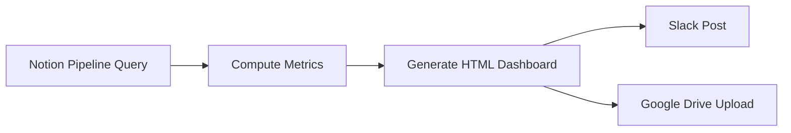

# Sales Weekly Dashboard

## Overview
Scheduled pipeline that queries Notion pipeline database, computes win rate, conversion rate, pipeline velocity, and other key metrics, generates an interactive HTML dashboard, posts summary to Slack, and uploads full dashboard to Google Drive.

## Autonomy Level
**L4** — Fully autonomous scheduled run; no human-in-loop for routine weekly execution.

## Pipeline Architecture
Sequential: Notion query → compute metrics → generate dashboard → Slack + Drive.

### Mermaid Diagram


## Trigger Conditions
- Cursor Automation schedule (weekly)
- "sales dashboard", "영업 대시보드", "pipeline analytics", "weekly sales report"
- `/sales-weekly-dashboard` command

## Skill Chain
| Step | Skill | Purpose |
|------|-------|---------|
| 1 | kwp-data-data-visualization | Charts and visualizations |
| 2 | kwp-data-interactive-dashboard-builder | Interactive HTML dashboard |
| 3 | visual-explainer | Summary infographic if needed |
| 4 | gws-drive | Upload dashboard HTML to Drive |
| 5 | md-to-slack-canvas | Post summary to Slack Canvas or channel |

## Output Channels
- **Slack**: Weekly summary with key metrics, link to dashboard
- **Google Drive**: Full interactive dashboard HTML file
- **Notion**: Optional metrics archive page

## Configuration
- `NOTION_PIPELINE_DB_ID`: Deals/pipeline database
- `GWS_DRIVE_DASHBOARD_FOLDER_ID`: Target folder for uploads
- `SLACK_SALES_CHANNEL_ID`: Channel for weekly post
- Metrics: win rate, conversion rate, pipeline velocity, stage distribution

## Example Invocation
```
/sales-weekly-dashboard
"Run sales dashboard"
"영업 대시보드 생성해줘"
```
