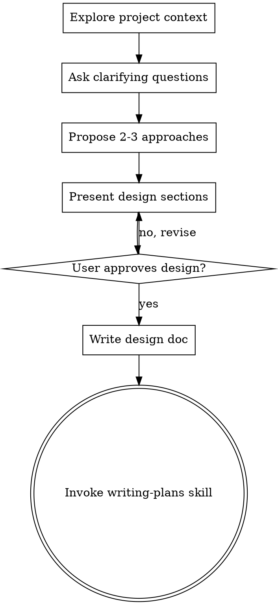

# Brainstorming Ideas Into Designs

## Overview

Help turn ideas into fully formed designs and specs through natural collaborative dialogue.

Start by understanding the current project context, then ask questions one at a time to refine the idea. Once you understand what you're building, present the design and get user approval.

<HARD-GATE>
Do NOT invoke any implementation skill, write any code, scaffold any project, or take any implementation action until you have presented a design and the user has approved it. This applies to EVERY project regardless of perceived simplicity.
</HARD-GATE>

## Anti-Pattern: "This Is Too Simple To Need A Design"

Every project goes through this process. A todo list, a single-function utility, a config change — all of them. "Simple" projects are where unexamined assumptions cause the most wasted work. The design can be short (a few sentences for truly simple projects), but you MUST present it and get approval.

## Checklist

You MUST create a task for each of these items and complete them in order:

1. **Explore project context** — check files, docs, recent commits
2. **Ask clarifying questions** — one at a time, understand purpose/constraints/success criteria
3. **Propose 2-3 approaches** — with trade-offs and your recommendation
4. **Present design** — in sections scaled to their complexity, get user approval after each section
5. **Write design doc** — save to `docs/plans/YYYY-MM-DD-<topic>-design.md` and commit
6. **Transition to implementation** — invoke writing-plans skill to create implementation plan

## Process Flow

**The terminal state is invoking writing-plans.** Do NOT invoke frontend-design, mcp-builder, or any other implementation skill. The ONLY skill you invoke after brainstorming is writing-plans.

## The Process

**Understanding the idea:**
- Check out the current project state first (files, docs, recent commits)
- Ask questions one at a time to refine the idea
- Prefer multiple choice questions when possible, but open-ended is fine too
- Only one question per message - if a topic needs more exploration, break it into multiple questions
- Focus on understanding: purpose, constraints, success criteria

**Exploring approaches:**
- Propose 2-3 different approaches with trade-offs
- Present options conversationally with your recommendation and reasoning
- Lead with your recommended option and explain why

**Presenting the design:**
- Once you believe you understand what you're building, present the design
- Scale each section to its complexity: a few sentences if straightforward, up to 200-300 words if nuanced
- Ask after each section whether it looks right so far
- Cover: architecture, components, data flow, error handling, testing
- Be ready to go back and clarify if something doesn't make sense

## After the Design

**Documentation:**
- Write the validated design to `docs/plans/YYYY-MM-DD-<topic>-design.md`
- Use elements-of-style:writing-clearly-and-concisely skill if available
- Commit the design document to git

**Implementation:**
- Invoke the writing-plans skill to create a detailed implementation plan
- Do NOT invoke any other skill. writing-plans is the next step.

## Key Principles

- **One question at a time** - Don't overwhelm with multiple questions
- **Multiple choice preferred** - Easier to answer than open-ended when possible
- **YAGNI ruthlessly** - Remove unnecessary features from all designs
- **Explore alternatives** - Always propose 2-3 approaches before settling
- **Incremental validation** - Present design, get approval before moving on
- **Be flexible** - Go back and clarify when something doesn't make sense

## Anti-Sycophancy Rules

When evaluating ideas and presenting designs, actively resist agreeing with everything:

1. **Forced counter-argument**: For every approach you recommend, state the single strongest reason NOT to do it
2. **No "looks good" without teeth**: Every approval must identify at least one concrete risk or trade-off
3. **Challenge premises**: Before accepting a requirement, ask "what evidence supports this assumption?"
4. **Kill ideas explicitly**: If an approach is bad, say so directly with reasoning — don't soften into "another option to consider"

## YC Pressure-Testing Framework

Apply these Garry Tan / YC-style stress tests to proposed designs:

### The 5 Killer Questions

1. **"Who is the specific user and what is their hair-on-fire problem?"** — If the answer is vague ("developers who want better tools"), the idea needs sharpening
2. **"What is the smallest possible version that tests the core hypothesis?"** — Strip everything until only the risky assumption remains
3. **"Why hasn't someone already built this? If they have, why will yours win?"** — Force honest competitive analysis
4. **"What would make you kill this project?"** — Define explicit failure criteria before building
5. **"Does this pass the 'friend test'?"** — Would you tell a friend to use this? If you'd hesitate, something is wrong

### Premise Verification Protocol

Before accepting any design requirement as given:

1. **Source check**: Where did this requirement originate? (User research? Assumption? Competitor copy?)
2. **Evidence grade**: Is there data (A), anecdotes (B), or just intuition (C)?
3. **Inversion test**: What happens if we do the opposite of this requirement?
4. **Dependency check**: Does this requirement depend on another unverified assumption?

Requirements with Grade C evidence must be flagged as assumptions to validate, not facts to build on.

### Forced Alternatives Gate

When proposing approaches, you MUST:
- Present at least 2 meaningfully different approaches (not variations of the same idea)
- Include a "do nothing" or "simpler alternative" option when applicable
- For each approach, state: effort, risk, reversibility, and what you'd learn
- Recommend one, but make the case strong enough that the user could disagree

## Examples

### Example 1: Standard workflow
**User says:** Request that triggers this skill
**Actions:** Follow the prescribed process steps in order. Verify each checkpoint before proceeding.
**Result:** Completed workflow with all verification criteria met.

## Error Handling

| Issue | Resolution |
|-------|-----------|
| Process step fails | Do not skip — diagnose the failure before proceeding to the next step |
| Verification fails | Roll back to the last passing checkpoint and retry |
| Conflicting with other processes | Follow the priority order defined in the skill |
