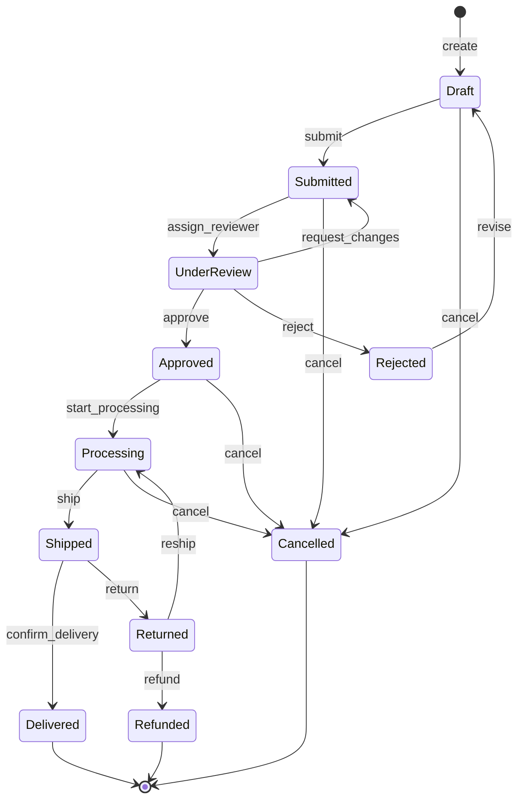
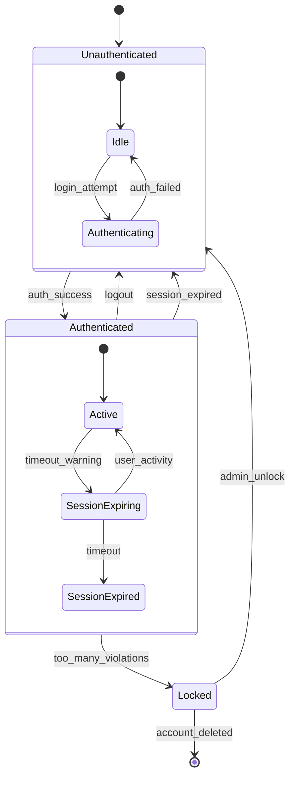
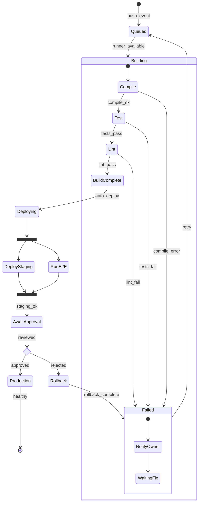
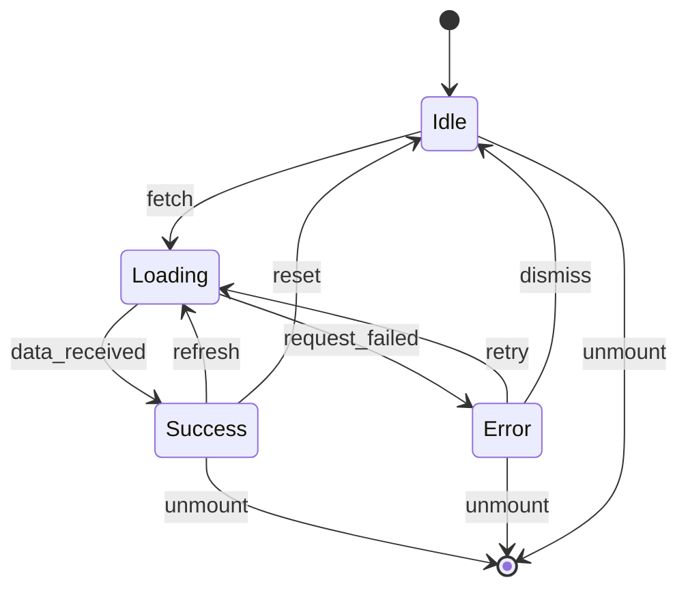
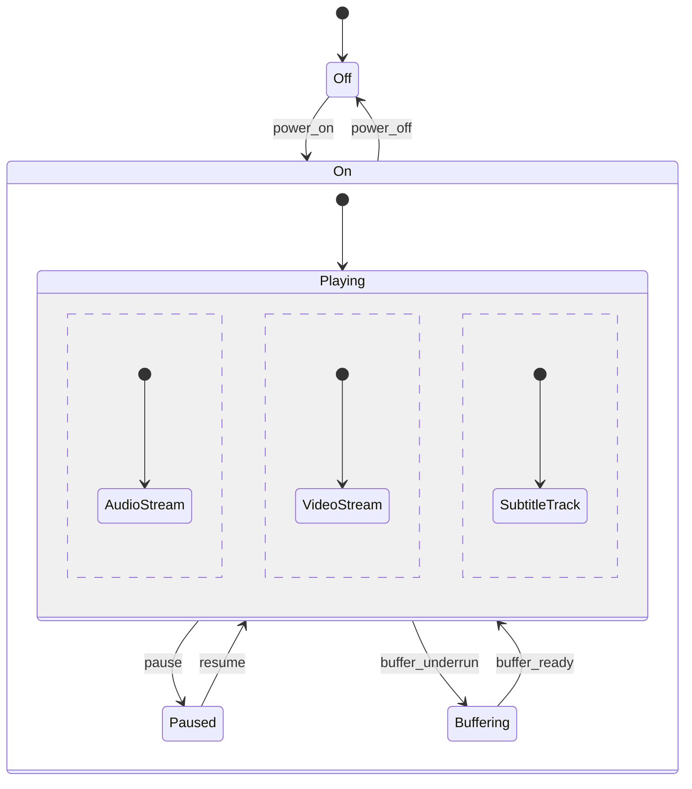

# State Diagram Generator

**Quick Start:** Define states -> Add transitions with triggers -> Add guards/actions -> Wrap with composite states if needed.

## Critical Rules

### Rule 1: Mermaid Code Fence
Always output inside ` ```mermaid ` fenced code blocks using `stateDiagram-v2`.

### Rule 2: Use stateDiagram-v2
Always use `stateDiagram-v2` (not the older `stateDiagram`). v2 supports all advanced features.

### Rule 3: State Naming
- State IDs must NOT contain spaces; use camelCase or PascalCase
- Display labels use `: Label` syntax: `StateId : Display Label`
- Avoid reserved words as state IDs

### Rule 4: Special States
| State | Syntax | Use For |
|---|---|---|
| Initial | `[*]` | Start of lifecycle |
| Final | `[*]` | End of lifecycle (same syntax, context-dependent) |
| Choice | `<<choice>>` | Conditional branching |
| Fork | `<<fork>>` | Parallel split |
| Join | `<<join>>` | Parallel merge |

### Rule 5: Transition Syntax
```
StateA --> StateB : trigger [guard] / action
```
- `trigger` -- event that causes the transition
- `[guard]` -- condition that must be true (optional)
- `/ action` -- side effect executed during transition (optional)

### Rule 6: Composite States
Nest states inside a parent to show hierarchical decomposition:
```
state ParentState {
  [*] --> ChildA
  ChildA --> ChildB
}
```

### Rule 7: Concurrency
Use `--` separator inside a composite state for parallel regions:
```
state ActiveState {
  [*] --> Processing
  --
  [*] --> Monitoring
}
```

## Template: Order Lifecycle



## Template: Authentication State Machine



## Template: CI/CD Pipeline States



## Template: Simple UI State (Fetch Operation)



## Template: Concurrent States (Media Player)



## Best Practices

1. **Start with [*]** -- every diagram should have a clear initial state
2. **Name states as nouns/adjectives** -- `Processing`, `Active`, `Locked` (not verbs)
3. **Label transitions as verbs/events** -- `submit`, `approve`, `timeout`
4. **Use composite states** -- group related states to reduce visual clutter
5. **Show error/edge paths** -- include cancelled, failed, and timeout transitions
6. **One responsibility per state** -- if a state does multiple things, decompose it
7. **Guards vs separate states** -- prefer guards `[condition]` for simple checks, separate states for complex logic
8. **Output format** -- always output inside ` ```mermaid ` fenced code blocks
