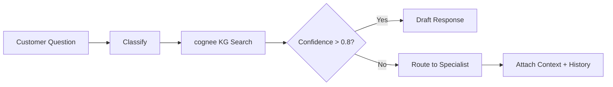

# Tech Support Brain

## Overview
Intelligent routing and response system for customer technical questions. Classifies incoming questions, searches the knowledge graph for matches, auto-drafts responses for high-confidence matches (>0.8), and routes low-confidence cases to specialists with full context and customer history.

## Autonomy Level
**L3** — Semi-autonomous; high-confidence responses are drafted for human review; low-confidence routes to specialists.

## Pipeline Architecture
Sequential with branching: classify → KG search → if match (conf > 0.8): draft response → if not: route to specialist with context.

### Mermaid Diagram


## Trigger Conditions
- Customer technical question (email, chat, ticket)
- "tech support brain", "기술 지원", "customer question routing", "KB search"
- `/tech-support-brain` with question text

## Skill Chain
| Step | Skill | Purpose |
|------|-------|---------|
| 1 | kwp-customer-support-ticket-triage | Classify question type, priority |
| 2 | kwp-customer-support-customer-research | Customer context, history |
| 3 | kwp-customer-support-response-drafting | Draft response for high-confidence match |
| 4 | kwp-customer-support-knowledge-management | KB article retrieval, update |
| 5 | cognee | Knowledge graph search for answer matching |

## Output Channels
- **Response**: Draft reply for high-confidence (human review before send)
- **Routing**: Specialist assignment with context bundle for low-confidence
- **Notion**: Optional ticket update with classification and routing

## Configuration
- `COGNEE_INDEX`: KB articles, runbooks, FAQs
- Confidence threshold: 0.8 for auto-draft
- Specialist routing rules by topic/priority

## Example Invocation
```
"Tech support brain: [customer question]"
"기술 지원 라우팅해줘"
"Route this customer question"
```
