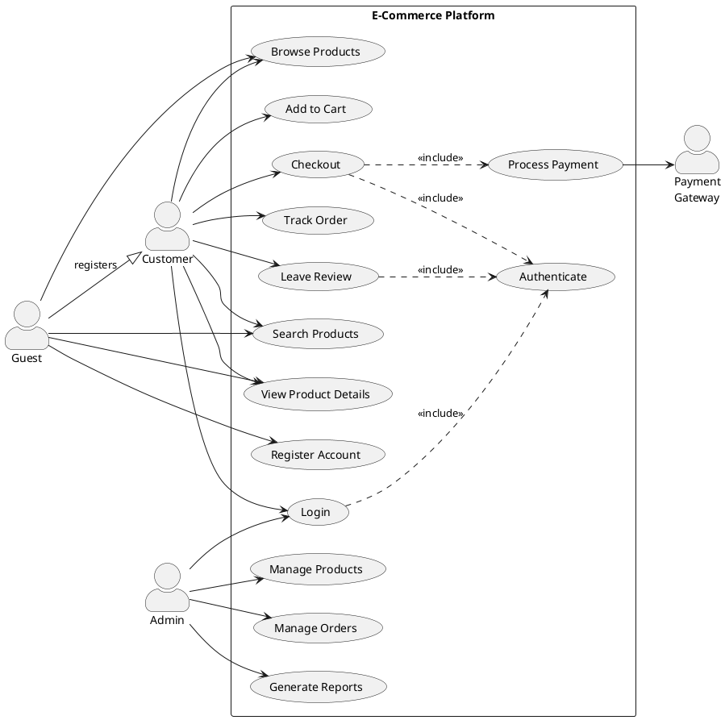
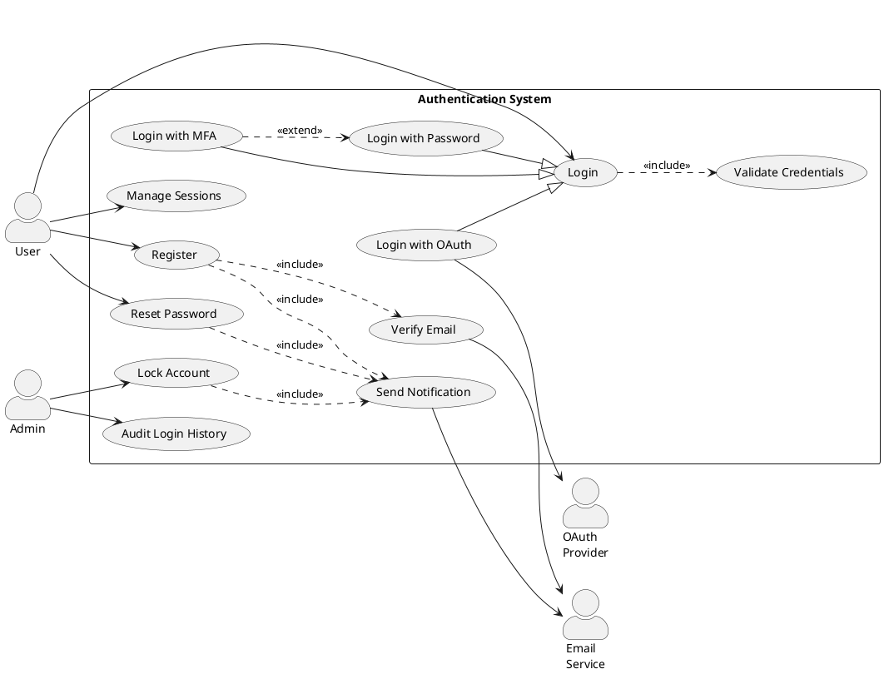
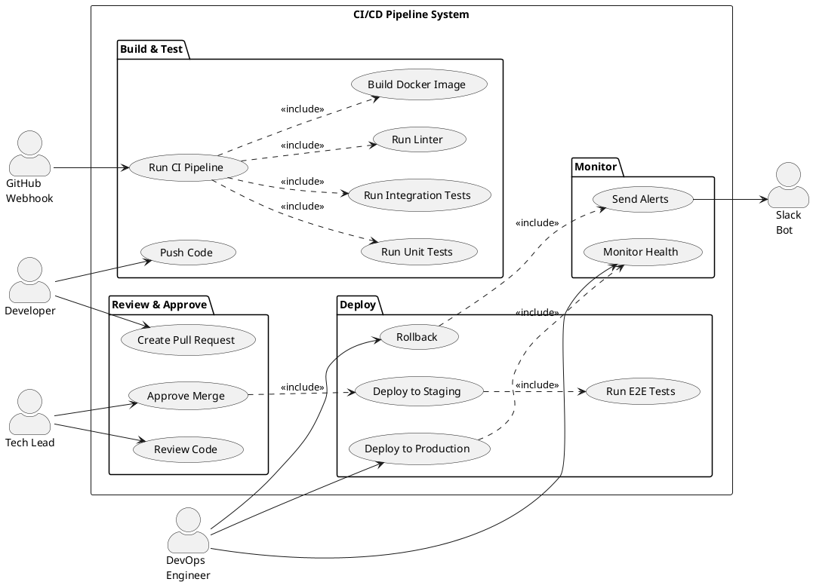
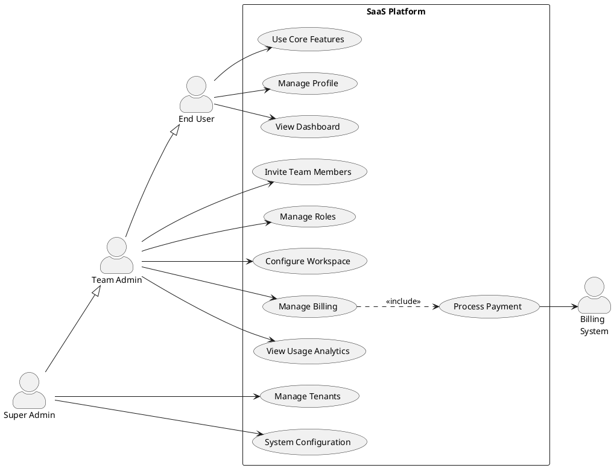

# Use Case Diagram Generator

**Quick Start:** Define actors -> Draw system boundary -> Add use cases -> Connect actors to use cases -> Add include/extend relationships.

## Critical Rules

### Rule 1: PlantUML Code Fence
Always output inside ` ```plantuml ` fenced code blocks with `@startuml` / `@enduml`.

### Rule 2: Direction
Use `left to right direction` for horizontal layouts (recommended when there are many use cases). Omit for vertical (default top-to-bottom).

### Rule 3: Actor Syntax
```
actor "Actor Name" as alias
```
Place primary actors on the left, secondary/supporting actors on the right.

### Rule 4: Use Case Syntax
```
usecase "Use Case Name" as UC1
usecase (Short Name) as UC2
```

### Rule 5: System Boundary
```
rectangle "System Name" {
    usecase "UC1" as uc1
    usecase "UC2" as uc2
}
```
Use `rectangle` (or `package`) to group use cases belonging to the same system or subsystem.

### Rule 6: Relationships
| Relationship | Syntax | Meaning |
|---|---|---|
| Association | `Actor --> UC` | Actor interacts with use case |
| Include | `UC1 ..> UC2 : <<include>>` | UC1 always invokes UC2 |
| Extend | `UC2 ..> UC1 : <<extend>>` | UC2 optionally extends UC1 |
| Generalization (actor) | `ChildActor --\|> ParentActor` | Actor inheritance |
| Generalization (use case) | `SpecificUC --\|> GeneralUC` | Use case inheritance |

### Rule 7: Styling
```
skinparam actorStyle awesome
skinparam backgroundColor white
skinparam usecase {
    BackgroundColor LightYellow
    BorderColor DarkSlateGray
}
```

## Template: E-Commerce Platform



## Template: User Authentication System



## Template: CI/CD Pipeline System



## Template: SaaS Platform (Multi-Role)



## Best Practices

1. **Identify primary vs secondary actors** -- primary actors initiate; secondary actors respond (payment gateways, email services)
2. **Keep use cases verb-noun** -- "Place Order", "View Report" (not "Order" or "Reports")
3. **Use system boundaries** -- `rectangle` groups show what's inside vs outside the system
4. **`<<include>>` for mandatory sub-steps** -- e.g., Checkout always includes Process Payment
5. **`<<extend>>` for optional behavior** -- e.g., MFA optionally extends Login
6. **Actor generalization for role hierarchies** -- Admin inherits from User
7. **Limit to 7-15 use cases per diagram** -- split subsystems into separate diagrams if needed
8. **Output format** -- always output inside ` ```plantuml ` fenced code blocks
