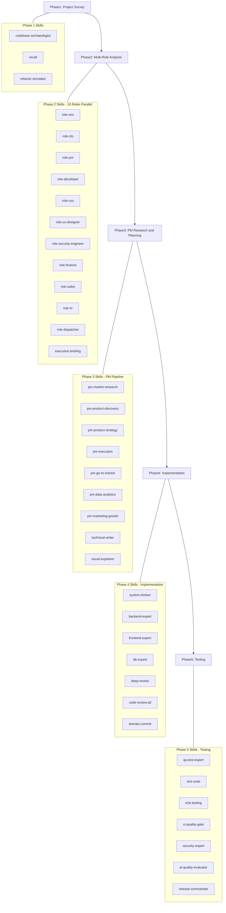

# Full-Stack Multi-Skill Analysis and Implementation Pipeline

## Phase 1: Project Survey and Gap Analysis

**Objective**: Produce a single consolidated document mapping every documented requirement against its implementation status (complete, partial, missing).

**Skills Used**:

- `codebase-archaeologist` — Git history analysis, ownership maps, churn hotspots to identify active vs stale areas
- `recall` — Restore cross-session context from MEMORY.md and past decisions
- `refactor-simulator` — Assess blast radius of areas needing changes

**Input Sources**:

- [README.md](README.md) — Feature list and tech stack
- [MEMORY.md](MEMORY.md) — Decisions, patterns, known constraints
- [tasks/todo.md](tasks/todo.md) — Current backlog and completed work
- [KNOWN_ISSUES.md](KNOWN_ISSUES.md) — Open bugs and workarounds
- [docs/prd/](docs/prd/) — Autonomous Trading Agent PRD (FR-1 through FR-6)
- [docs/product-vision.md](docs/product-vision.md), [docs/roadmap.md](docs/roadmap.md), [docs/okrs.md](docs/okrs.md)

**Output**: `docs/project-survey-gap-analysis.md` — A structured gap analysis document with sections:

1. Feature inventory (implemented vs documented)
2. Requirement traceability matrix (PRD FR-x to code)
3. Technical debt inventory
4. Known issues and blockers

---

## Phase 2: Multi-Role Requirement Analysis (10 Roles x 10 Requirements)

**Objective**: Each of the 10 role-perspective skills analyzes the project and produces its top 10 priority requirements. All results are synthesized into one consolidated document.

**Skills Used (parallel batches of 4)**:

Batch 1:

- `role-ceo` — Strategic impact, market positioning, investment priorities
- `role-cto` — Architecture gaps, tech debt, performance/SLO needs, security posture
- `role-pm` — PRD gaps, sprint priorities, user story gaps, OKR alignment
- `role-developer` — Implementation complexity, code quality, testing gaps

Batch 2:

- `role-cso` — Market sizing gaps, competitive positioning, GTM needs
- `role-ux-designer` — UX gaps, accessibility issues, design system consistency
- `role-security-engineer` — STRIDE threats, OWASP gaps, compliance needs
- `role-finance` — ROI analysis, budget requirements, audit compliance

Batch 3:

- `role-sales` — Sales enablement gaps, demo needs, competitive battlecard gaps
- `role-hr` — Team capacity, hiring needs, training requirements

**Orchestration**: `role-dispatcher` dispatches to all 10 roles, collects results.

**Synthesis**: `executive-briefing` combines all role outputs into a unified CEO briefing with cross-role consensus, conflicts, and prioritized action items.

**Output**: `docs/multi-role-requirements-analysis.md` — Single file containing:

- 10 sections (one per role), each with 10 prioritized requirements
- Cross-role consensus matrix
- Conflict resolution recommendations
- Overall priority ranking (top 20 across all roles)

---

## Phase 3: PM Research, Analysis, and Implementation Planning

**Objective**: Take the prioritized requirements from Phase 2, conduct thorough research, and produce a detailed implementation plan document.

**Skills Used (sequential pipeline)**:

### 3A. Research Phase (parallel)

- `pm-market-research` — User personas update, competitor analysis refresh, market sizing validation
- `pm-product-discovery` — Assumption testing on top requirements, Opportunity Solution Tree, feature prioritization
- `pm-product-strategy` — Vision alignment check, Lean Canvas update, SWOT refresh for new requirements
- `alphaear-search` + `alphaear-news` — Finance-domain research for trading-specific requirements

### 3B. Planning Phase (sequential)

- `pm-execution` — Write/update PRDs for top priority items, define OKRs, plan sprint breakdown, generate user stories
- `pm-go-to-market` — GTM strategy for any user-facing features, ICP validation
- `pm-data-analytics` — Define success metrics, cohort analysis design, A/B test plans
- `pm-marketing-growth` — Positioning updates, value proposition refinement

### 3C. Document Generation

- `technical-writer` — ADRs for architectural decisions, API documentation updates
- `visual-explainer` — Architecture diagrams, data flow visualizations
- `anthropic-docx` — Professional Word document output
- `presentation-strategist` — Presentation blueprint for stakeholder review

**Output**: `docs/implementation-plan.md` + `outputs/implementation-plan.docx` containing:

1. Prioritized implementation backlog (from Phase 2 synthesis)
2. Updated PRDs for top items
3. Sprint breakdown with story points
4. Architecture diagrams for new components
5. Success metrics and KPIs
6. Risk assessment and mitigation plan

---

## Phase 4: Implementation

**Objective**: Execute the implementation plan using all engineering skills, following the priority order from Phase 3.

**Skills Used**:

### 4A. Architecture and Design

- `system-thinker` — End-to-end system design for new features (data flows, feedback loops)
- `backend-expert` — FastAPI service design, Pydantic models, async patterns
- `frontend-expert` — React component architecture, performance optimization
- `db-expert` — PostgreSQL schema changes, Alembic migrations, query optimization
- `design-architect` — UI/UX design audit and improvement plan

### 4B. Code Implementation (sequential by priority)

- `ecc-coding-standards` — Enforce TypeScript/Python coding standards throughout
- `ecc-search-first` — Search for existing solutions before writing new code
- `fsd-development` — Frontend domain scaffolding (if new domains needed)
- `sre-devops-expert` — CI/CD pipeline updates, Docker Compose changes
- `security-expert` — STRIDE threat modeling, OWASP checks on new endpoints
- `i18n-sync` — Translation key sync for any new UI strings
- `dependency-auditor` — Audit new dependencies for CVEs

### 4C. Code Review and Quality

- `deep-review` — 4-agent parallel review (frontend, backend, security, tests) after each major feature
- `simplify` — Code quality, DRY violations, tech debt cleanup
- `code-review-all` — Adversarial review with crash checklist and security hacking perspective
- `workflow-eval-opt` — Evaluator-optimizer loop for quality-critical components

### 4D. Documentation

- `technical-writer` — ADRs, API docs, operational guides
- `onboarding-accelerator` — Update onboarding docs for new features
- `visual-explainer` — Updated architecture diagrams

### 4E. Commit and Ship

- `domain-commit` — Domain-split commits with pre-commit hooks
- `release-ship` — Push and create PR

**Workflow Pattern**: Sequential pipeline (4A → 4B → 4C → 4D → 4E) with parallel sub-steps within each phase (max 4 concurrent subagents).

---

## Phase 5: Comprehensive Testing

**Objective**: Validate all implementations using every available testing skill.

**Skills Used**:

### 5A. Test Strategy and Design

- `qa-test-expert` — Design comprehensive test strategy covering unit, integration, E2E
- `test-suite` — Run full test lifecycle: coverage review → quality review → generation → execution

### 5B. Backend Testing

- `ci-quality-gate` — Run full local CI pipeline (secret scan, Python lint/test, build)
- `backend-expert` — Review test coverage for FastAPI services
- `ecc-verification-loop` — 6-phase verification (build, type check, lint, tests, security, diff)

### 5C. Frontend Testing

- `e2e-testing` — Write and run Playwright E2E tests for new UI features
- `playwright-runner` — Ad-hoc browser automation for edge cases
- `anthropic-webapp-testing` — Web app testing with Playwright
- `ui-suite` — 3-agent UI/UX review (design audit, web standards, design system)

### 5D. Security Testing

- `security-expert` — STRIDE threat modeling, vulnerability assessment
- `dependency-auditor` — CVE scan on all dependencies
- `compliance-governance` — Data classification and access control review

### 5E. Quality Evaluation

- `ai-quality-evaluator` — Score AI-generated reports for accuracy and hallucination
- `evals-skills` — LLM eval pipeline for any AI components
- `workflow-eval-opt` — Iterative quality refinement until thresholds met

### 5F. Final Validation

- `diagnose` — 3-agent diagnosis of any remaining failures
- `release-commander` — Full release lifecycle check (10-skill pipeline)
- `ship` — Final pre-merge pipeline with 4-agent review

**Output**: `docs/test-results-report.md` containing:

1. Test coverage metrics (unit, integration, E2E)
2. Security scan results
3. Performance benchmarks
4. AI quality scores
5. Pass/fail summary with remediation notes

---

## Execution Flow Diagram

## Skill Count Summary

| Phase     | Category                   | Skill Count                                  |
| --------- | -------------------------- | -------------------------------------------- |
| Phase 1   | Survey/Context             | 3 skills                                     |
| Phase 2   | Role Analysis              | 12 skills (10 roles + dispatcher + briefing) |
| Phase 3   | PM/Research                | 11 skills                                    |
| Phase 4   | Implementation             | 17 skills                                    |
| Phase 5   | Testing                    | 13 skills                                    |
| **Total** | **Unique skills deployed** | **~50 skills**                               |

## Concurrency Strategy

- Max 4 concurrent subagents at any time
- Phase 2 roles run in 3 batches (4 + 4 + 2)
- Phase 3 research runs in parallel (4 skills), planning runs sequentially
- Phase 4 implementation is sequential by priority, with parallel review at checkpoints
- Phase 5 testing runs backend/frontend/security in parallel batches

## Key Files Touched

- **Input**: `README.md`, `MEMORY.md`, `tasks/todo.md`, `KNOWN_ISSUES.md`, `docs/prd/`*, `docs/roadmap.md`, `docs/okrs.md`
- **Generated**: `docs/project-survey-gap-analysis.md`, `docs/multi-role-requirements-analysis.md`, `docs/implementation-plan.md`, `outputs/implementation-plan.docx`, `docs/test-results-report.md`
- **Modified**: Backend services, frontend components, DB migrations, test files, CI workflows (scope depends on Phase 2/3 output)
