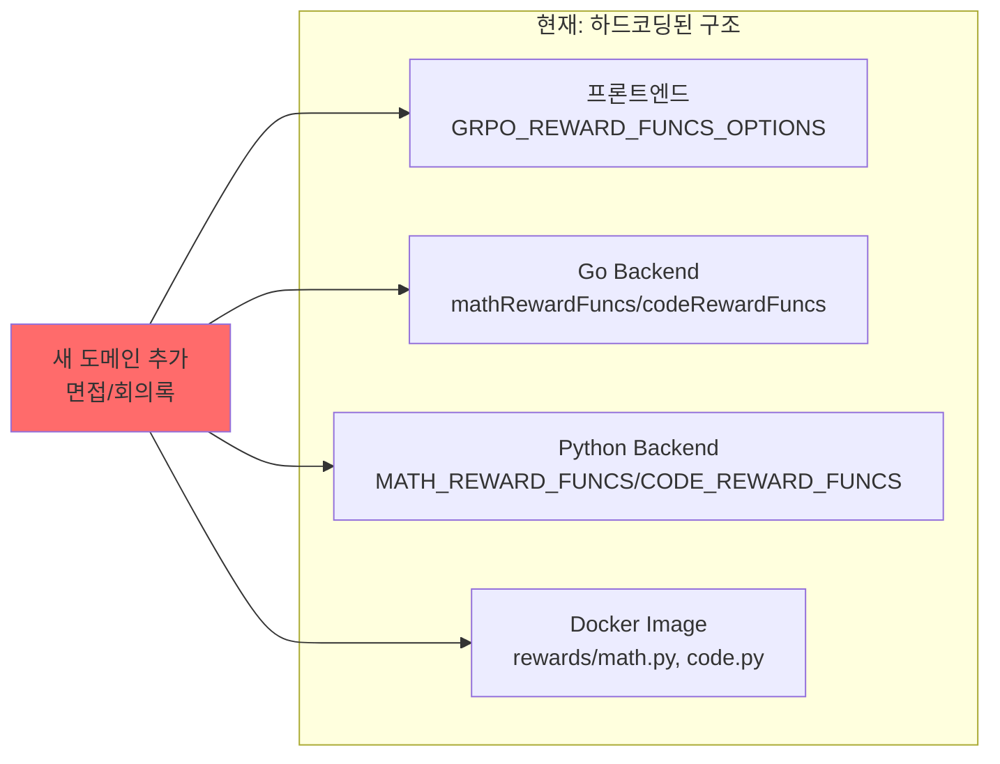
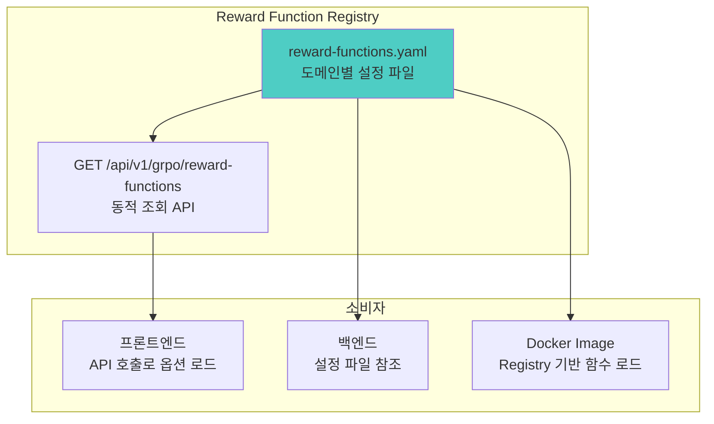

# GRPO Reward Function 확장성 아키텍처 설계

## 현재 상태 분석

### 현재 구조의 문제점

현재 GRPO는 다음과 같이 **하드코딩**되어 있습니다:

1. **Task 타입**: `math`, `code`, `default` 세 가지만 지원
2. **Reward Functions**: 8개 함수가 고정 ([`BlockConfigPanel.tsx`](ai-platform/frontend/src/features/pipeline-builder/components/BlockConfigPanel.tsx) 128-140라인)
3. **기본값 로직**: 백엔드 여러 곳에서 중복 정의

        - [`mlstudio_handlers.go`](ai-platform/backend/go/internal/runner/pod/mlstudio_handlers.go) (583-649라인)
        - [`kfp_pipeline_generator.py`](ai-platform-backend/finetune/app/services/kfp_pipeline_generator.py)
        - [`kfp_pipeline_compiler.py`](ai-platform/backend/go/scripts/kfp_pipeline_compiler.py)



**새 도메인 추가 시 수정 필요한 곳:**

- 프론트엔드: `GRPO_REWARD_FUNCS_OPTIONS` 배열
- Go 백엔드: `mathRewardFuncs`, `codeRewardFuncs` 변수
- Python 백엔드: 기본값 로직
- Docker 이미지: 실제 reward function 구현

---

## 제안하는 아키텍처: Registry 기반 Reward Function System

### 핵심 설계 원칙

1. **Single Source of Truth**: 한 곳에서 모든 도메인/reward function 정의
2. **동적 로딩**: 코드 수정 없이 설정으로 도메인 추가
3. **커스텀 확장**: 사용자 정의 reward function 지원



---

## 구현 방안 (3가지 옵션)

### Option A: 설정 파일 기반 Registry (권장)

**구조:**

```yaml
# ai-platform-backend/finetune/configs/reward-functions.yaml
domains:
  math:
    display_name: "수학/추론"
    description: "수학 문제 풀이 및 논리적 추론 강화"
    reward_functions:
            - id: check_answer
        display_name: "답변 확인"
        category: qa
            - id: check_numbers
        display_name: "숫자 확인"
        category: math
            - id: match_format_exactly
        display_name: "형식 정확 일치"
        category: format
      # ...

  code:
    display_name: "코드"
    description: "코드 생성 및 프로그래밍 강화"
    reward_functions:
            - id: code_syntax_validity_reward
        display_name: "코드 구문 유효성"
        category: code
      # ...

  interview:  # 새로운 도메인
    display_name: "면접"
    description: "면접 질문 답변 강화"
    reward_functions:
            - id: answer_relevance_reward
        display_name: "답변 관련성"
        category: interview
            - id: professional_tone_reward
        display_name: "전문적 어조"
        category: interview
            - id: structure_reward
        display_name: "답변 구조화"
        category: interview

  meeting:  # 새로운 도메인
    display_name: "회의록"
    description: "회의록 요약 및 정리 강화"
    reward_functions:
            - id: summary_completeness_reward
        display_name: "요약 완성도"
        category: summary
            - id: action_item_extraction_reward
        display_name: "액션 아이템 추출"
        category: extraction
```

**API 엔드포인트:**

```javascript
GET /api/v1/pipelines/grpo/domains
GET /api/v1/pipelines/grpo/reward-functions
GET /api/v1/pipelines/grpo/reward-functions?domain=interview
```

**장점:**

- 코드 수정 없이 YAML 파일만 수정하면 도메인 추가 가능
- 프론트엔드가 동적으로 옵션을 로드
- Docker 이미지 재빌드 없이 설정 변경 가능 (ConfigMap 마운트)

---

### Option B: 데이터베이스 기반 Registry

**테이블 구조:**

```sql
-- 도메인 테이블
CREATE TABLE grpo_domains (
    id SERIAL PRIMARY KEY,
    name VARCHAR(50) UNIQUE NOT NULL,  -- math, code, interview
    display_name VARCHAR(100) NOT NULL,
    description TEXT,
    is_active BOOLEAN DEFAULT true,
    created_at TIMESTAMP DEFAULT NOW()
);

-- Reward Function 테이블
CREATE TABLE grpo_reward_functions (
    id SERIAL PRIMARY KEY,
    function_id VARCHAR(100) UNIQUE NOT NULL,  -- check_answer
    display_name VARCHAR(200) NOT NULL,
    category VARCHAR(50),  -- qa, math, code, interview
    description TEXT,
    is_active BOOLEAN DEFAULT true
);

-- 도메인-함수 매핑
CREATE TABLE grpo_domain_functions (
    domain_id INT REFERENCES grpo_domains(id),
    function_id INT REFERENCES grpo_reward_functions(id),
    is_default BOOLEAN DEFAULT false,
    PRIMARY KEY (domain_id, function_id)
);
```

**장점:**

- Admin UI에서 도메인/함수 관리 가능
- 조직별/프로젝트별 커스터마이징 가능
- 버전 관리 및 롤백 용이

**단점:**

- 마이그레이션 필요
- 운영 복잡도 증가

---

### Option C: 하이브리드 (권장 구현 순서)

**Phase 1**: 설정 파일 기반 Registry (Option A) 구현

**Phase 2**: Admin UI에서 관리 가능하도록 DB 연동 (Option B) 확장---

## 구현 파일 변경 목록

### Phase 1 구현 범위

| 영역 | 파일 | 변경 내용 |

|------|------|-----------|

| 설정 | `ai-platform-backend/finetune/configs/reward-functions.yaml` | 신규 - 도메인/함수 정의 |

| Python 백엔드 | `ai-platform-backend/finetune/app/services/reward_function_registry.py` | 신규 - Registry 서비스 |

| Python 라우터 | `ai-platform-backend/finetune/app/routers/reward_functions.py` | 신규 - API 엔드포인트 |

| Go 백엔드 | `ai-platform/backend/go/internal/runner/pod/mlstudio_handlers.go` | 수정 - 하드코딩 제거, Registry 참조 |

| 프론트엔드 | `ai-platform/frontend/src/features/pipeline-builder/components/BlockConfigPanel.tsx` | 수정 - API 호출로 옵션 동적 로드 |

| 프론트엔드 API | `ai-platform/frontend/src/features/pipeline-builder/api/rewardFunctions.ts` | 신규 - API 클라이언트 |---

## Docker 이미지 Reward Function 확장 전략

현재 reward function 실제 구현은 Docker 이미지 내부에 있습니다:

- `training-image/rewards/math.py`
- `training-image/rewards/code.py`

**확장 방안:**

```python
# training-image/rewards/registry.py
import importlib
import os

class RewardFunctionRegistry:
    _functions = {}

    @classmethod
    def register(cls, name: str):
        """데코레이터로 함수 등록"""
        def decorator(func):
            cls._functions[name] = func
            return func
        return decorator

    @classmethod
    def get(cls, name: str):
        if name not in cls._functions:
            # 동적 로딩 시도
            cls._load_custom_functions()
        return cls._functions.get(name)

    @classmethod
    def _load_custom_functions(cls):
        """외부 마운트된 커스텀 함수 로드"""
        custom_path = os.getenv("CUSTOM_REWARD_FUNCS_PATH", "/app/custom_rewards")
        if os.path.exists(custom_path):
            for file in os.listdir(custom_path):
                if file.endswith(".py"):
                    spec = importlib.util.spec_from_file_location(
                        file[:-3], os.path.join(custom_path, file)
                    )
                    module = importlib.util.module_from_spec(spec)
                    spec.loader.exec_module(module)
```

**커스텀 Reward Function 예시:**

```python
# custom_rewards/interview.py
from rewards.registry import RewardFunctionRegistry

@RewardFunctionRegistry.register("answer_relevance_reward")
def answer_relevance_reward(response: str, reference: str) -> float:
    """면접 답변 관련성 평가"""
    # 구현...
    return score

@RewardFunctionRegistry.register("professional_tone_reward")
def professional_tone_reward(response: str) -> float:
    """전문적 어조 평가"""
    # 구현...
    return score
```

---

## 권장 구현 우선순위

1. **즉시 구현 (Low effort, High impact)**

        - `reward-functions.yaml` 설정 파일 생성
        - Registry 서비스 및 API 엔드포인트 추가
        - 프론트엔드 동적 로딩 적용

2. **중기 (설정 기반 확장)**

        - Docker 이미지에 동적 함수 로딩 시스템 추가
        - ConfigMap 기반 커스텀 함수 마운트

3. **장기 (Admin 통합)**

        - DB 기반 Registry로 확장
        - Admin UI에서 도메인/함수 관리

---

## 결론

**현명한 접근법**은 **설정 파일 기반 Registry (Option A)**를 먼저 구현하는 것입니다:

- 새 도메인(면접, 회의록 등) 추가 시 **YAML 파일만 수정**
- 코드 변경/배포 최소화
- 프론트엔드가 **동적으로 옵션 로드**하므로 UI 수정 불필요
- Docker 이미지는 **범용 함수 로더**로 확장하여 커스텀 함수 지원

이 접근법은 현재 아키텍처(`PipelineTemplate` 시스템, `mlstudio_handlers.go`의 `getRewardFuncs` 함수)와 일관성을 유지하면서 확장성을 제공합니다.
