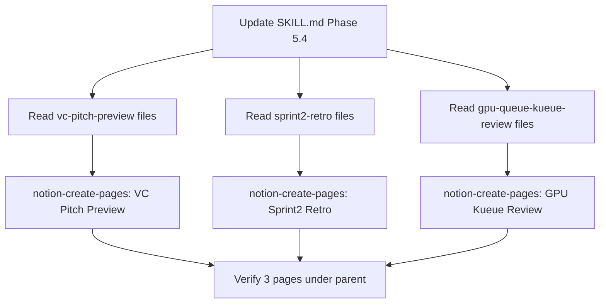

# Notion Meeting Digest Upload

## Current State

- [SKILL.md](.cursor/skills/meeting-digest/SKILL.md) Phase 5.4 already defines a `--notion` flag, but:
  - It only includes `summary.md` content (no action items)
  - It requires explicit `--notion [parent-id]` every time
  - No default parent page is configured
- 3 meetings exist with `summary.md` and `action-items.md`:
  - `output/meetings/2026-03-13/vc-pitch-preview/`
  - `output/meetings/2026-03-14/26-03-sprint2-retro/`
  - `output/meetings/2026-03-14/gpu-queue-kueue-review/`
- Target Notion parent page: `3239eddc34e680e8a7a5d5b5eac18b38`

## Task 1: Upgrade SKILL.md Phase 5.4

### 1a. Add Default Notion Parent to Configuration Table

In the Configuration table (lines 34-41), add a new row:

```
| Default Notion Parent (--notion) | `3239eddc34e680e8a7a5d5b5eac18b38` (AI Platform Meetings) |
```

### 1b. Make Notion Upload Always-On

Change Phase 5.4 from conditional (`--notion` flag required) to **always-on by default**. The `--notion [parent-id]` flag becomes an override for the parent page ID rather than an on/off toggle.

Update the Output Flags table (line 58):

- From: `--notion [parent-id]` — Create structured Notion page
- To: `--no-notion` — Skip Notion page creation (enabled by default)

Update the Pipeline Overview (line 82) to reflect Notion is always executed.

### 1c. Expand Phase 5.4 Content to Include Both Documents

Current Phase 5.4 only sends `summary-markdown-without-title`. Upgrade to create one Notion page per meeting with **both** summary and action items combined.

New Phase 5.4 structure:

```
CallMcpTool(
  server="plugin-notion-workspace-notion",
  toolName="notion-create-pages",
  arguments={
    "parent": {"page_id": "<parent-id or default>"},
    "pages": [{
      "properties": {"title": "{meeting-title} ({date})"},
      "icon": "meeting-type-emoji",
      "content": "<combined summary + action-items markdown>"
    }]
  }
)
```

Content composition:

1. Full `summary.md` content (strip the H1 title since Notion page title replaces it)
2. Horizontal rule separator (`---`)
3. Full `action-items.md` content (strip its H1 title)

Icon mapping by meeting type:

- `discovery` -> research icon
- `strategy` -> target icon
- `gtm` -> rocket icon
- `sprint` -> running icon
- `operational` -> gear icon

### 1d. Update Version

Bump `metadata.version` from `"2.1.0"` to `"2.2.0"`.

## Task 2: Upload 3 Existing Meetings to Notion

For each meeting, read `summary.md` and `action-items.md`, combine content, and call `notion-create-pages` MCP tool with parent `3239eddc34e680e8a7a5d5b5eac18b38`.

### 2a. VC Pitch Preview (2026-03-13)

- Source: `output/meetings/2026-03-13/vc-pitch-preview/`
- Page title: "VC Pitch Preview 회의 요약 (2026-03-13)"
- Content: `summary.md` + `---` + `action-items.md`

### 2b. Sprint2 Retro (2026-03-14)

- Source: `output/meetings/2026-03-14/26-03-sprint2-retro/`
- Page title: "26-03-Sprint2 회고 (2026-03-14)"
- Content: `summary.md` + `---` + `action-items.md`

### 2c. GPU Queue Kueue Review (2026-03-14)

- Source: `output/meetings/2026-03-14/gpu-queue-kueue-review/`
- Page title: "GPU Queue(Kueue) 관리 기능 리뷰 미팅 (2026-03-14)"
- Content: `summary.md` + `---` + `action-items.md`

## Execution Flow




## Notes

- Notion MCP (`plugin-notion-workspace-notion`) does not support file uploads (binary attachments). Markdown content will be rendered directly as Notion page content.
- Pipe tables in markdown may not render in Notion. If tables fail, convert to bulleted lists as per the learned-memory rule.
- Each meeting creates exactly one sub-page under the parent, keeping meetings organized and distinct.
