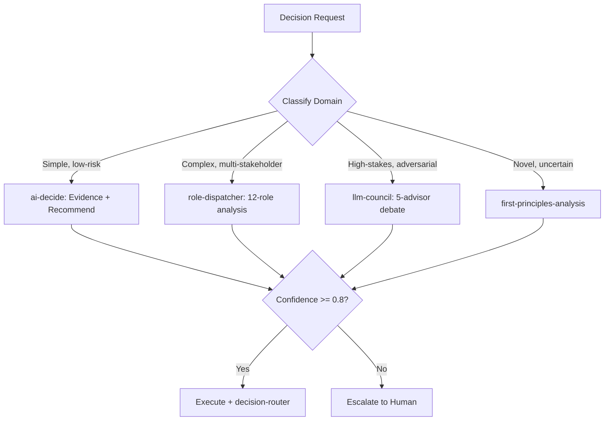

# Autonomous Decision Agent

Orchestrate autonomous decision-making by composing multi-model consensus, adversarial council debate, provenance-tagged evidence retrieval, and confidence-gated execution tiers. Routes decisions through appropriate frameworks (OODA, PDCA, Cynefin) based on domain and uncertainty level.

## When to Use

Use when the user asks to "make a decision", "autonomous decision", "decision agent", "confidence-gated execution", "OODA loop", "자율 의사결정", "의사결정 에이전트", "autonomous-decision-agent", or needs structured decision-making with evidence collection, multi-perspective analysis, and confidence scoring before action.

Do NOT use for simple yes/no questions (answer directly). Do NOT use for trading-specific decisions (use trading-agent-desk). Do NOT use for document routing (use decision-router directly).

## Default Skills

| Skill | Role in This Agent | Invocation |
|-------|-------------------|------------|
| llm-council | 5-advisor adversarial council with blind peer review and chair verdict | High-stakes decisions requiring diverse perspectives |
| hermes-mixture-of-agents | Multi-model consensus via parallel LLM queries and aggregation | Complex reasoning requiring model diversity |
| ai-decide | Provenance-separated evidence from MemKraft + LLM Wiki | Evidence-backed decision support |
| decision-router | Route decisions to appropriate Slack channels | Post-decision distribution |
| role-dispatcher | 12-role cross-perspective analysis | Multi-stakeholder impact assessment |
| first-principles-analysis | Strip assumptions layer-by-layer to bedrock truths | Foundational analysis for novel problems |

## MCP Tools

| Tool | Server | Purpose |
|------|--------|---------|
| slack_post_message.py | scripts/ (SLACK_USER_TOKEN) | Route decisions to #효정-의사결정 or #7층-리더방 |

## Workflow

## Modes

- **quick**: ai-decide with MemKraft evidence lookup
- **council**: llm-council 5-advisor adversarial debate (3 rounds)
- **cross-role**: role-dispatcher 12-perspective analysis
- **first-principles**: Assumption stripping for novel domains

## Safety Gates

- Confidence threshold: auto-execute only above 0.8
- Karpathy Opposite Direction Test mandatory on all recommendations
- Irreversible decisions always require human confirmation
- Decision provenance logged with source attribution
