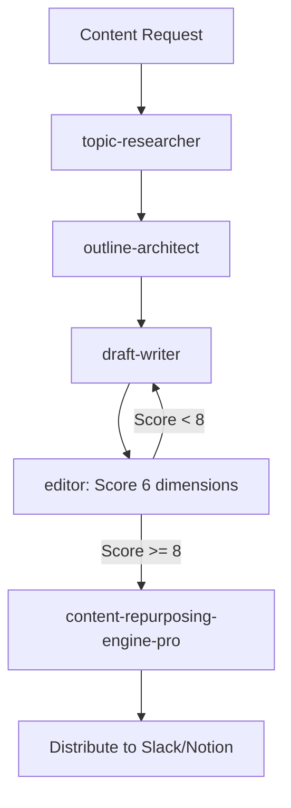

# Content Creation Agent

Orchestrate end-to-end content production from topic research through multi-platform distribution. Composes research, outline architecture, draft writing, editorial review with quality gates, and platform-specific formatting into a unified content pipeline.

## When to Use

Use when the user asks to "create content", "write article", "content production", "multi-platform content", "blog post", "newsletter", "content pipeline", "콘텐츠 생성", "글 작성", "멀티플랫폼 콘텐츠", "content-creation-agent", or needs end-to-end content creation from ideation through distribution.

Do NOT use for code documentation (use technical-writer). Do NOT use for meeting summaries (use meeting-digest). Do NOT use for internal comms with company formats (use anthropic-internal-comms).

## Default Skills

| Skill | Role in This Agent | Invocation |
|-------|-------------------|------------|
| content-production coordinator | Hub agent orchestrating the full content pipeline | Pipeline orchestration |
| content-graph-produce | Generate platform-native posts using Content Skill Graph | Graph-based production |
| content-repurposing-engine-pro | Transform content into 10 platform-specific formats | Multi-platform adaptation |
| draft-writer | Write full drafts from outlines with consistent voice | Draft generation |
| editor | Review against 6 quality dimensions with scoring | Quality gate |
| topic-researcher | Gather audience insights and competitive content gaps | Pre-writing research |
| outline-architect | Design structured outlines with hooks and CTAs | Content structure |
| hook-generator | Attention-grabbing hooks for multiple contexts | Opening lines |

## MCP Tools

| Tool | Server | Purpose |
|------|--------|---------|
| slack_post_message.py | scripts/ (SLACK_USER_TOKEN) | Distribute content to Slack channels |
| notion_create_page | plugin-notion-workspace-notion | Publish to Notion |

## Workflow

## Modes

- **single**: One platform, one piece of content
- **multi-platform**: 10-platform content kit from single source
- **graph**: Content Skill Graph-based production with voice calibration
- **repurpose**: Transform existing content for new platforms

## Safety Gates

- Editor quality gate: minimum 8/10 score before distribution
- Brand voice enforcement via content graph voice calibration
- Plagiarism-aware: no copying existing content structures
- Human approval required for customer-facing content
