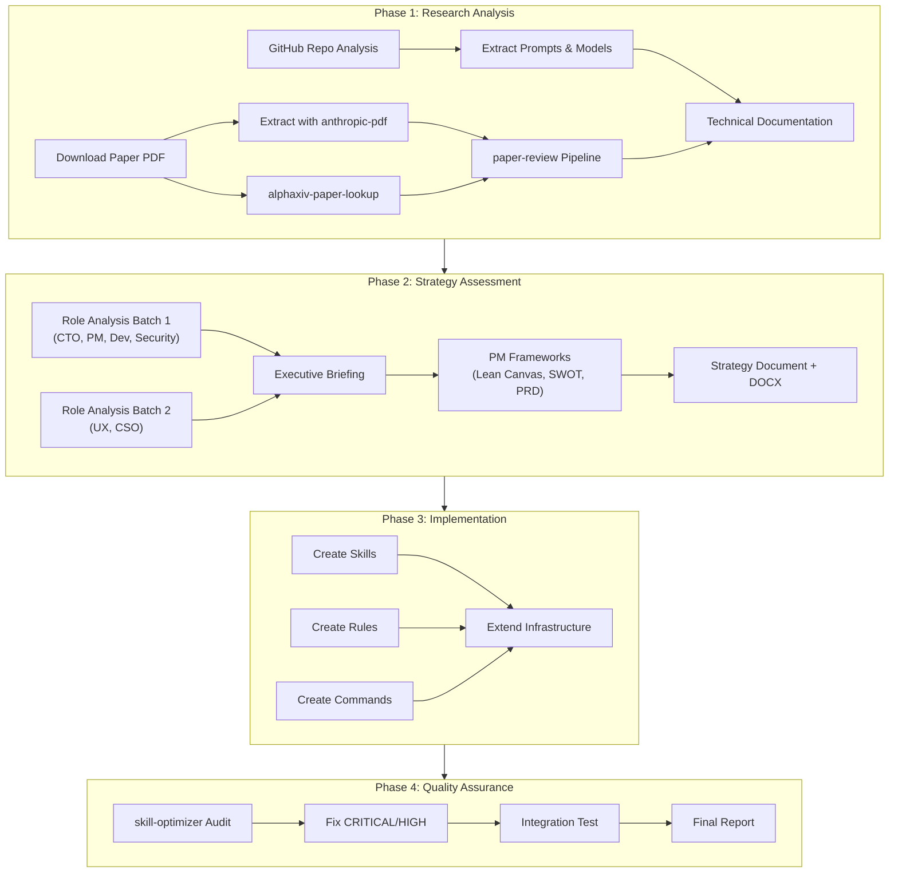

# AutoSkill Pipeline — Detailed Step Reference

## Pipeline Execution Flow

## Skill Composition Matrix

| Phase | Skills Used | Parallelism |
|-------|------------|-------------|
| 1A | `anthropic-pdf` | — |
| 1B | `alphaxiv-paper-lookup`, `defuddle` | Parallel with 1A |
| 1C | `paper-review` (PM sub-skills) | After 1A+1B |
| 1D | `visual-explainer`, `technical-writer` | After 1C |
| 2A | `role-cto`, `role-pm`, `role-developer`, `role-security-engineer` | 4 parallel |
| 2B | `role-ux-designer`, `role-cso` | 2 parallel |
| 2C | `executive-briefing`, `pm-product-strategy`, `pm-execution` | Sequential |
| 2D | `anthropic-docx` | After 2C |
| 3A | `create-skill`, `prompt-transformer` | Per-skill parallel |
| 3B | Direct file creation | Sequential |
| 3C | Direct file creation | Sequential |
| 4A | `skill-optimizer` | Per-skill sequential |
| 4B | `autoskill-evolve` (dry-run test) | After 4A |

## Error Recovery

- Phase 1 failure: Can be retried independently
- Phase 2 failure: Can skip individual roles and proceed
- Phase 3 failure: Skill creation is idempotent (overwrite-safe)
- Phase 4 failure: Audit findings are informational, don't block

## Estimated Runtime

| Phase | Time | Notes |
|-------|------|-------|
| Phase 1 | 15-20 min | PDF download + paper review |
| Phase 2 | 10-15 min | 6 parallel role analyses |
| Phase 3 | 25-35 min | Skill creation + infrastructure |
| Phase 4 | 10-15 min | Audit + integration test |
| **Total** | **60-85 min** | With parallel execution |
