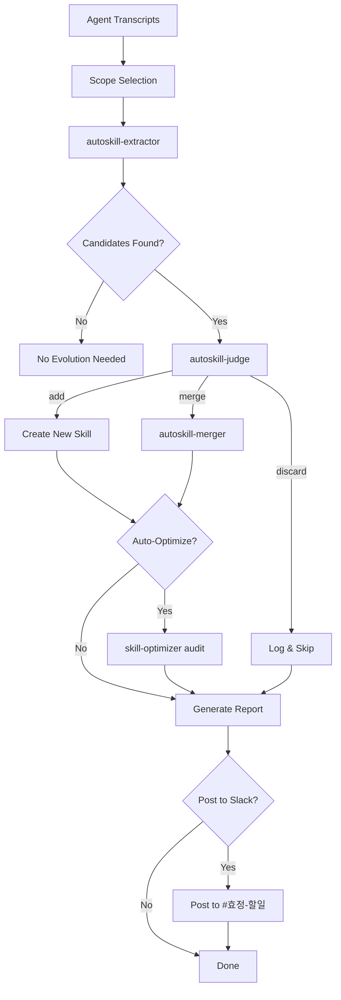

# AutoSkill Evolution Workflow Reference

## Pipeline Architecture



## State Management

The evolution state is tracked in `.cursor/hooks/state/autoskill-evolution.json`.

### State Schema

```json
{
  "last_processed": "ISO8601 timestamp",
  "processed_transcripts": ["uuid1", "uuid2"],
  "evolution_count": 0,
  "skills_created": 0,
  "skills_merged": 0,
  "skills_discarded": 0,
  "version_history": [
    {
      "date": "2026-03-14",
      "action": "merge",
      "skill": "korean-response-format",
      "version": "v0.1.3",
      "source": "transcript-uuid"
    }
  ]
}
```

## Incremental Processing

The pipeline uses a watermark-based approach:
1. Read `last_processed` timestamp from state
2. Find all transcripts newer than the watermark
3. Process each transcript sequentially
4. Update watermark after each successful processing
5. If interrupted, resume from last watermark

## Quality Metrics

Track these metrics across evolution runs:
- **Extraction rate**: candidates / transcripts processed
- **Acceptance rate**: (added + merged) / candidates
- **Merge ratio**: merged / (added + merged)
- **Average confidence**: mean confidence of accepted candidates
- **Version depth**: average version number of merged skills

## Error Recovery

- If extraction fails for a transcript, skip and log
- If judge fails, default to "discard" (safe choice)
- If merge fails, log conflict and skip (don't corrupt existing skill)
- State file corruption: rebuild from git history
