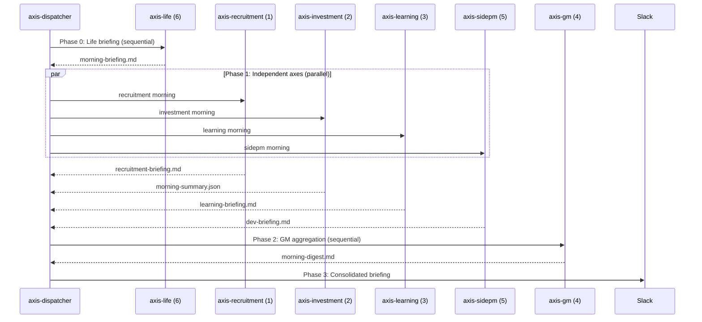

# Axis Dispatcher — 6-Axis Meta-Orchestrator

Central dispatcher that schedules and runs all 6 axis orchestrators with
dependency-aware ordering, parallel execution where safe, failure isolation,
and consolidated Slack reporting.

## Architecture

```
axis-dispatcher (this skill)
├── axis-life         (Axis 6 — first, no dependencies)
├── axis-investment   (Axis 2 — parallel with Axis 1,3,5)
├── axis-recruitment  (Axis 1 — parallel with Axis 2,3,5)
├── axis-learning     (Axis 3 — parallel with Axis 1,2,5)
├── axis-sidepm       (Axis 5 — parallel with Axis 1,2,3)
└── axis-gm           (Axis 4 — last, reads all other axes' outputs)
```

## Principles

- **Dependency-Aware Ordering**: Axis 6 (Life) runs first for calendar/email
  context. Axes 1,2,3,5 run in parallel (independent domains). Axis 4 (GM)
  runs last to aggregate all outputs.
- **Failure Isolation**: Each axis runs in its own subagent. One axis failing
  does not prevent others from running.
- **Per-Axis Failure Alerting**: Failed axes post to `#효정-할일` immediately,
  then the final report summarizes all failures.
- **Idempotent Date-Key**: All outputs keyed by `{date}` (YYYY-MM-DD). Re-running
  the same day overwrites previous outputs.

## Phase Guard Protocol (Dispatcher Level)

Each axis SKILL.md implements its own Phase Guard: before running a wrapped
sub-pipeline (e.g., `today`, `google-daily`, `hf-trending-intelligence`),
the axis checks if the sub-pipeline's output files already exist for today.
If they do, the phase is skipped and existing outputs are reused.

**Dispatcher responsibilities:**

1. Pass `--force` flag down to all axes when the user explicitly requests
   a full re-run.
2. Collect `REUSED` entries from each axis's manifest and include them
   in the dispatch manifest under `reused_phases`.
3. The dispatcher itself checks for its own guard:
   if `outputs/axis/dispatch/{date}/dispatch-manifest.json` exists and
   `--force` is not set, warn the user that the daily dispatch already ran
   and ask for confirmation before re-running.

This prevents duplicate API calls, duplicate Slack posts, and wasted
compute when individual pipelines were already invoked manually before
the scheduled dispatch.

## Composed Skills

This dispatcher does not implement domain logic. It invokes axis orchestrators:

| Axis | Skill | Domain |
|------|-------|--------|
| 1 | `axis-recruitment` | Job pipeline, interviews |
| 2 | `axis-investment` | Market intelligence, trading |
| 3 | `axis-learning` | Papers, KB, study programs |
| 4 | `axis-gm` | Cross-axis coordination |
| 5 | `axis-sidepm` | Code projects, sprints |
| 6 | `axis-life` | Calendar, email, errands |

## Morning Routine (~07:00 daily)



### Morning Execution Flow

**Phase 0 — Life First** (sequential)
Run `axis-life` morning routine. This must complete first because:
- Calendar data informs other axes (interviews affect recruitment, meetings affect sidepm)
- Email triage may surface items for other axes

**Phase 1 — Independent Axes** (parallel, max 4 concurrent)
Launch 4 subagents in parallel:
1. `axis-recruitment` morning
2. `axis-investment` morning
3. `axis-learning` morning
4. `axis-sidepm` morning

Each subagent returns: `{ "axis": "<name>", "status": "ok|failed", "summary_file": "<path>", "errors": [] }`

**Phase 2 — GM Aggregation** (sequential)
Run `axis-gm` morning. It reads all Phase 0 + Phase 1 outputs.

**Phase 3 — Consolidated Slack Briefing**
Read `axis-gm`'s `morning-digest.md` and post to `#효정-할일` as a structured
thread:
- Main message: 6-axis status grid (axis name → GREEN/YELLOW/RED)
- Thread reply 1: Top priorities across axes
- Thread reply 2: Pending decisions
- Thread reply 3: Errors/warnings (if any)

## Evening Routine (~17:00 daily)

Same structure but runs evening phases of each axis:

**Phase 0** — `axis-life` evening (tomorrow prep)
**Phase 1** — Parallel: `axis-investment` EOD, `axis-sidepm` EOD shipping,
`axis-learning` paper processing, `axis-recruitment` follow-ups
**Phase 2** — `axis-gm` daily digest
**Phase 3** — EOD Slack summary to `#효정-할일`

## Weekly Routine (Friday PM, after evening routine)

After the Friday evening routine completes:

**Phase W1** — Parallel: `axis-learning` weekly progress, `axis-sidepm` weekly report
**Phase W2** — `axis-gm` weekly OKR + improvement recs + executive briefing
**Phase W3** — Weekly Slack summary + post to Notion

## Output Artifacts

The dispatcher itself writes minimal files — most outputs live in each axis's
`outputs/axis/{name}/{date}/` directory.

| Phase | Output File | Description |
|-------|-------------|-------------|
| Morning | `outputs/axis/gm/{date}/dispatch-morning.json` | Dispatch manifest |
| Evening | `outputs/axis/gm/{date}/dispatch-evening.json` | Dispatch manifest |
| Weekly | `outputs/axis/gm/{date}/dispatch-weekly.json` | Weekly manifest |

### Dispatch manifest schema

```json
{
  "routine": "morning|evening|weekly",
  "date": "YYYY-MM-DD",
  "started_at": "ISO timestamp",
  "completed_at": "ISO timestamp",
  "axes": [
    {
      "name": "axis-life",
      "phase": 0,
      "status": "completed|failed|skipped",
      "elapsed_ms": 12000,
      "summary_file": "outputs/axis/life/{date}/morning-briefing.md",
      "errors": []
    }
  ],
  "overall_status": "all_green|partial_failure|critical_failure",
  "axes_green": 6,
  "axes_failed": 0
}
```

## Failure Handling

Full protocol: `references/failure-alerting.md`.

### Per-Axis Failure Protocol

Each axis writes errors to `outputs/axis/{axis}/{date}/errors.json` using the
standard error record format (severity S1-S4, phase, impact, recovery).

When an axis fails:
1. Immediately post to `#효정-할일`:
   `⚠️ Axis {N} ({name}) failed: {error_summary}`
2. Record the failure in the dispatch manifest
3. Continue running remaining axes
4. Include the failure in the consolidated briefing

### Dispatcher-Level Aggregation

After all axes complete, read each axis's `errors.json` and apply
escalation rules:
- 3+ axes degraded (S2+) in a single routine → escalate to `#효정-의사결정`
- 2+ axes critical (S1) → escalate to `#효정-의사결정`
- Include aggregated error summary in dispatch manifest `errors` field

### Critical Failure

If 3+ axes fail in a single routine, escalate:
- Post to `#효정-의사결정` with full error context
- Mark the routine as `critical_failure`

### Circuit Breaker

If an axis reports S1 severity for 3 consecutive days, automatically set
its automation level to 0 in `outputs/axis/automation-levels.json` and
post a persistent alert to `#효정-의사결정`.

### Retry Policy

No automatic retries at the dispatcher level. Individual axes handle their
own retries internally. The user can re-run a specific axis manually.

## Automation Configuration

### Cursor Automations Cron

Set up via `cursor-automations` skill:

```yaml
automations:
  - name: "6-Axis Morning"
    trigger:
      type: cron
      schedule: "0 7 * * 1-5"
    action:
      skill: axis-dispatcher
      args: { routine: "morning" }
    
  - name: "6-Axis Evening"
    trigger:
      type: cron
      schedule: "0 17 * * 1-5"
    action:
      skill: axis-dispatcher
      args: { routine: "evening" }
    
  - name: "6-Axis Weekly"
    trigger:
      type: cron
      schedule: "0 17 * * 5"
      after: "6-Axis Evening"
    action:
      skill: axis-dispatcher
      args: { routine: "weekly" }
```

## Slack Channels

- `#효정-할일` — consolidated briefings, axis failure alerts
- `#효정-의사결정` — critical failure escalation
- Individual axes post to their own channels as defined in their SKILL.md

## Progressive Automation Levels

The dispatcher tracks per-axis automation levels in
`outputs/axis/automation-levels.json`:

```json
{
  "axis-recruitment": { "level": 0, "last_reviewed": "2026-04-07" },
  "axis-investment": { "level": 0, "last_reviewed": "2026-04-07" },
  "axis-learning": { "level": 0, "last_reviewed": "2026-04-07" },
  "axis-gm": { "level": 0, "last_reviewed": "2026-04-07" },
  "axis-sidepm": { "level": 0, "last_reviewed": "2026-04-07" },
  "axis-life": { "level": 0, "last_reviewed": "2026-04-07" }
}
```

Level meanings:
- **0 — Report Only**: Axis generates reports and briefings; no actions
- **1 — Suggest + Confirm**: Axis suggests actions; human must approve
- **2 — Act + Notify**: Axis executes pre-approved actions; notifies after

Level upgrades require explicit human approval via `#효정-의사결정`.

## Integration with Existing Pipelines

This dispatcher **wraps** existing pipelines — it does NOT replace them:

| Existing Pipeline | Wrapped By | Relationship |
|-------------------|------------|--------------|
| `today` | `axis-investment` Phase 1 | Invoked as-is |
| `google-daily` | `axis-life` Phase 1-2 | Calendar + email phases |
| `morning-ship` | `axis-sidepm` Phase 1 | Git sync portion |
| `eod-ship` | `axis-sidepm` Phase E1 | EOD shipping |
| `sod-ship` | `axis-sidepm` Phase 1 | Start-of-day sync |
| `daily-am-orchestrator` | Replaced at dispatcher level | The 6-axis system supersedes this |
| `daily-pm-orchestrator` | Replaced at dispatcher level | The 6-axis system supersedes this |
| `hf-trending-intelligence` | `axis-learning` Phase 1 | AI radar |
| `role-dispatcher` | `axis-gm` on-demand | Multi-role analysis |

The old `daily-am-orchestrator` and `daily-pm-orchestrator` remain functional
for backward compatibility but are superseded by this dispatcher.

## Gotchas

- Phase 1 parallel axes use max 4 concurrent subagents (Cursor limit)
- The GM axis MUST run after all other axes — it reads their outputs
- If Slack MCP is unavailable, write briefings to files only and alert
  via the terminal
- On first run, persistent state files (learning-queue, job-pipeline,
  errands-queue, automation-levels) must be initialized as empty arrays
  or objects
- Weekend routines: consider skipping or running a reduced set (investment
  markets are closed)
