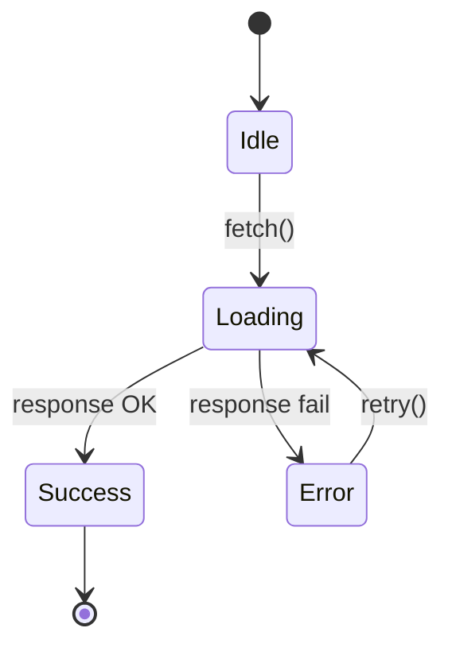
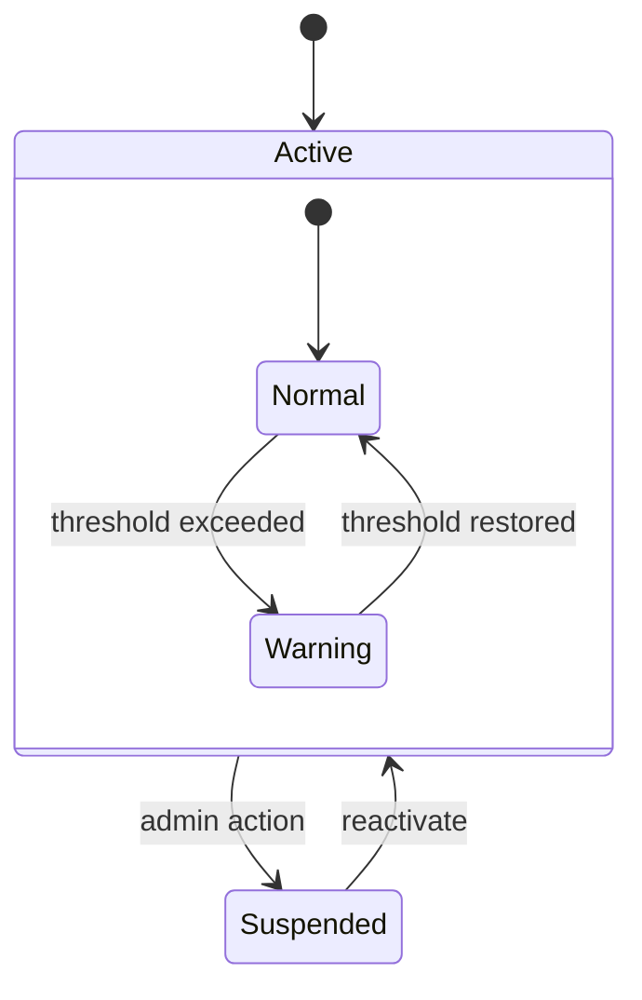
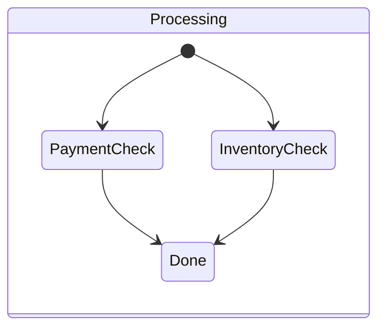

# State Extraction Guide

Patterns for detecting and documenting state machines from source code.

## Detection Patterns by Language

### TypeScript / JavaScript

| Pattern | Signal | Example |
|---------|--------|---------|
| String union | `type Status = 'active' \| 'inactive'` | State enum |
| Enum | `enum OrderStatus { PENDING, CONFIRMED }` | State enum |
| Switch/case | `switch (order.status) { case 'pending': ... }` | State transitions |
| Reducer | `case 'SET_STATUS': return { ...state, status: action.payload }` | Redux/useReducer state |
| XState | `createMachine({ states: { idle: {}, loading: {} } })` | Formal state machine |
| Status field | `{ status: string }` in interface/type | State property |

### Python

| Pattern | Signal | Example |
|---------|--------|---------|
| Enum class | `class Status(Enum): ACTIVE = 'active'` | State enum |
| If/elif chain | `if obj.status == 'pending': obj.status = 'active'` | State transition |
| Django choices | `STATUS_CHOICES = [('active', 'Active'), ...]` | State enum |
| SQLAlchemy enum | `Column(Enum('draft', 'published'))` | DB-level state |

### React / Component State

| Pattern | Signal | Example |
|---------|--------|---------|
| useState | `const [status, setStatus] = useState('idle')` | Component state |
| Conditional render | `{status === 'loading' && <Spinner />}` | State-dependent UI |
| useReducer | `dispatch({ type: 'FETCH_SUCCESS' })` | State transition |
| Error boundary | `componentDidCatch` | Error state |

## Mermaid State Diagram Syntax

### Basic State Diagram

### Composite States

### Fork/Join (Parallel States)

## Edge Case Classification

### Severity Matrix

| Severity | Data Impact | User Impact | Example |
|----------|-------------|-------------|---------|
| Critical | Data loss/corruption | Security breach | Missing auth check on state transition |
| High | Inconsistent state | Blocking error | Race condition between cancel and ship |
| Medium | No data impact | Poor UX | Missing loading state between transitions |
| Low | None | Cosmetic | Wrong icon for a state |

### Common Edge Cases by State Pattern

| Pattern | Common Edge Cases |
|---------|-------------------|
| Linear flow | Skipped step, backward transition, timeout at any step |
| Branching | Unmergeable branches, missing branch for edge input |
| Cyclic | Infinite loop, count-limited retries without limit |
| Concurrent | Race conditions, deadlock, inconsistent final state |
