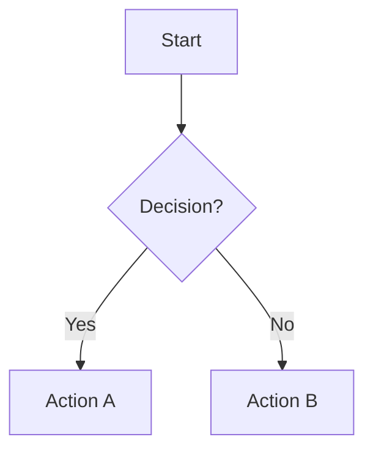
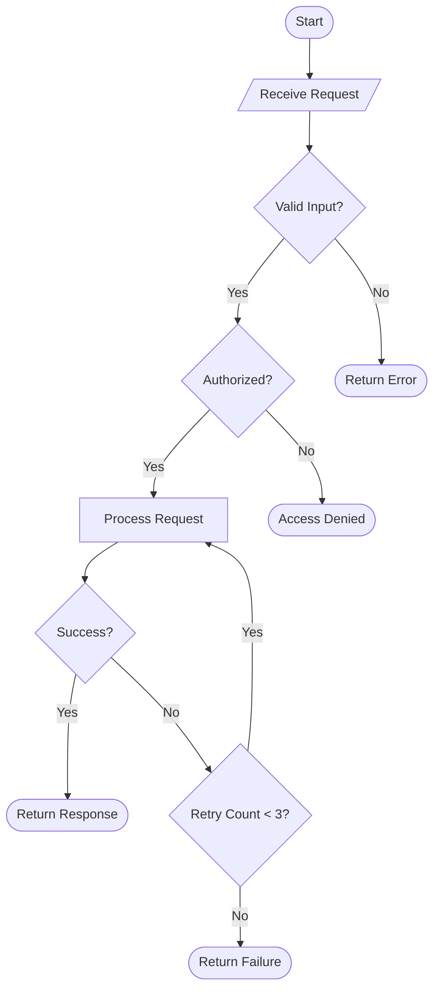
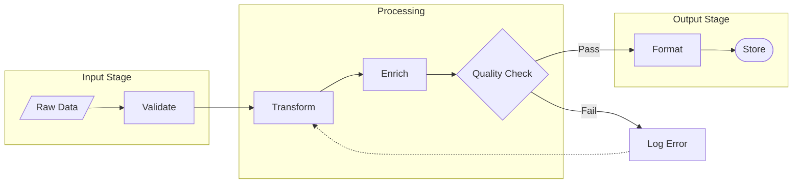
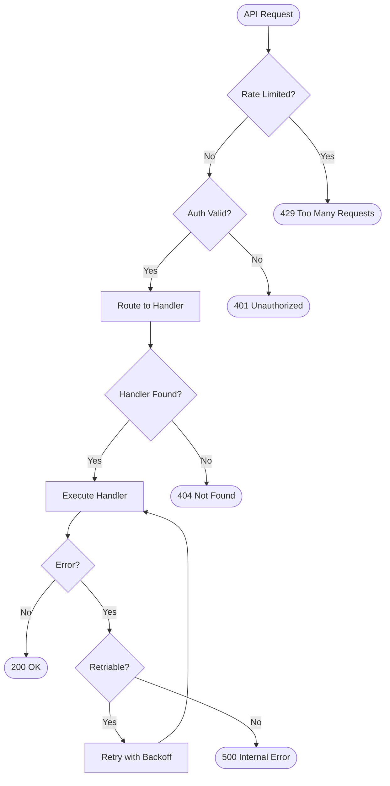
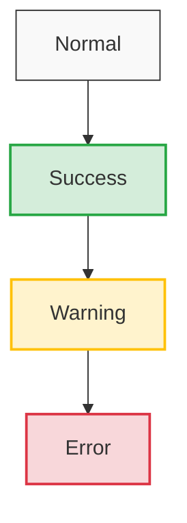

# Flowchart Generator

**Quick Start:** Choose direction (TD/LR) -> Define nodes with shapes -> Connect with arrows -> Add subgraphs for grouping.

## Critical Rules

### Rule 1: Always Use `flowchart` Over `graph`
Prefer `flowchart TD` over `graph TD`. The `flowchart` keyword supports newer Mermaid features like advanced arrow types.

### Rule 2: Unique Node IDs
Every node must have a unique ID within the entire diagram. Reusing the same ID changes its label globally.



### Rule 3: Avoid List Conflicts
If embedding Mermaid in Markdown, avoid ` - ` (dash-space) at the start of lines inside the diagram code block. This conflicts with Markdown list parsing.

### Rule 4: Special Characters
Wrap node labels containing special characters (`()`, `{}`, `[]`, `"`) in double quotes:
```
A["Node with (parens) and {braces}"]
```

### Rule 5: Subgraph Naming
When using subgraphs, always provide a display label. Do NOT use reserved keywords as subgraph IDs.

```
subgraph SG1 ["Processing Stage"]
    P1[Step 1] --> P2[Step 2]
end
```

## Directions

| Direction | Code | Best For |
|---|---|---|
| Top to Bottom | `flowchart TD` or `flowchart TB` | General processes, decision trees |
| Left to Right | `flowchart LR` | Pipelines, horizontal flows |
| Bottom to Top | `flowchart BT` | Build-up diagrams |
| Right to Left | `flowchart RL` | Reverse flows |

## Node Shapes

| Shape | Syntax | Use For |
|---|---|---|
| Rectangle | `A[Text]` | Process steps |
| Rounded | `A(Text)` | Start/End terminals |
| Stadium | `A([Text])` | Alternate terminals |
| Diamond | `A{Text}` | Decisions / conditions |
| Hexagon | `A{{Text}}` | Preparation steps |
| Parallelogram | `A[/Text/]` | Input/Output |
| Trapezoid | `A[/Text\]` | Manual operations |
| Circle | `A((Text))` | Connectors / junctions |

## Arrow Types

| Arrow | Syntax | Meaning |
|---|---|---|
| Solid | `-->` | Normal flow |
| Dotted | `-.->` | Optional / async |
| Thick | `==>` | Primary / critical path |
| Labeled | `-->|label|` | Conditional edge |

## Template: Decision Tree



## Template: Pipeline with Subgraphs



## Template: Error Handling Flow



## Styling

### Node Classes


### Link Styling
```
linkStyle 0 stroke:#28a745,stroke-width:2px
linkStyle 1 stroke:#ffc107,stroke-width:2px
```

## Best Practices

1. **Direction matters** -- use TD for decision trees, LR for pipelines
2. **Limit branching** -- keep max 3-4 branches per decision node for readability
3. **Group related steps** -- use subgraphs to cluster logical stages
4. **Label all edges** -- especially on decision branches (Yes/No, Pass/Fail)
5. **Consistent shapes** -- decisions are always diamonds, I/O always parallelograms
6. **Output format** -- always output inside ` ```mermaid ` fenced code blocks
